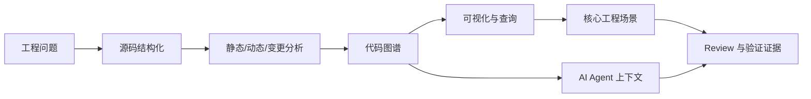

# Code Visualization

最新版阅读地址：[code-visualization](https://xiexiao064.gitbook.io/code-visualization)
GitHub 地址：[code-visualization-book](https://github.com/Xiaoxie1994/code-visualization-book)，欢迎贡献想法和建议。

## 前言：从代码可视化到软件理解

这本书讨论的不是“如何把代码画成一张图”，而是一个更基础的问题：

> 如何把一个真实软件系统转化为可观察、可查询、可验证的结构化事实。

代码可视化的对象并不是代码文本本身，而是隐藏在代码背后的结构、关系、行为、演进和组织上下文。文件、类、方法、调用链、依赖关系、控制流、数据流、测试覆盖、运行时 Trace、变更历史、Owner 和架构边界，都是理解软件系统时需要面对的事实。

当这些事实只散落在源码、日志、文档、PR、测试平台和人的经验里时，开发者只能靠阅读、搜索和询问来拼接上下文。代码可视化要做的，是把这些事实采集出来、组织起来，并以图、路径、矩阵、报告或查询接口的方式服务工程决策。

## 为什么现在重新写这本书

最初写这本书时，我更关注传统代码可视化能力：AST、调用图、依赖图、图表生成、代码变更影响分析，以及一些业界工具案例。后来 AI 编程工具快速发展，代码理解的重要性并没有下降，反而被进一步放大。

AI 可以更快地生成和修改代码，但它也带来了新的问题：

- 它是否找对了修改位置？
- 它是否理解了调用链和模块边界？
- 它是否遗漏了相关测试？
- 它是否破坏了架构约束？
- 它是否引入了安全、性能或数据一致性风险？
- 人类 Reviewer 如何验证它的修改？

这些问题不能只靠自然语言解释解决。它们需要结构化证据：调用关系、影响面、测试覆盖、运行时路径、架构规则和历史变更。换句话说，AI 时代更需要代码理解系统，而代码可视化正是这套系统的重要表达层和证据层。

因此，新版会采用“原理先行，再推进到 AI 时代应用”的结构：先讲源码如何被结构化，程序行为如何被分析，代码事实如何被建模成图谱；再讲少量核心工程场景；最后讨论这些能力如何服务 AI Agent、AI Review 和系统治理。

## 本书主线

全书围绕下面这条链路展开：

> 后续 AI 配图备注：可生成一张“人类开发者 + AI Agent 共同围绕代码图谱工作的主视觉图”，适合作为首页头图。画面重点是源码、运行时、测试、PR、Agent 汇聚到一张软件理解地图，风格应偏技术书籍封面，不要做营销海报。

读完这本书，你应该能够：

1. 理解 AST、符号表、CFG、DFG、Call Graph、Trace、Coverage 等概念如何服务代码理解。
2. 判断不同工程问题需要采集哪些代码数据。
3. 设计一个小型代码图谱和可视化查询系统。
4. 理解 AI Agent 修改代码时需要什么上下文、约束和验证证据。

## 本书适合谁

- 想系统理解代码可视化、程序分析和代码图谱的开发者。
- 经常接手大型代码库、遗留系统或跨团队项目的工程师。
- 关注研发效能、质量治理、架构治理和影响面分析的技术负责人。
- 想把 AI 编程工具引入真实工程流程，但担心上下文、测试和 Review 风险的团队。
- 对“人和 AI 如何共同理解代码库”感兴趣的读者。

## 阅读方式

如果你更关注原理，建议按目录顺序阅读前 3 篇；如果你更关注工程落地，可以重点阅读“代码库理解与上下文构建”“变更影响分析与验证”“架构理解与遗留系统改造”；如果你关注 AI 编程工具，则可以在理解代码图谱基础后阅读第 5 篇。

实践部分会构建一个最小代码理解系统，目标不是做一个完整商业平台，而是把“源码解析 -> 图谱构建 -> 影响面分析 -> 可视化展示 -> Agent 查询接口 -> 验证报告”这条链路跑通。

## 延伸阅读与参考资料

- [ANTLR](https://www.antlr.org/)：语法分析器生成工具，可用于理解 Lexer、Parser 和语法规则。
- [Tree-sitter](https://tree-sitter.github.io/tree-sitter/)：面向代码编辑器和代码分析场景的增量解析器。
- [OpenTelemetry Traces](https://opentelemetry.io/docs/concepts/signals/traces/)：理解 Trace、Span 和运行时链路观测的官方资料。
- [CodeQL Data Flow Analysis](https://codeql.github.com/docs/writing-codeql-queries/about-data-flow-analysis/)：理解数据流和污点分析的官方资料。
- [GitHub Copilot: Explore a codebase](https://docs.github.com/en/copilot/tutorials/explore-a-codebase)：AI 辅助代码库探索的官方教程。
- [SWE-bench](https://github.com/swe-bench/SWE-bench)：仓库级软件工程任务评测基准。

## 交流联系

- Email: [xiexiao064@gmail.com](mailto:xiexiao064@gmail.com)
- WeChat: ShawnLFF
- 公众号：肖恩聊技术

