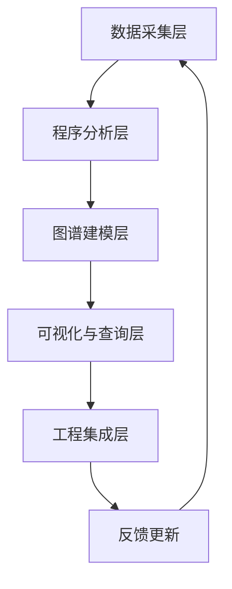
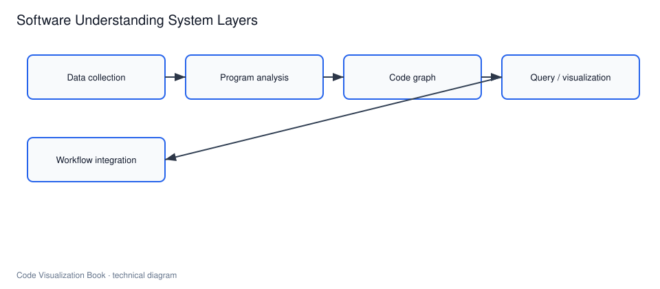

# 从图形展示到软件理解系统

## 本章要解决的问题

为什么代码可视化应升级为持续更新的软件理解系统，而不是一次性画图？

## 读者读完应获得什么

1. 能描述数据采集、程序分析、图谱建模、查询表达、工程集成五层结构。
2. 能说明一次 PR 分析如何在系统中闭环。
3. 能判断一个“可视化能力”是否只是展示层，还是已具备系统能力。

## 本章不讲什么

- 不展开某个平台的完整安装手册。
- 不比较所有商业工具。

---

代码可视化经常被误解为“生成几张图”。类图、依赖图、调用图和火焰图都有价值，但它们只是最终表达层。真正能支撑工程决策的，是一套持续更新的软件理解系统。

软件理解系统的目标，是把代码、运行时、变更历史和工程上下文转化为可查询、可解释、可验证的事实。图形展示只是输出之一；其他输出还包括影响面报告、测试推荐、风险说明、Agent 上下文包和 Review 检查清单。




> 后续 AI 配图备注：可生成软件理解系统分层架构图，体现五层闭环。

## 数据采集层

没有可靠数据，后续分析都会变成猜测。常见来源：

| 数据源 | 例子 | 用途 |
| --- | --- | --- |
| 源码与构建 | 文件、AST、依赖锁 | 结构与候选关系 |
| 运行时 | Trace、日志、覆盖率 | 真实路径与热点 |
| 变更 | Git Diff、PR、缺陷 | 演进与风险 |
| 组织 | Owner、服务目录、规则 | 治理与边界 |

在 `mini-shop` 中，最小采集至少包括 Java 源码、测试文件和 `PR-42` Diff。

## 程序分析层

分析层把原始数据变成工程事实：

- AST / 符号 / 类型
- 调用图、依赖图
- CFG / DFG
- Trace 到方法映射
- Diff 到实体映射

这一层决定系统“知道什么”和“不确定什么”。

## 图谱建模层

图谱层统一存放节点、边、属性和证据来源。对 `mini-shop`，可以把 `OrderService.createOrder`、`PricingService.calculateTotal`、`DiscountPolicy.apply` 及 `tests` 关系放进同一模型，供影响面和 Agent 查询复用。

参考样例：[`examples/mini-shop/artifacts/code-graph.json`](../examples/mini-shop/artifacts/code-graph.json)

## 可视化与查询层

输出不应只有大图，还应包括：

- 子图探索
- 路径解释
- 影响面报告
- 符号/调用/测试查询 API

查询层是人和 AI 共用的接口。

## 工程集成层

系统只有进入工作流才有持续价值：

- IDE：跳转、解释、局部影响
- CI/PR：变更影响、测试建议、规则检查
- APM：运行时证据回灌
- AI Agent：上下文包与验证报告

## 一次 PR 闭环

以 `PR-42` 为例：

```text
采集 DiscountPolicy 源码
 -> 解析 apply 方法
 -> 映射 Diff 到 method:DiscountPolicy#apply
 -> 反向调用得到 calculateTotal / createOrder / create
 -> 关联 PricingServiceTest / OrderServiceTest
 -> 输出影响面报告与验证建议
 -> 进入 PR Review
```

这就是从“图形展示”到“软件理解系统”的差别：结果可复用、可审计、可更新。

## 系统能力成熟度

| 级别 | 特征 | 典型产出 |
| --- | --- | --- |
| L1 展示 | 手工导出静态图 | 一次分享用的架构图 |
| L2 分析 | 可重复抽取结构/调用 | 调用图、依赖图 |
| L3 图谱 | 多源事实统一查询 | 影响面、上下文包 |
| L4 集成 | 进入 PR/CI/Agent | 自动报告与审计轨迹 |

本书后续内容按 L2 到 L4 逐步展开。

“系统”一词在这里不是为了显得宏大。它强调闭环：事实要被采集、被更新、被查询、被写回工程动作。只有展示层的代码可视化，就像只有仪表盘没有传感器——演示时好看，PR 到来时帮不上忙。

读本章时请把每一层都映射到 `PR-42`：采集如何认出 `DiscountPolicy.apply`，分析如何生成路径，图谱如何保存边，查询如何被人/Agent 使用，集成如何把报告贴进 PR。缺一层，整条证据链就会在那一层断开。


## 局限

- 系统建设有成本，应从最小闭环开始。
- 多源融合会引入冲突，需要证据优先级。
- 过度自动化可能制造虚假确定感。

## 小结

1. 图是表达，系统才是能力。
2. 软件理解系统由采集、分析、图谱、查询、集成构成闭环。
3. PR 影响面是检验系统是否有用的典型场景。
4. AI Agent 和 Reviewer 都依赖同一套事实层。

## 反馈环：系统如何持续变准

软件理解系统不是一次索引。关键反馈包括：

1. 测试结果回写覆盖与可靠性
2. Review 决策回写规则是否过严/过松
3. 运行时热点回写路径优先级
4. Agent 轨迹回写上下文策略是否有效

没有反馈环，图谱会在两周内过时，重新退化成“又一个静态站点”。

## 平台边界

系统应清楚自己不替代：

- 业务需求分析
- 最终合并责任
- 生产变更审批制度
- 完整可观测性平台

它提供的是事实、查询与证据，而不是自动免责。

## 关键要点复盘

围绕「从图形展示到软件理解系统」，读者离开本章前应能做到：

1. 画出采集-分析-图谱-查询-集成闭环
2. 把 PR-42 产物映射到五层
3. 说明缺采集/集成时系统如何断裂
4. 给出一周版最小系统清单
5. 衔接到编译/程序分析原理篇

若任一做不到，请先复习本章例子与练习，再继续向后读。

## PR-42 在五层中的产物映射

| 层 | PR-42 对应产物/动作 |
| --- | --- |
| 采集 | 解析 `DiscountPolicy` 等方法与候选调用 |
| 分析 | Diff→变更实体；反向调用；相关测试 |
| 图谱 | `code-graph.json` 中的 nodes/edges/rules |
| 查询/可视化 | 影响路径视图、节点详情、报告页 |
| 集成 | PR 评论/CI 检查/Agent 工具响应 |

缺任一层，系统会在该层断开：例如有图谱无集成，则只存在于演示环境；有集成无采集，则报告会过期。

## 最小可行系统（一周版）

1. JSON 图谱 + 手写/半自动采集
2. 一个 `impact_analysis` 脚本
3. Markdown 验证报告
4. PR 模板强制粘贴报告摘要

先闭环，再平台化。


## 练习

1. 用五层模型标出 `PR-42` 影响面报告分别经过哪些层。
2. 说明为什么只有展示层、没有采集/图谱层时系统不可持续。
3. 给你们团队的现状自评：L1-L4 哪一级，缺什么。

## 常见问题：软件理解系统

### 有图是不是就有系统？

不是。缺采集、图谱更新与工程集成时，图只是展览。

### 必须一开始就做平台吗？

不必。先跑通最小闭环，再平台化。

## 本章导航

- 上一章：[代码可视化到底可视化什么](what-to-visualize.md)
- 下一章：[编译器视角下的代码结构](../part2/compiler-view.md)
- 相关章：[代码图谱：节点、边与属性](../part3/code-graph-model.md)

## 延伸阅读与参考资料

- [OpenTelemetry](https://opentelemetry.io/docs/concepts/signals/traces/)：运行时信号如何进入事实层。资料卡：`../docs/research-cards/rc-opentelemetry-traces.md`
- [Backstage](https://backstage.io/docs/overview/what-is-backstage/)：工程门户与目录集成视角。资料卡：`../docs/research-cards/rc-backstage-catalog.md`
- [CodeQL documentation](https://codeql.github.com/docs/)：静态分析事实如何服务安全与理解。
- [Internal Developer Platform concepts](https://internaldeveloperplatform.org/)：平台化集成的工程语境。
- [GitHub Actions / checks 概念](https://docs.github.com/en/pull-requests/collaborating-with-pull-requests/collaborating-on-repositories-with-code-quality-features/about-status-checks)：工程集成层中的 PR 检查位。
- 本书案例：[`examples/mini-shop/artifacts/`](../examples/mini-shop/artifacts/)。
