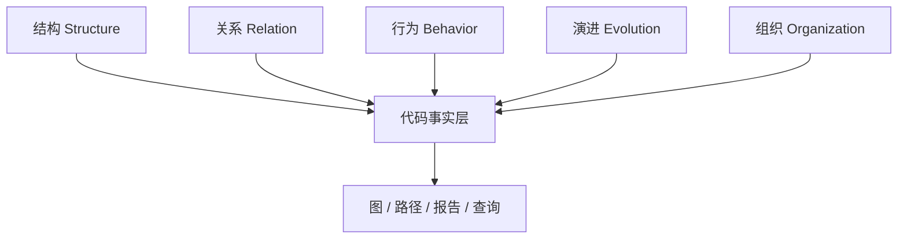

# 代码可视化到底可视化什么

## 本章要解决的问题

代码可视化的对象到底是什么？是图表类型，还是代码背后的事实？

## 读者读完应获得什么

1. 能把可视化对象分成结构、关系、行为、演进、组织五类事实。
2. 能把一个功能从入口追踪到代码、测试和 Owner 的事实链。
3. 能为后续代码图谱建模准备实体清单。

## 本章不讲什么

- 不比较各类前端图库。
- 不把“选哪种图”当成主问题。

---

初次接触代码可视化，会想到类图、调用图、依赖图、控制流图、火焰图。这些图重要，但如果只从图表类型出发，容易误以为代码可视化就是为代码选一种图形表达。

更准确的理解是：代码可视化可视化的不是代码文本，而是代码背后的事实。图只是表达方式之一；查询、报告、矩阵、列表和路径解释同样属于代码理解系统。

## 五类可视化对象



### 结构：代码由哪些实体组成

- 仓库、模块、包、目录
- 文件、类、接口、枚举
- 方法、字段、参数、配置项
- 测试文件与测试用例

在 `mini-shop` 中，结构实体至少包括：

```text
module: order / pricing / payment
class: OrderService, PricingService, DiscountPolicy, PaymentClient
method: createOrder, calculateTotal, apply, charge
test: OrderServiceTest, PricingServiceTest
```

### 关系：实体如何连接

- 包含、依赖、调用、继承、实现
- 读写、配置引用、测试覆盖

例如：

```text
OrderService.createOrder -> PricingService.calculateTotal
PricingService.calculateTotal -> DiscountPolicy.apply
OrderServiceTest covers OrderService.createOrder
```

### 行为：系统实际怎么运行

- 控制流与数据流
- 运行时 Trace / Span
- 覆盖率、性能热点、错误路径

静态关系说明“可能怎样连接”，行为事实说明“实际怎样发生”。

### 演进：系统如何变化

- Diff、Commit、PR
- 变更频率、共变文件、缺陷历史

`PR-42` 把 `DiscountPolicy.apply` 中的折扣从 `0.9` 改为 `0.85`，这就是演进事实；它需要映射回结构实体后才能做影响面分析。

### 组织：谁负责、边界在哪

- Owner、团队、服务目录
- 架构规则与模块边界

例如规则：`pricing` 不得直接依赖 `payment`。组织事实让可视化不仅服务代码阅读，也服务治理。

## 从对象到事实链

以“创建 VIP 订单”为例，完整事实链可以是：

1. 入口：`OrderController.create`
2. 业务编排：`OrderService.createOrder`
3. 计价：`PricingService.calculateTotal`
4. 折扣：`DiscountPolicy.apply`
5. 支付：`PaymentClient.charge`
6. 测试：`OrderServiceTest.shouldCreateVipOrderWithDiscount`
7. 规则：订单总价变更会影响支付金额

可视化系统要能把这条链查出来，而不是只展示一张静态类图。

## 表达方式不止图

| 事实类型 | 常见表达 |
| --- | --- |
| 结构 | 目录树、符号列表、代码大纲 |
| 关系 | 调用图、依赖图、引用矩阵 |
| 行为 | 路径图、火焰图、覆盖热区 |
| 演进 | 变更耦合图、热点文件列表 |
| 组织 | 服务目录、Owner 地图、规则违规列表 |

选择表达方式的标准是：它是否帮助回答当前问题，并保留可回跳源码的证据。

## 和代码图谱的过渡

当五类事实需要统一查询时，自然会进入代码图谱：

- 节点 = 实体
- 边 = 关系
- 属性 = 证据来源、位置、置信度、时间

后面章节会把这些对象落实为可存储、可查询的模型。

## 事实优先级

不是所有事实都要同时可视化。可按任务裁剪：

| 任务 | 优先事实 |
| --- | --- |
| 定位功能入口 | 结构 + 调用关系 |
| 评估 PR | 变更实体 + 调用方 + 测试 |
| 架构治理 | 模块依赖 + 规则 + 热点 |
| Agent 修改 | 符号 + 边界 + 测试 + 轨迹 |

这能避免“全量大图”既慢又不可读。

## 局限

- 不是所有事实都能高精度自动提取。
- 组织与业务语义常需人工规则补充。
- 事实过多会噪声化，必须按任务裁剪。

## 小结

1. 可视化的对象是事实，不是图本身。
2. 结构、关系、行为、演进、组织构成基本事实分类。
3. 工程问题需要事实链，而不是孤立节点。
4. 统一事实层是走向代码图谱的前提。

## 对象选择的反模式

1. **只可视化目录树**：看不到调用与变更，对 PR 几乎无帮助。
2. **只可视化全量调用大图**：信息过载，决策成本更高。
3. **只可视化运行时大盘**：无法回跳到可修改的代码实体。
4. **只可视化组织架构**：缺少代码事实时，治理会变成形式主义。

正确做法是任务驱动的对象组合：先问题，后事实，再表达。

## 五类事实的最小字段建议

| 事实类 | 最小字段 |
| --- | --- |
| 结构 | id, name, file, line range |
| 关系 | from, to, type, confidence, evidence |
| 行为 | entity_id, trace/test id, timestamp |
| 演进 | entity_id, commit/pr, change_type |
| 组织 | entity_id, owner, rule_id, status |

## 练习

1. 把“创建 VIP 订单”写成结构/关系/行为/演进/组织五类事实清单。
2. 指出哪两类事实无法仅靠 AST 获得。
3. 为代码图谱列出至少 6 个节点类型候选。

## 延伸阅读与参考资料

- [Backstage Software Catalog](https://backstage.io/docs/features/software-catalog/)：组织与服务元数据如何目录化。资料卡：`../docs/research-cards/rc-backstage-catalog.md`
- [OpenTelemetry Traces](https://opentelemetry.io/docs/concepts/signals/traces/)：行为事实中的路径信号。资料卡：`../docs/research-cards/rc-opentelemetry-traces.md`
- [GitHub docs: About the dependency graph](https://docs.github.com/en/code-security/supply-chain-security/understanding-your-software-supply-chain/about-the-dependency-graph)：依赖关系作为结构/关系事实。
- [Language Server Protocol](https://microsoft.github.io/language-server-protocol/)：符号与引用作为可查询结构事实。资料卡：`../docs/research-cards/rc-lsp.md`
- [Git diff](https://git-scm.com/docs/git-diff)：演进事实的基础输入。资料卡：`../docs/research-cards/rc-git-diff.md`
- 本书案例：[`examples/mini-shop/`](../examples/mini-shop/)。
