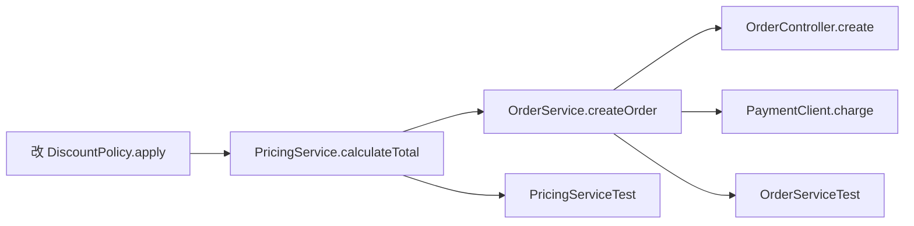

# 为什么需要代码可视化

## 本章要解决的问题

为什么复杂代码库不能只靠搜索、文档和经验理解？代码可视化到底解决什么工程问题？

## 读者读完应获得什么

1. 能说明大型代码库理解困难的真实来源。
2. 能区分“画一张大图”和“围绕问题组织可验证事实”。
3. 能用一次跨模块改动说明：没有结构化事实时，人和 AI 都会误判影响面。

## 本章不讲什么

- 不介绍具体绘图库用法。
- 不展开完整程序分析算法。
- 不把代码可视化窄化为 UI 美化。

---

软件系统的复杂性并不只来自代码行数。一个中型项目可能只有几万到几十万行代码，但它同时包含业务入口、框架约定、模块依赖、数据库访问、异步任务、配置开关、测试用例、部署脚本和历史包袱。开发者真正需要理解的，不是某个文件里的语句，而是这些语句如何和整个系统发生关系。

代码可视化的价值也不只是“把代码画成图”。如果只是把所有类、方法和调用关系铺到一张图上，结果往往比源代码更难读。真正有用的代码可视化，是把隐藏在代码里的事实提取出来，并围绕具体问题组织成可观察、可查询、可验证的表达。

## 大型代码库为什么难理解

代码难理解通常不是因为某一段代码写得特别复杂，而是因为读者缺少上下文。一个方法可能只有十几行，但你需要知道它被谁调用、在哪个请求路径里执行、依赖哪些配置、修改后影响哪些测试、是否被线上流量频繁触达。

大型代码库常见的理解障碍包括：

- 入口分散：HTTP 接口、消息消费、定时任务、命令行任务、测试入口分布在不同位置。
- 调用链深：业务逻辑跨越多层服务、公共库和中间件。
- 隐式约定多：框架注解、反射、配置和生成代码让文本搜索失效。
- 演进历史长：当前结构是多次补丁、迁移和妥协的结果。
- 责任边界模糊：Owner、模块边界和架构规则不在源码字面中显式出现。

文档能帮助建立心智模型，但文档会过期。搜索能定位关键字，但无法稳定表达结构和关系。同事经验很有效，但不可复制、不可审计。

## 一个跨模块改动的例子

以全书案例 `mini-shop` 为例。看起来只是改一行折扣：

```java
// DiscountPolicy.apply
return amount * 0.85; // 原为 0.9
```

但工程上它至少牵动：

1. `PricingService.calculateTotal` 的计算结果
2. `OrderService.createOrder` 的订单总价
3. `PaymentClient.charge` 的支付金额
4. `PricingServiceTest` 与 `OrderServiceTest` 的断言

如果只靠搜索 `0.9` 或阅读单个文件，很容易漏掉调用方和测试。可视化与代码理解系统要回答的，正是这类问题：

> 这次改动看起来很小，但它真正碰到了哪些实体、路径和验证点？



## 文档、搜索和经验的边界

| 方式 | 擅长 | 不足 |
| --- | --- | --- |
| 文档 | 说明意图和设计背景 | 容易过期，缺少可执行证据 |
| 文本搜索 | 快速定位关键字 | 误报漏报多，不懂结构 |
| IDE 跳转 | 单点定义/引用导航 | 难以形成全局影响面和报告 |
| 同事经验 | 解释历史和隐式约定 | 不可复制、不可审计 |
| 代码可视化/图谱 | 组织结构、关系、行为与演进事实 | 依赖数据采集与建模质量 |

代码可视化不是取代这些方式，而是把其中可结构化的部分沉淀成系统能力。

## AI 时代为什么更需要它

AI 编程工具加快了生成和修改，但也放大了验证压力：

- 它是否找对了修改位置？
- 它是否理解模块边界？
- 它是否更新了相关测试？
- Reviewer 如何审计它的结论？

如果没有结构化事实层，人和 AI 都只能用自然语言“感觉相关”。有了代码理解系统，改动可以对应到实体、路径、测试和规则，形成可检查证据。

## 代码可视化真正服务的问题

围绕工程问题，而不是围绕图表类型，常见问题包括：

1. 这个功能从入口到实现经过哪些代码？
2. 这次 PR 可能影响哪些模块和测试？
3. 哪些热点文件经常一起变更？
4. 架构边界是否被破坏？
5. 给 Agent 的上下文应该包含哪些符号和约束？

图、路径、矩阵、报告和查询接口，都只是回答这些问题的表达形式。

## 从“看见”到“可决策”

有用的代码可视化最终要落到决策：

1. 要不要改
2. 改哪里
3. 还要看谁/测谁
4. 如何向 Reviewer 证明

因此本书后文不会把“生成大图”当终点，而会把图、路径、报告和查询都视为**决策界面**。对 AI Agent 同样如此：没有决策所需事实，生成再快也只是加速不确定。

## 局限

- 可视化不能自动保证正确理解；数据质量和模型边界决定上限。
- 全量大图通常不可读；必须按问题裁剪子图。
- 没有工程集成时，图只是展览，不是工作流能力。

## 小结

1. 代码库难理解，主要因为上下文分散，而不是单段代码难读。
2. 文档、搜索和经验都有边界，需要结构化事实层补齐。
3. 有用的代码可视化围绕工程问题组织证据，而不是堆砌大图。
4. AI 加速修改后，影响面判断和验证证据变得更关键。

下一章将回答：既然要可视化，到底应该把哪些事实作为对象。

## 工程决策清单：什么时候必须上代码理解系统

当出现以下信号中的任意两项，通常就值得建设结构化代码理解能力，而不是继续只靠搜索和经验：

1. 跨模块缺陷占比高，定位时间显著长于修改时间
2. AI/自动化改码开始进入主干，但 Review 只能抽样
3. 架构规则写在文档里，却经常在 PR 中被无意识破坏
4. 测试很多，却说不清一次变更该跑哪些
5. 关键路径缺乏 Owner，事故复盘靠“谁熟谁上”

`mini-shop` 虽小，但已经具备这些信号的缩影：折扣一行变更，会穿过计价、订单与支付，并打坏两份断言。若把它放大到真实多仓系统，缺少事实层的成本会指数上升。

## 与本书其余章节的接口

- 第二篇回答“结构事实从哪来”
- 第三篇回答“如何融合成图谱与证据”
- 第四篇回答“工程上怎么用”
- 第五篇回答“AI 如何被约束与审计”
- 第六篇给出可跟做闭环

## 关键要点复盘

围绕「为什么需要代码可视化」，读者离开本章前应能做到：

1. 用自己的话解释核心概念与边界
2. 在 `mini-shop` / `PR-42` 上指出对应实体、路径或产物
3. 说明它如何服务人或 AI 的具体决策
4. 列出至少两个局限或失败模式
5. 知道下一章将把它连接到哪一层能力

若任一做不到，请先复习本章例子与练习，再继续向后读。

## 失败模式：把“可视化”做成展览

| 失败模式 | 表现 | 后果 | 纠正 |
| --- | --- | --- | --- |
| 全仓大图 | 默认渲染所有类与调用 | 不可读、不可决策 | 按任务裁剪子图 |
| 无实体 ID | 图上只有文件名字符串 | 无法对接影响面/Agent | 稳定符号 ID |
| 无验证出口 | 只有图，没有测试/规则 | Review 仍靠感觉 | 报告与检查清单 |
| 与工作流脱节 | 图在 wiki，PR 看不到 | 无人使用 | 集成到 PR/CI |

`PR-42` 的正确起点不是“画全仓”，而是从 `method:DiscountPolicy#apply` 展开路径、测试与风险。


## 练习

1. 用 `mini-shop` 的 VIP 折扣修改，列出只靠文本搜索可能漏掉的 3 类影响。
2. 对比“文档 / 搜索 / 同事经验 / 代码图谱”在该修改上的优劣。
3. 写一段 5 行说明：为什么 AI 修改速度上升会放大验证压力。

## 延伸阅读与参考资料

- [SWE-bench](https://github.com/swe-bench/SWE-bench)：仓库级软件工程任务说明“改对代码”需要仓库上下文与验证。资料卡：`../docs/research-cards/rc-swe-bench.md`
- [GitHub Copilot: Explore a codebase](https://docs.github.com/en/copilot/tutorials/explore-a-codebase)：官方代码库探索路径。资料卡：`../docs/research-cards/rc-github-copilot-explore.md`
- [IEEE 关于软件维护成本的经典讨论综述入口](https://ieeexplore.ieee.org/)（检索 software maintenance cost）：理解“理解成本”长期存在。
- [Git documentation](https://git-scm.com/doc)：变更是软件事实的基础来源之一。
- [OpenTelemetry Traces](https://opentelemetry.io/docs/concepts/signals/traces/)：运行时事实补充结构理解。资料卡：`../docs/research-cards/rc-opentelemetry-traces.md`
- 本书案例：[`examples/mini-shop/`](../examples/mini-shop/) 与 [`docs/sample-case/README.md`](../docs/sample-case/README.md)。
