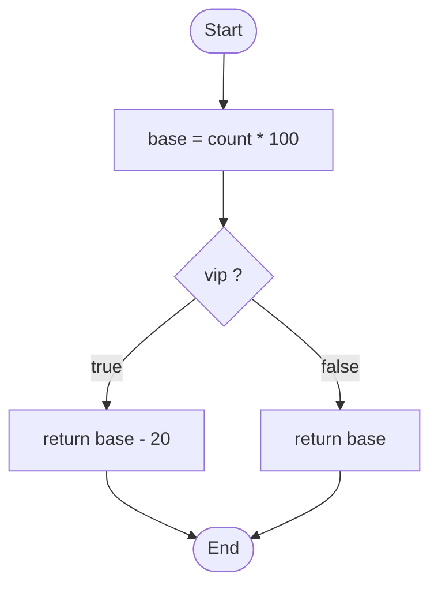
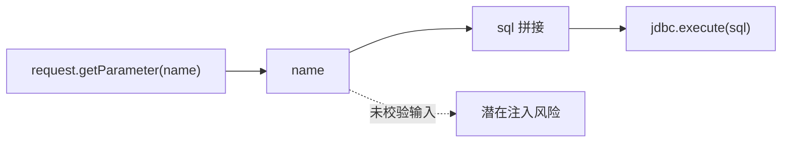

# IR、SSA、CFG 与 DFG

AST、符号表和类型关系帮助我们理解代码结构和语义，但很多程序分析问题更关心执行路径和数据传播。比如某段代码是否可达，用户输入是否流向危险操作，某个变量的值来自哪里，修改一个条件会影响哪些分支。

这些问题需要更接近程序行为的表示。本章介绍四个关键概念：IR、SSA、CFG 和 DFG。它们听起来偏编译原理，但在代码可视化、安全分析、测试选择、影响面分析和 AI Review 中都非常实用。

## 为什么需要中间表示

中间表示简称 IR，是介于源码和目标代码之间的程序表示。编译器使用 IR 是为了让分析、优化和代码生成不直接依赖具体语法。

对代码可视化来说，IR 有两个价值。

第一，它让不同语法变得更规整。比如 `for`、`while`、增强 `for` 都可以转换成更统一的控制结构，方便分析工具处理。

第二，它让分析对象更接近程序行为。AST 表达的是“代码怎么写”，IR 更关注“程序怎么执行”。控制流、数据流和优化分析通常在 IR 或类似结构上更容易实现。

## 一个简单例子

看下面的代码：

```java
int price(int count, boolean vip) {
    int base = count * 100;
    if (vip) {
        return base - 20;
    }
    return base;
}
```

从 AST 看，它是一个方法声明，里面有变量声明、`if` 语句和两个 `return`。但如果要分析执行路径，我们更关心：

- `base` 一定会先被计算。
- `vip` 决定进入哪个分支。
- 两个分支都会返回一个值。
- 返回值都依赖 `base`。

这些信息可以通过控制流和数据流表达出来。

## SSA：让值的来源更清楚

SSA 是静态单赋值形式。它要求每个变量只被赋值一次。如果变量在不同位置被重新赋值，就用不同版本表示。

例如：

```java
int x = 1;
x = x + 1;
return x;
```

可以转换成类似：

```text
x1 = 1
x2 = x1 + 1
return x2
```

这样，`x2` 的来源就非常清楚：它来自 `x1 + 1`，而 `x1` 来自常量 `1`。SSA 减少了“同一个变量名在不同时间代表不同值”的混乱。

在数据流分析中，SSA 很有价值。工具可以更容易判断一个值从哪里来、经过哪些计算、最后流向哪里。

## CFG：控制路径

控制流图（Control Flow Graph, CFG）用节点表示基本块或语句，用边表示可能的执行转移。

一个 `if` 语句会产生分支边，一个循环会产生回边，一个 `return` 会结束当前路径，一个异常可能跳到异常处理路径。

CFG 可以回答：

- 一个函数有哪些可能执行路径。
- 某个语句是否可能执行。
- 哪些条件控制了某段代码。
- 某个修改可能影响哪些后续分支。
- 哪些路径被测试覆盖，哪些没有覆盖。

在可视化中，CFG 适合解释复杂函数内部逻辑，尤其是条件分支、循环和异常处理较多的代码。但在大型系统层面，直接展示所有函数的 CFG 通常没有意义。更常见的方式是把 CFG 作为底层分析数据，只在需要解释某个复杂函数或安全路径时展示。



## DFG：数据依赖

数据流图（Data Flow Graph, DFG）关注值如何产生、传播和使用。

例如：

```java
String name = request.getParameter("name");
String sql = "select * from user where name = '" + name + "'";
jdbc.execute(sql);
```

DFG 会关注：

- `name` 来自用户输入。
- `sql` 依赖 `name`。
- `sql` 被传入 `jdbc.execute`。

这条路径对安全分析非常重要，因为用户输入流向了数据库执行函数。污点分析就是典型的数据流应用：从 Source 出发，看数据是否流向危险 Sink，中间是否经过清洗或校验。

DFG 可以回答：

- 一个变量的值来自哪里。
- 某个字段被哪些代码读写。
- 用户输入是否影响敏感操作。
- 某个返回值依赖哪些参数。
- 数据是否经过必要校验。



> 后续 AI 配图备注：可生成一张“同一段代码对应 CFG 与 DFG 两种视角”的对照图，左侧突出控制分支，右侧突出数据从输入流向 Sink。

## PDG：控制依赖与数据依赖的结合

程序依赖图（Program Dependence Graph, PDG）通常会结合控制依赖和数据依赖。控制依赖说明某段代码是否执行取决于哪个条件，数据依赖说明某个值依赖哪些定义。

例如：

```java
if (user.isAdmin()) {
    deleteOrder(orderId);
}
```

`deleteOrder(orderId)` 对 `user.isAdmin()` 有控制依赖，对 `orderId` 有数据依赖。做权限审查时，两类依赖都很重要：不仅要知道删除操作使用了哪个参数，还要知道它是否受权限判断控制。

在 AI Review 场景中，PDG 思想也有价值。系统可以检查 AI 是否移除了关键控制条件，或者是否让未校验输入流向危险操作。

## IR 与可视化之间的距离

IR、SSA、CFG、DFG 都是底层表示，不一定适合直接给所有读者展示。它们更像代码理解系统的分析层。

面向用户时，我们通常会把底层分析结果转换成更直接的视图或报告：

- 从 CFG 中提取关键条件路径。
- 从 DFG 中提取 Source 到 Sink 路径。
- 从 SSA 中解释某个值的来源。
- 从 PDG 中解释某个危险操作受哪些条件保护。

这也是“从图到证据”的思路：底层图不一定直接展示，但它能支撑可验证的结论。

## 在影响面分析中的作用

影响面分析通常从调用图开始，但仅有调用图不够。某些修改只影响特定分支，某些参数变化只影响特定数据路径，某些安全风险只在缺少校验时出现。

CFG 和 DFG 可以帮助更精细地判断：

- 修改一个条件表达式会影响哪些分支。
- 修改一个参数校验会影响哪些数据流。
- 修改一个返回值会影响哪些调用方。
- 哪些测试覆盖了受影响路径。

实践中，很多系统会先用调用图做粗粒度影响面，再用控制流和数据流分析做重点路径解释。

## 在 AI 时代的作用

AI 生成代码后，Reviewer 需要的不只是“代码看起来合理”，还需要知道关键路径有没有被破坏。

IR、CFG、DFG 可以支撑一些更强的检查：

- AI 是否删除或绕过了权限判断。
- AI 是否让用户输入绕过校验。
- AI 是否改变了异常路径。
- AI 是否让返回值依赖了新的不稳定数据。
- AI 是否修改了测试未覆盖的路径。

这些检查不一定都要完全自动化，但它们提供了 Review 证据层的方向。

## 小结

AST 和符号表让工具理解代码结构和语义，IR、SSA、CFG、DFG 让工具进一步理解执行路径和数据传播。它们是安全分析、测试选择、影响面分析和 AI Review 的底层能力。

到这里，第二篇已经从源码文本讲到了程序行为的基础表示。下一篇会进入程序分析与代码图谱：如何把静态、动态和变更数据组织成可查询、可视化的软件事实。

## 延伸阅读与参考资料

- [LLVM Language Reference Manual](https://llvm.org/docs/LangRef.html)：LLVM IR 的官方语言参考。
- [LLVM Passes](https://llvm.org/docs/Passes.html)：LLVM 分析和转换 Pass 列表。
- [CodeQL Data Flow Analysis](https://codeql.github.com/docs/writing-codeql-queries/about-data-flow-analysis/)：从安全分析角度理解数据流。
- [Static Single Assignment Form](https://en.wikipedia.org/wiki/Static_single-assignment_form)：SSA 基础概念。
