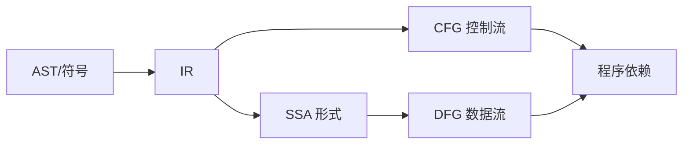
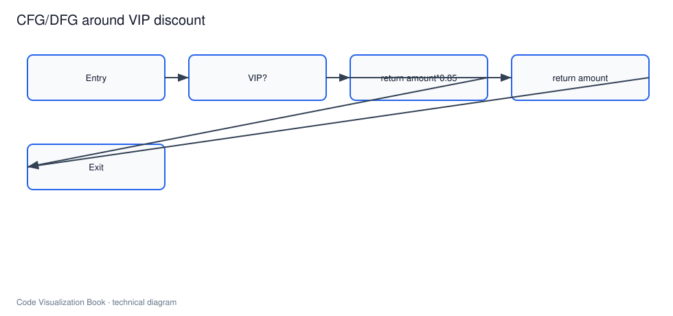
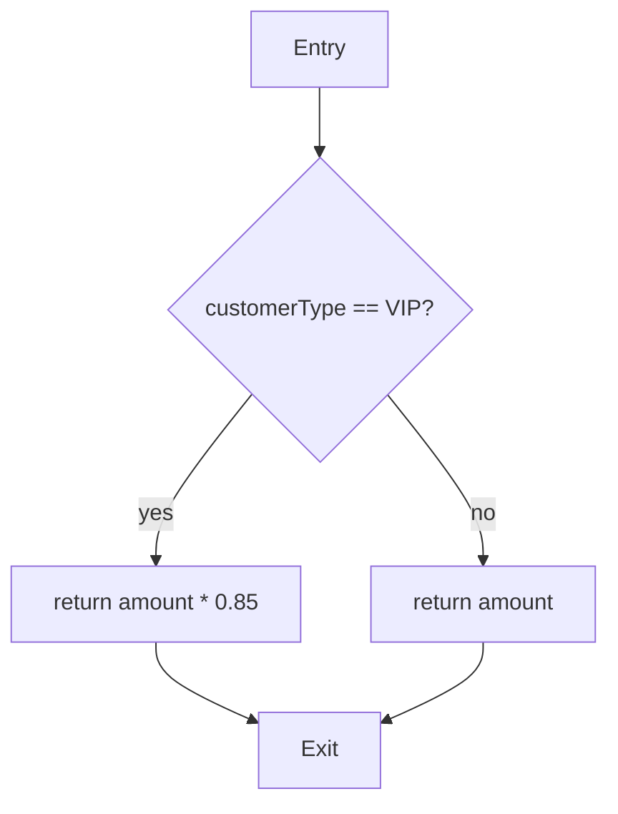

# IR、SSA、CFG 与 DFG

## 本章要解决的问题

如何表达程序路径和数据传播？CFG/DFG 对代码理解与 AI Review 有什么用？

## 读者读完应获得什么

1. 能解释 IR、SSA、CFG、DFG 的基本含义与关系。
2. 能对小函数画出控制流并指出数据依赖。
3. 能说明这些图如何服务风险路径与验证，而不是替代测试。

## 本章不讲什么

- 不讲完整编译优化流程。
- 不实现工业级指针分析。

---

AST 与符号回答“程序由什么构成、名字指向谁”。要回答“执行可能怎么走、数据如何传播”，需要控制流图（CFG）与数据流图（DFG），它们通常建立在中间表示（IR）之上。

## 概念地图




| 概念 | 回答的问题 |
| --- | --- |
| IR | 用更适合分析的形式表示程序 |
| CFG | 哪些基本块，如何分支/汇合 |
| SSA | 每个变量赋值如何唯一命名，便于数据流 |
| DFG | 值从哪里产生，流到哪里 |

## 最小例子：折扣计算

```java
public double apply(String customerType, double amount) {
 if ("VIP".equals(customerType)) {
 return amount * 0.85;
 }
 return amount;
}
```

简化 CFG：



数据依赖上：

- 返回值依赖 `amount`
- VIP 分支还依赖字面量 `0.85`
- 条件依赖 `customerType`

当 `PR-42` 修改 `0.9 -> 0.85` 时，变更点落在 VIP 分支的数据流上；相关测试正是在验证这条路径的输出。

## 为何对可视化有用

1. **路径解释**：展示“从入口到敏感操作”的可能路径
2. **影响细化**：区分改的是死代码还是热路径
3. **安全/校验审查**：DFG 支持污点传播直觉（输入是否到达危险点）
4. **AI Review 证据**：说明模型修改落在哪条路径的数据依赖上

## 与调用图的分工

| 图 | 粒度 | 典型用途 |
| --- | --- | --- |
| 调用图 | 方法间 | 影响面、上下文扩展 |
| CFG | 方法内控制 | 分支覆盖、路径风险 |
| DFG | 值依赖 | 数据传播、常量影响 |

`mini-shop` 的跨模块影响面主要靠调用图；单方法内折扣逻辑变化，则可用 CFG/DFG 解释“为什么测试断言会变”。

## 和 AI Agent 的关系

Agent 修改条件或字面量时，系统可附加：

- 受影响分支
- 相关返回值依赖
- 建议覆盖的测试路径

这比只说“改了一行”更可审。

## 局限

- 精确 CFG/DFG 代价高，别名与异常路径复杂。
- 动态分派让过程间分析变难。
- 对很多工程场景，先做好调用图 + 测试关联，再按需加深数据流。

## 小结

1. IR 为深度分析提供稳定表示。
2. CFG 描述控制可能，DFG 描述数据依赖。
3. 它们补全 AST/符号无法回答的路径问题。
4. 在 AI Review 中，路径与数据依赖是重要证据类型。

## 何时升级到 CFG/DFG

不是每个任务都要上控制流/数据流。建议阈值：

| 场景 | 是否需要 CFG/DFG |
| --- | --- |
| 找方法调用方 | 通常否，调用图即可 |
| 解释分支相关 bug | 需要 CFG |
| 输入是否到达敏感点 | 需要 DFG/污点 |
| 字面量/条件影响返回值 | 轻量 DFG 有帮助 |
| 仅更新测试断言 | 可能否 |

`PR-42` 改的是 VIP 分支字面量，用 CFG 标注分支、用数据依赖解释返回值变化，是合适深度；不必一上来上完整过程间指针分析。

## 工作示例：折扣字面量的数据依赖

对 VIP 分支：

```text
amount --DFG--> mul(amount, 0.85) --DFG--> return
customerType --CFG condition--> VIP branch
```

因此：

- 改 `0.85`：改变返回值数据依赖
- 改 VIP 判断条件：改变控制依赖
- 两者都会逼迫测试更新，但解释路径不同

在验证报告中写清“数据依赖变化”还是“控制依赖变化”，能帮助 Reviewer 更快抓住重点。

## 与调用图联合使用

CFG/DFG 解释方法内部，调用图解释方法之间。`PR-42` 的完整解释通常是：

```text
DFG: 0.9/0.85 -> apply return
CallGraph: apply <- calculateTotal <- createOrder <- create
Tests: PricingServiceTest, OrderServiceTest
```

## 关键要点复盘

围绕「IR、SSA、CFG 与 DFG」，读者离开本章前应能做到：

1. 用自己的话解释核心概念与边界
2. 在 `mini-shop` / `PR-42` 上指出对应实体、路径或产物
3. 说明它如何服务人或 AI 的具体决策
4. 列出至少两个局限或失败模式
5. 知道下一章将把它连接到哪一层能力

若任一做不到，请先复习本章例子与练习，再继续向后读。

## 教学用 CFG/DFG 记录格式

不必先上工业分析器，可用 JSON 记录方法内事实：

```json
{
  "method": "method:DiscountPolicy#apply",
  "cfg_blocks": [
    {"id": "B0", "text": "entry"},
    {"id": "B1", "text": "if VIP"},
    {"id": "B2", "text": "return amount * 0.85"},
    {"id": "B3", "text": "return amount"}
  ],
  "cfg_edges": [
    {"from": "B0", "to": "B1"},
    {"from": "B1", "to": "B2", "label": "VIP"},
    {"from": "B1", "to": "B3", "label": "else"}
  ],
  "dfg_edges": [
    {"from": "param:amount", "to": "mul:amount*0.85"},
    {"from": "mul:amount*0.85", "to": "return:B2"},
    {"from": "param:amount", "to": "return:B3"}
  ]
}
```

对 `PR-42`：

- 变更落在 `B2` 的字面量
- DFG 解释返回值变化
- 调用图解释谁消费该返回值

## 常见误解

| 误解 | 澄清 |
| --- | --- |
| CFG 就是流程图装饰 | CFG 是可达控制事实，服务路径与测试选择 |
| DFG 等于完整程序证明 | DFG 受别名/反射限制，是证据不是定理 |
| 有了调用图就不需要 CFG | 调用图跨方法，CFG 管方法内分支 |
| AI 可读源码所以不需要 IR | IR/路径事实让审计可机器检查 |


## 练习

1. 为 `DiscountPolicy.apply` 画出 CFG，并标出 VIP 分支上的数据依赖。
2. 说明 `PR-42` 修改字面量时，影响的是控制结构还是数据依赖（或两者）。
3. 举一个“有调用边但需要 DFG 才能解释风险”的例子（可用安全数据流直觉）。

## 延伸阅读与参考资料

- [CodeQL Data Flow Analysis](https://codeql.github.com/docs/writing-codeql-queries/about-data-flow-analysis/)：数据流分析官方说明。资料卡：`../docs/research-cards/rc-codeql-dataflow.md`
- [LLVM LangRef](https://llvm.org/docs/LangRef.html)：IR/SSA 工业参考。
- [Static Program Analysis (Møller & Schwartzbach)](https://cs.au.dk/~amoeller/spa/)：静态分析教材级公开资源。
- [Muchnick, Advanced Compiler Design & Implementation 概念](https://www.elsevier.com/books/advanced-compiler-design-implementation/muchnick/978-1-55860-320-2)：CFG/数据流经典背景。
- [WALA / analysis frameworks overview](https://github.com/wala/WALA)：过程间分析工程参考。
- 本书案例：[`examples/mini-shop/`](../examples/mini-shop/)。
