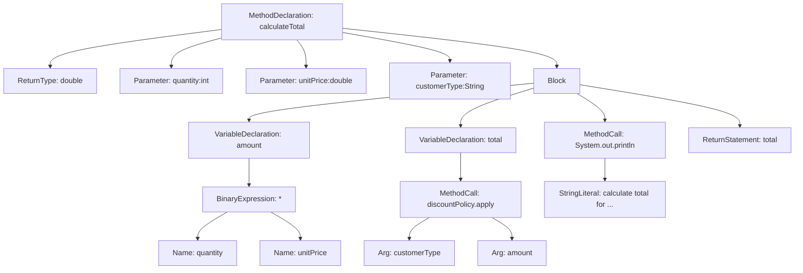
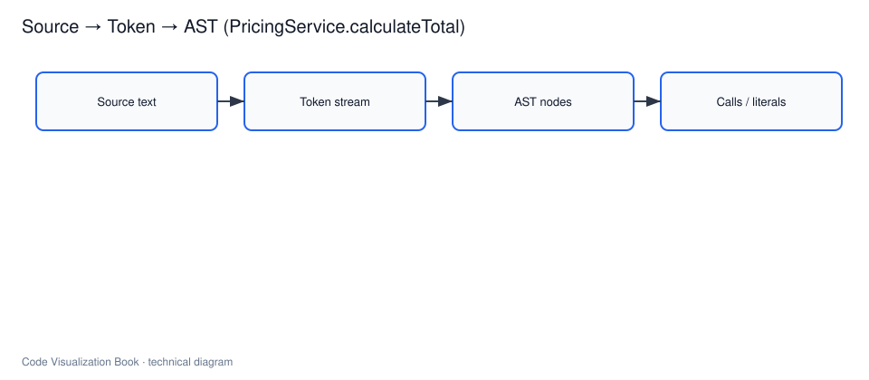

# 从字符到 AST

## 本章要解决的问题

为什么全文搜索和正则匹配无法稳定理解代码？AST 提供了什么结构化事实，又故意不提供什么？

## 读者读完应获得什么

1. 能解释 Token、Lexer、Parser、AST 在代码理解流水线中的位置。
2. 能对一个真实函数画出最小 AST，并说明哪些节点对可视化有用。
3. 能判断：哪些问题适合用 AST 解决，哪些必须交给符号表、调用图、运行时或测试证据。
4. 能说明 AI Agent 为什么不能只靠“读文本改文本”，而需要 AST 层结构事实。

## 本章不讲什么

- 不实现完整编译器或完整语言前端。
- 不展开所有 Parser 算法（递归下降、LR、GLR 等）。
- 不在本章解决符号绑定、类型推断、动态分派和运行时路径。
- 不把工具评测当主题；工具只作为可复现入口。

---

AST 是很多代码可视化系统和代码理解基础设施的第一层数据基础。它把源码从线性文本变成树形结构，让工具可以稳定定位声明、表达式、语句和调用。

如果说上一章建立了编译器视角，那么本章关注其中最常用的一段链路：

```text
字符流 -> Token 流 -> AST -> 后续分析输入
```

理解 AST 之后，后面讲符号解析、调用图、影响面分析和 Agent 上下文构建都会更自然。

本章使用全书贯穿案例 `mini-shop` 中的 `PricingService.calculateTotal` 作为主例子。完整源码见 [`examples/mini-shop/`](../examples/mini-shop/)。

## 为什么不能只做字符串搜索

假设我们要找出所有“真正调用 `calculateTotal`”的位置，或者判断某次修改是否动到了方法调用。最直接的方式是全文搜索 `calculate` 或 `calculateTotal(`，但很快会遇到误报和漏报。

`mini-shop` 里同时存在这些片段：

```java
// 真实方法声明
public double calculateTotal(int quantity, double unitPrice, String customerType) { ... }

// 真实方法调用
double total = pricingService.calculateTotal(quantity, unitPrice, customerType);

// 日志文本，不是调用
System.out.println("calculate total for " + customerType);

// 可能被字符串搜索误伤的注释
// TODO: calculate total offline for batch jobs
```

字符串搜索可能：

1. 把日志和注释当成调用。
2. 因换行、空格、链式调用漏掉真实调用。
3. 无法区分“方法声明”和“方法调用”。
4. 无法知道调用发生在哪个方法体内。

AST 的意义就在于：工具不再猜文本，而是基于语言结构识别：

- 这是一次方法调用表达式。
- 这是一个字符串字面量。
- 这是一个方法声明。
- 该节点位于哪个文件、哪一行、哪个父节点之下。

对 AI Agent 来说，这一点尤其关键。Agent 如果只靠文本片段做修改，很容易“改到了字面量，却以为改到了调用”。AST 层事实能把这类错误降到语法结构层面。

## 从字符到 Token

词法分析器（Lexer）把字符流切成 Token。Token 是语言的最小语法单元。

以 `calculateTotal` 方法签名中的片段为例：

```java
public double calculateTotal(int quantity, double unitPrice, String customerType)
```

词法分析会得到类似序列：

| Token 文本 | 大致类别 |
| --- | --- |
| `public` | 关键字 |
| `double` | 类型/关键字 |
| `calculateTotal` | 标识符 |
| `(` | 分隔符 |
| `int` | 类型/关键字 |
| `quantity` | 标识符 |
| `,` | 分隔符 |
| `double` | 类型/关键字 |
| `unitPrice` | 标识符 |
| `...` | ... |

Token 已经比裸字符串稳定：注释和空白通常不会进入核心 Token 序列，标识符和关键字也被分开了。但 Token 仍不足以表达程序结构，因为你还不知道：

- 哪些 Token 组成一个方法声明
- 哪些 Token 组成参数列表
- 哪些 Token 属于方法体里的表达式

因此还需要 Parser。

## 从 Token 到 AST

Parser 按语言语法规则把 Token 组织成树。不同工具可能生成不同形态：

- 更完整的语法树：保留大量标点和细粒度语法节点
- 更抽象的 AST：压缩对分析无用的细节，保留语义上重要的节点

对代码理解系统而言，通常更关心后一类：方法、参数、调用、返回、分支、字面量等。

`PricingService.calculateTotal` 的核心源码如下：

```java
public double calculateTotal(int quantity, double unitPrice, String customerType) {
 double amount = quantity * unitPrice;
 double total = discountPolicy.apply(customerType, amount);
 System.out.println("calculate total for " + customerType);
 return total;
}
```

它的最小 AST 可以画成：




> 后续 AI 配图备注：可生成一张“源码文本到 Token 再到 AST 树”的教学插图。左侧是 `calculateTotal` 源码，中间是 Token 列表，右侧是 AST 节点树；用颜色区分“方法调用节点”和“字符串字面量节点”，强调日志文本不是调用。

这棵树表达的是结构，不是排版。工具可以从根向下遍历，也可以按节点类型查询：

- 找所有 `MethodDeclaration`：得到方法列表
- 找所有 `MethodCall`：得到候选调用
- 找所有 `StringLiteral`：得到字符串常量，而不是调用

因此，日志里的 `"calculate total for ..."` 会落在字符串节点，而 `discountPolicy.apply(...)` 会落在方法调用节点。这就是 AST 相对字符串搜索的第一层优势。

## AST 节点里应保留什么

如果只把 AST 当“树长什么样”来看，后续系统仍然难用。面向代码图谱和可视化时，每个关键节点至少应保留：

```text
node_type
name / operator / literal_value
parent_relation
file_path
start_line / end_line
start_column / end_column
```

以方法调用 `discountPolicy.apply(customerType, amount)` 为例，抽取结果可以是：

```json
{
 "node_type": "MethodCall",
 "expression": "discountPolicy.apply",
 "method_name": "apply",
 "receiver": "discountPolicy",
 "arguments": ["customerType", "amount"],
 "file_path": "src/main/java/com/minishop/pricing/PricingService.java",
 "start_line": 14,
 "end_line": 14
}
```

这些字段看起来简单，却决定了后续能力：

1. 可视化需要行号，才能把图节点回跳到源码。
2. 影响面分析需要方法名和所属文件，才能把 Diff 映射到实体。
3. Agent 上下文需要结构化位置，才能说明“我改的是哪一个调用”。
4. Review 证据需要可追溯路径，而不是“模型认为相关”的模糊描述。

## AST 能回答的问题

AST 最适合回答结构性问题：

- 一个文件包含哪些类、方法和字段
- 一个方法的参数和返回类型文本是什么
- 方法体里有哪些变量声明、分支、循环和调用表达式
- 哪些地方使用了注解、装饰器或特定语法模式
- 哪些节点是字符串字面量，哪些节点是真正调用

在 `mini-shop` 上，仅凭 AST 就可以稳定得到：

```text
PricingService
 method calculateTotal(...)
 calls discountPolicy.apply(...)
 calls System.out.println(...)
 returns total
```

在可视化中，这些事实可以直接生成：

- 代码大纲 / 类结构树
- 方法内表达式树
- 候选调用列表
- 语法模式命中结果

它们也是后续构建调用图、数据流和变更实体映射的输入，而不是终点。

## AST 在自动化修改中的价值

AST 不只是“读代码”的数据源，也能用于更安全的自动修改。

对比两种改法：

| 方式 | 做法 | 风险 |
| --- | --- | --- |
| 字符串替换 | 全局替换 `0.9` 或 `calculate` | 容易误改注释、日志、文档、其他数字 |
| AST 修改 | 定位 `DiscountPolicy.apply` 方法体中的数值字面量节点 | 修改目标明确，可保留格式和周围结构 |

常见基于 AST 的能力包括：

- 批量修改 API 调用
- 自动迁移语法
- 识别危险模式
- 生成代码结构报告
- 做局部、可回放的重构

在 AI 时代，这一层更加重要。AI 生成补丁后，系统可以用 AST 做第一道校验：

1. 修改后文件是否仍能解析
2. 目标节点是否真的从声明/调用集合中发生变化
3. 是否误改了字符串字面量或其他无关节点

这不会证明业务正确，但能先挡住大量“语法级误改”。

## 一个最小抽取流程

对 `mini-shop` 做 AST 采集时，最小流程可以是：

```text
1. 扫描 src/main/java 与 src/test/java 下的 .java 文件
2. 对每个文件做 parse，失败则记录错误并继续
3. 遍历 AST，提取：
 - 类 / 接口声明
 - 方法声明
 - 方法调用表达式
 - 字面量（至少先保留字符串和数字）
4. 为每个节点附上 file_path 与行列位置
5. 输出 JSON，供图谱构建使用
```

一个面向后续图谱的最小方法节点可以长这样：

```json
{
 "id": "method:com.minishop.pricing.PricingService#calculateTotal",
 "type": "method",
 "name": "calculateTotal",
 "qualified_name": "com.minishop.pricing.PricingService.calculateTotal",
 "file_path": "src/main/java/com/minishop/pricing/PricingService.java",
 "start_line": 11,
 "end_line": 16,
 "parameters": [
 {"name": "quantity", "type_text": "int"},
 {"name": "unitPrice", "type_text": "double"},
 {"name": "customerType", "type_text": "String"}
 ],
 "return_type_text": "double",
 "calls": [
 {
 "method_name": "apply",
 "receiver_text": "discountPolicy",
 "line": 14
 },
 {
 "method_name": "println",
 "receiver_text": "System.out",
 "line": 15
 }
 ]
}
```

注意这里的 `calls` 还只是“候选调用”，不是已解析完成的精确调用边。`apply` 最终指向哪个方法定义，需要符号表和类型信息；本章只负责把调用表达式稳定挖出来。

## 权威定义与工程现实

在编译原理中，词法分析与语法分析把源程序变成可处理结构；AST 是后续语义分析与工具处理的常用起点。工程上，语言工具往往不会“从零手写完整编译器”，而是复用：

1. 语言官方 Compiler API（如 TypeScript）
2. 成熟 Parser 框架（ANTLR、tree-sitter）
3. 生态解析库（JavaParser）

对代码理解系统，关键不是复刻编译器后端，而是稳定获得：

- 节点类型
- 层级关系
- 源码位置
- 可遍历/可查询接口

因此本书把 AST 定义为**结构事实层的第一公民**，并要求后续图谱节点能回跳到 AST 位置证据。

## 局限

AST 很有用，但不是完整语义。它无法单独可靠回答：

1. 一个名字到底绑定到哪个定义
 `discountPolicy` 是字段、参数还是局部变量？需要符号表和作用域。
2. 一个调用最终可能分派到哪些实现
 接口、继承、重载会让“同名方法”有多条可能路径。
3. 某次调用是否在生产路径上真实发生
 这需要 Trace、日志或覆盖率等运行时证据。
4. 某次改动的工程影响有多大
 需要把 Diff 映射到实体，再沿调用图、测试关系和历史风险传播。
5. 用户输入是否经过校验后进入敏感操作
 这通常需要数据流 / 污点分析，而不是纯 AST 遍历。

所以正确位置是：

```text
AST = 结构事实层
符号/类型 = 名字与关系层
CFG/DFG/Call Graph = 路径与依赖层
Trace/Coverage/Git = 行为与演进证据层
```

AI Agent 如果停在 AST，它可能知道“这里有一个调用节点”，但仍不知道“该不该改、改完影响谁、该跑哪些测试”。

## 常见工具选择

不同生态有不同入口，选择标准应优先“可讲解、可复现”，而不是“最完整”：

| 工具 | 适合什么 | 需要注意 |
| --- | --- | --- |
| [Tree-sitter](https://tree-sitter.github.io/tree-sitter/) | 多语言、增量解析、编辑器/扫描器场景 | 语义信息较少，常需额外查询 |
| [JavaParser](https://javaparser.org/) | Java 教学和 Java 项目抽取 | 主要服务 Java 生态 |
| [ANTLR](https://www.antlr.org/) | 讲解 Lexer/Parser 规则如何工作 | 自己维护语法成本更高 |
| TypeScript Compiler API | TS/JS 项目中的结构与类型信息 | 更接近语言服务，而不只是纯 AST |
| Babel | JS/TS 变换与工程化改造 | 更偏转换管线 |

本书实践部分默认用 Java + 易解释的 AST 抽取路径，因为 `mini-shop` 的类型和声明结构足够清楚，方便从 AST 过渡到符号与调用图。

## 和 AI Agent 的关系

把 AST 放进 AI 编程链路，不是为了让模型“多看一点树”，而是为了提供可审计的结构约束。

对 `mini-shop` 的典型 Agent 任务“调整 VIP 折扣”：

错误路径：

```text
搜索文本 "0.9" 或 "calculate"
 -> 可能改到日志、注释或其他数字
 -> 不知道调用方和测试
```

更合理的路径：

```text
定位 DiscountPolicy.apply 的方法声明节点
 -> 确认数值字面量节点
 -> 提取相关调用表达式
 -> 后续再查符号、调用方、测试
 -> 生成可回放的修改与验证证据
```

因此，AST 在 AI 时代至少承担四类角色：

1. **定位层**：找到真正要改的语法节点
2. **校验层**：修改后是否仍可解析、目标节点是否变化
3. **抽取层**：为图谱和上下文包提供结构实体
4. **解释层**：向人和 Reviewer 说明“改的是声明还是字面量，还是调用”

AST 不会替代测试，也不会替代影响面分析；它只是让 Agent 从“文本补丁机”变成“能操作结构事实的修改器”的第一步。

## 小结

1. 字符串搜索处理的是文本外观；AST 处理的是语言结构。
2. Lexer 把字符变成 Token，Parser 把 Token 变成可遍历树。
3. 对代码理解系统而言，AST 节点必须带上类型、名称和源码位置。
4. AST 能稳定回答“有哪些声明和表达式”，但不能单独回答“名字指向谁、运行时是否走到、影响面多大”。
5. 在 AI 时代，AST 是 Agent 定位、校验和证据抽取的基础层，而不是完整的代码理解系统。

下一章将在 AST 之上补上名字与类型：符号表、作用域和引用关系。到那时，我们才能把 `discountPolicy.apply(...)` 从“一个调用表达式”推进到“一次指向具体定义的引用”。

## 关键要点复盘

围绕本章，读者离开前应能做到：

1. 说明为何不能只靠字符串搜索
2. 走通 Token→AST 与最小抽取流程
3. 在 mini-shop 上指出 AST 能/不能回答的问题
4. 选择 parser 时权衡增量与语义
5. 衔接到符号与类型

若任一做不到，请先复习本章例子与练习，再继续向后读。

## 练习

1. 打开 `PricingService.java`，列出 `calculateTotal` 的方法声明、变量声明、方法调用、字符串字面量节点。
2. 说明日志文本为何不应进入调用图候选边。
3. 设计 3 条 AST 级校验规则，用于检查 Agent 是否误改字符串字面量。
4. 对比 Tree-sitter 与 JavaParser 在“教学可复现/Java 语义便利”上的取舍（参考资料卡）。

## 常见问题：AST

### AST 能直接当调用图吗？

不能。调用边通常还要符号消解与类型信息。

### 选 Tree-sitter 还是 JavaParser？

看目标语言与是否需要语义；教学可用其一讲清流程。

## 本章检查清单

1. 能否说明字符串搜索的失败模式
2. 能否描述 Token→AST 最小流程
3. 能否指出 AST 对 PR-42 的边界

## 本章导航

- 上一章：[编译器视角下的代码结构](compiler-view.md)
- 下一章：[符号表、作用域与类型关系](symbols-scopes-types.md)
- 相关章：[静态分析](../part3/static-analysis.md)；[采集源码结构](../part6/collect-source-structure.md)

## 延伸阅读与参考资料

- [Tree-sitter](https://tree-sitter.github.io/tree-sitter/)：增量解析与具体语法树。资料卡：`../docs/research-cards/rc-tree-sitter.md`
- [ANTLR](https://www.antlr.org/)：语法规则驱动的前端构建。资料卡：`../docs/research-cards/rc-antlr.md`
- [JavaParser](https://javaparser.org/)：Java AST 访问、修改与位置信息。资料卡：`../docs/research-cards/rc-javaparser.md`
- [TypeScript Compiler API](https://github.com/microsoft/TypeScript/wiki/Using-the-Compiler-API)：结构与类型信息更接近语言服务。
- [Aho et al., Compilers (Dragon Book) 相关概念](https://www.amazon.com/Compilers-Principles-Techniques-Tools-2nd/dp/0321486811)：词法/语法分析经典教材背景（概念级）。
- [Eclipse JDT / Java model 文档入口](https://www.eclipse.org/jdt/)：IDE 结构模型的工程参考。
- 本书案例：[`examples/mini-shop/`](../examples/mini-shop/)；资料卡目录：[`../docs/research-cards/`](../docs/research-cards/)。
