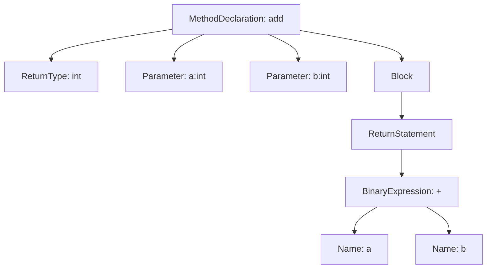

# 从字符到 AST

AST 是很多代码可视化工具的第一层数据基础。它把源码从线性文本变成树形结构，让工具可以稳定地定位声明、表达式、语句和调用。

如果说上一章建立了编译器视角，那么本章关注其中最常用的一段链路：从字符到 Token，再从 Token 到 AST。理解 AST 之后，后面讲符号解析、调用图、影响面分析和自动重构都会更自然。

## 为什么不能只做字符串搜索

假设我们想找出所有调用 `save` 方法的位置。最直接的方式是全文搜索 `save(`，但这很快会遇到误报和漏报：

```java
orderRepository.save(order);
log.info("save order");
this.<Order>save(order);
save(
    order
);
```

字符串搜索可能会匹配日志文本，也可能因为换行、泛型、链式调用或语言语法差异漏掉真实调用。更复杂的情况下，方法名可能来自静态导入、继承方法、函数变量或框架生成代码。

AST 的意义就在于：它让工具不再猜文本，而是基于语言结构识别“这是一次方法调用”“这是一个字符串字面量”“这是一个变量声明”。

## Token：最小语法单元

词法分析器会把字符流切分为 Token。Token 是语言的最小语法单元。以这段代码为例：

```java
public int add(int a, int b) {
    return a + b;
}
```

词法分析会识别出：

- `public`：关键字。
- `int`：关键字或基础类型标识。
- `add`：标识符。
- `(`、`)`、`{`、`}`：分隔符。
- `return`：关键字。
- `+`：操作符。

Token 还不足以表达程序结构，但它已经为语法分析提供了稳定输入。注释、空格和换行通常不会影响核心 Token 序列。

## Parser：按语法规则组织结构

Parser 会根据语言语法规则，把 Token 组织成树。不同工具可能生成不同形式的树：有些更接近完整语法树，保留大量标点和语法细节；有些更接近抽象语法树，只保留对分析有用的节点。

一个方法声明节点通常会包含：

- 方法名。
- 返回类型。
- 参数列表。
- 修饰符。
- 方法体。
- 源码位置。

方法体里又包含语句，语句里包含表达式，表达式里可能包含调用、字段访问、字面量和操作符。这样，源码就从一段文本变成了可遍历的数据结构。

## AST 的基本形态

AST 通常是一棵树：



这棵树表达的是代码结构，而不是排版格式。工具可以从根节点向下遍历，也可以查找特定类型的节点。例如查找所有 `MethodDeclaration`，就能得到文件里的方法列表；查找所有 `MethodCallExpr`，就能得到候选调用表达式。

> 后续 AI 配图备注：可生成一张“源码文本到 Token 再到 AST 树”的教学插图，左侧是 Java 小函数，中间是 Token 列表，右侧是 AST 节点树。

## AST 能回答的问题

AST 最适合回答结构性问题：

- 一个文件包含哪些类、接口、方法和字段。
- 一个方法的参数和返回类型是什么。
- 方法体里有哪些分支、循环和调用表达式。
- 哪些地方使用了某个注解或装饰器。
- 哪些代码符合某种语法模式。

在可视化中，AST 可以直接生成代码大纲、类结构树、语法节点图，也可以为后续分析提供输入。例如构建调用图时，第一步通常就是从 AST 中找出所有调用表达式。

## AST 在自动化重构中的价值

AST 不只是阅读工具的数据源，也能用于自动修改代码。相比字符串替换，基于 AST 的修改更安全。

比如要给所有 Controller 方法增加一个注解，字符串替换很容易误改注释或格式，而 AST 工具可以精确定位方法声明节点，并在正确位置插入注解。

常见基于 AST 的能力包括：

- 批量修改 API 调用。
- 自动迁移语法。
- 识别危险模式。
- 生成代码结构报告。
- 进行局部重构。

这类能力在 AI 时代也很重要。AI 生成的修改如果能通过 AST 层校验，就可以减少语法级误改。

## AST 的局限

AST 不是完整语义。它无法单独回答：

- 一个变量引用到底指向哪个定义。
- 一个接口调用最终可能分派到哪些实现。
- 某个调用是否真的在生产环境发生。
- 某段代码是否被测试覆盖。
- 某个用户输入是否经过校验后才进入数据库。

这些问题需要符号表、类型解析、控制流、数据流、运行时 Trace 和 Coverage 等信息。

因此，AST 是代码理解的第一层，不是全部。

## 常见工具选择

不同生态有不同选择：

- ANTLR：通过语法规则生成 Lexer 和 Parser，适合教学和自定义语言分析。
- Tree-sitter：支持增量解析和多语言生态，常用于编辑器、代码导航和轻量分析。
- JavaParser：面向 Java，适合提取类、方法、注解和调用表达式。
- Babel：常用于 JavaScript 解析、转换和插件生态。
- TypeScript Compiler API：可以获得 TypeScript 的 AST 和类型信息。

选择工具时，重点看五个问题：

1. 是否支持目标语言和版本。
2. 是否能容忍不完整代码。
3. 是否提供源码位置。
4. 是否支持类型或符号解析。
5. 是否适合增量更新。

如果目标是构建一个代码理解系统，源码位置和增量更新非常关键。没有源码位置，图节点无法跳回代码；没有增量更新，大仓库每次全量解析成本会很高。

## 一个最小抽取流程

一个简单 AST 抽取流程可以这样设计：

```text
扫描源码文件
  -> 解析为 AST
  -> 遍历声明节点
  -> 记录类、方法、字段
  -> 遍历调用表达式
  -> 记录候选调用边
  -> 输出节点表和边表
```

这里得到的调用边还只是候选关系，因为调用目标可能需要类型解析才能确认。但它已经足够支撑第一版代码结构图。

## 和 AI Agent 的关系

Agent 上下文工程需要知道“哪些文件和符号与任务相关”。AST 能提供最基础的索引：

- 某个类在哪个文件。
- 某个方法的源码范围。
- 某个方法里调用了哪些候选方法。
- 某个注解标记了哪些入口。
- 某个测试文件包含哪些测试用例。

这些结构化索引可以让 Agent 更快定位上下文，也可以让系统检查 AI 输出是否语法合法、是否修改了预期节点。

## 小结

AST 把源码从文本变成树，是代码可视化和代码理解系统的第一层数据基础。它适合定位结构、识别语法模式和支持自动化修改，但不负责完整语义和运行时事实。

下一章会在 AST 之上继续推进：当我们知道代码结构后，还需要知道名字指向谁、类型是什么、引用在哪里。这就是符号表、作用域和类型关系要解决的问题。

## 延伸阅读与参考资料

- [ANTLR](https://www.antlr.org/)：通过语法规则生成 Lexer 和 Parser。
- [Tree-sitter](https://tree-sitter.github.io/tree-sitter/)：适合编辑器和增量解析场景的解析器。
- [JavaParser](https://javaparser.org/)：Java 代码解析和 AST 分析工具。
- [Babel Parser](https://babeljs.io/docs/babel-parser)：JavaScript 生态常用解析器。
- [TypeScript Compiler API](https://github.com/microsoft/TypeScript/wiki/Using-the-Compiler-API)：TypeScript AST 和类型信息访问入口。
