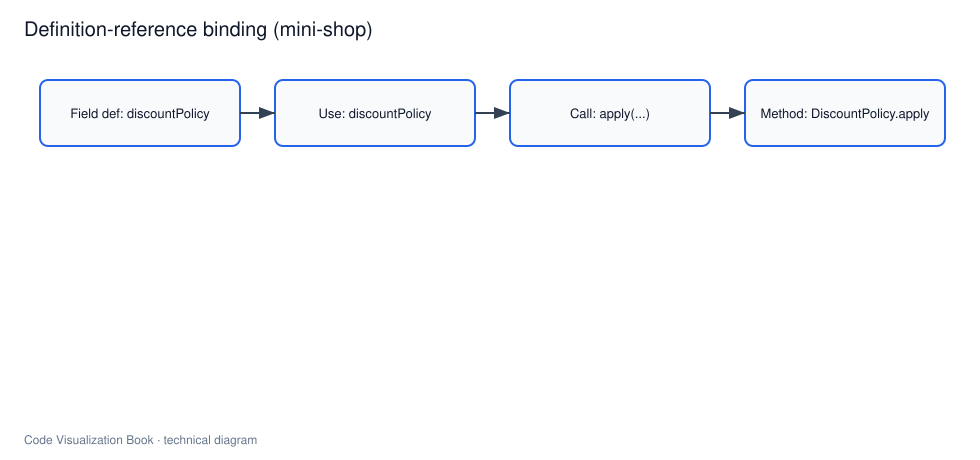

# 符号表、作用域与类型关系

## 本章要解决的问题

为什么有了 AST 还不够？名字、作用域和类型如何把“表达式”变成“可导航关系”？

## 读者读完应获得什么

1. 能解释符号、定义、引用、作用域、类型的基本关系。
2. 能说明 IDE“跳转到定义”背后需要哪些查询。
3. 能在 `mini-shop` 上区分同名文本与真实绑定。

## 本章不讲什么

- 不完整实现类型推断算法。
- 不覆盖所有 OOP/泛型边角。

---



AST 告诉我们“这里有一个名字、一次调用”，但还不能稳定回答：

- 这个名字定义在哪里？
- 它在当前作用域是否可见？
- 调用应绑定到哪个方法？

符号表、作用域和类型系统补的就是这一层。

## 定义与引用

以 `mini-shop` 为例：

```java
private final DiscountPolicy discountPolicy;

double total = discountPolicy.apply(customerType, amount);
```

- 定义：字段 `discountPolicy` 的声明
- 引用：方法体中的 `discountPolicy`
- 调用引用：`apply` 应绑定到 `DiscountPolicy.apply`

如果只有 AST，你只知道有一个标识符；有了符号信息，才能建立：

```text
ref:discountPolicy --resolves_to--> field:PricingService.discountPolicy
call:apply --resolves_to--> method:DiscountPolicy#apply
```

## 作用域

作用域决定名字可见性。常见层次：

```text
编译单元/文件
 -> 类/接口
 -> 方法
 -> 语句块
```

同名变量可以在不同作用域合法共存。代码理解系统必须按作用域解析，而不能全局字符串匹配。

## 类型关系

类型帮助消解重载、继承和接口实现：

- 方法参数类型影响重载选择
- 接口引用可能指向多个实现
- 泛型擦除/推断影响静态确定性

对可视化与影响面来说，类型关系至少应支持：

| 关系 | 用途 |
| --- | --- |
| extends / implements | 架构与层次图 |
| typed_as | 字段/参数/返回值 |
| overrides | 多态调用候选 |
| resolves_to | 精确或候选定义 |

## IDE 跳转背后的查询

“跳转到定义”通常不是魔法，而是：

```text
1. 定位光标处 AST 节点
2. 取标识符与上下文类型
3. 查符号表得到候选定义
4. 按作用域/类型排序消解
5. 跳到定义节点源码位置
```

“查找引用”则是反向索引：从定义找所有 resolves_to 边。

## 对调用图的影响

未做符号消解时，`apply(` 只能得到候选调用；完成消解后，`mini-shop` 可得到较可靠边：

```text
PricingService.calculateTotal -> DiscountPolicy.apply
OrderService.createOrder -> PricingService.calculateTotal
```

这对 `PR-42` 影响面分析是前提：变更实体必须能连到真实调用方。

## 和 AI Agent 的关系

Agent 若只搜索 `apply` 文本，可能误伤无关方法。更稳妥的上下文应包含：

- 目标符号 ID
- 定义位置
- 直接引用与调用方
- 类型与模块边界

也就是把符号层事实写进上下文包，而不是只贴源码片段。

## 局限

- 动态语言、反射、依赖注入会降低静态绑定精度。
- 跨项目/生成代码需要额外索引。
- 多实现多态时往往只能给候选集，不能假装唯一确定。

## 小结

1. AST 给结构，符号与类型给绑定。
2. 作用域是正确解析名字的前提。
3. 定义-引用关系是 IDE、调用图和影响面的共同基础。
4. Agent 上下文应使用符号 ID，而不是裸字符串。

## 解析不确定时的工程策略

当静态绑定无法唯一确定时，系统不应假装唯一：

```text
resolves_to candidates = [ImplA.m, ImplB.m]
confidence = medium
reason = polymorphic_receiver
```

对影响面，这意味着路径要按候选集合扩展；对 Agent，这意味着修改前要更高确认级别。把不确定性藏起来，比“查不到”更危险。

## mini-shop 中的绑定练习

- `discountPolicy`：字段定义在 `PricingService`
- `apply`：绑定到 `DiscountPolicy.apply`
- `save`：绑定到 `OrderRepository.save`，不能与日志文本混淆

这三条是后续调用图与 PR-42 影响面的前提。

## 关键要点复盘

围绕「符号表、作用域与类型关系」，读者离开本章前应能做到：

1. 用自己的话解释核心概念与边界
2. 在 `mini-shop` / `PR-42` 上指出对应实体、路径或产物
3. 说明它如何服务人或 AI 的具体决策
4. 列出至少两个局限或失败模式
5. 知道下一章将把它连接到哪一层能力

若任一做不到，请先复习本章例子与练习，再继续向后读。

## 练习

1. 在 `PricingService` 中标出 `discountPolicy` 的定义点与引用点。
2. 说明为何“同名 apply”不能直接当精确调用边。
3. 用 LSP 的 go-to-definition / find-references 类比，写出图谱应支持的两条查询。

## 延伸阅读与参考资料

- [JLS §6 Names](https://docs.oracle.com/javase/specs/jls/se17/html/jls-6.html)：名称与作用域一级规则。资料卡：`../docs/research-cards/rc-jls-names.md`
- [Language Server Protocol](https://microsoft.github.io/language-server-protocol/)：定义/引用查询的协议化。资料卡：`../docs/research-cards/rc-lsp.md`
- [TypeScript Compiler API](https://github.com/microsoft/TypeScript/wiki/Using-the-Compiler-API)：类型与符号信息工程入口。
- [JavaParser Symbol Solver 相关文档](https://javaparser.org/)：Java 符号解析实践。
- [Oracle Java Tutorials: Packages/Names](https://docs.oracle.com/javase/tutorial/java/package/index.html)：包与可见性基础。
- 本书案例：[`examples/mini-shop/`](../examples/mini-shop/)。
