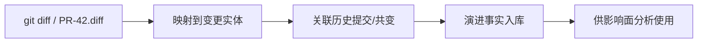

# 变更分析：系统是如何演进的

## 本章要解决的问题

Git/PR 历史如何成为代码理解事实？如何识别热点与变更耦合？

## 读者读完应获得什么

1. 能把 Diff/Commit/PR 映射到代码实体。
2. 能解释变更频率、共变和风险的基本用法。
3. 能用 `PR-42` 说明演进事实如何进入影响面。

## 本章不讲什么

- 不做完整代码考古产品。
- 不依赖真实公司仓库数据。

---

代码理解不只看“现在是什么”，还要看“如何变成这样”。变更分析把版本历史变成可查询事实。

## 核心对象

| 对象 | 字段例子 | 用途 |
| --- | --- | --- |
| Commit | author, time, message | 责任与时间线 |
| Diff | file, line range, type | 映射变更实体 |
| PR | reviewers, labels, checks | 流程上下文 |
| EntityChange | method/class change count | 热点 |
| CoChange | files/methods changed together | 隐式耦合 |

## 从 Diff 到实体

`PR-42` Diff：

```diff
- return amount * 0.9;
+ return amount * 0.85;
```

映射结果：

```text
changed_entity = method:DiscountPolicy#apply
file = DiscountPolicy.java
line = 6
```

只有映射到实体，后续才能沿调用图扩展影响面。样例见 [`examples/mini-shop/artifacts/pr-42.diff`](../examples/mini-shop/artifacts/pr-42.diff)。

## 变更耦合与热点

若历史中 `DiscountPolicy` 与 `PricingServiceTest` 经常同 PR 修改，说明存在验证耦合；这可以提示 Agent：改折扣时默认带上测试文件。

可视化上常用：

- 热点文件柱状/热力
- 共变矩阵
- 实体变更时间线

## 风险直觉

高风险常来自组合信号：

1. 变更落在核心调用链
2. 相关测试少或断言脆弱
3. 历史缺陷密集
4. 跨模块共变突然增加

`PR-42` 虽是单字面量修改，但落在金额链路上，因此风险不是“低到可忽略”。

## 和 AI 的关系

Agent 可用变更事实做：

- 优先阅读近期共变文件
- 避开长期稳定且无测试的高危区时提高确认级别
- 在验证报告中引用历史缺陷密度（若有）

## 变更分析流水线



对 `PR-42`，映射金标是 `method:DiscountPolicy#apply`，而不是停在文件路径。


变更分析把时间维引进来。没有它，图谱只是当前快照；有了它，你才能问“谁总是和折扣逻辑一起改”“这次 diff 到底碰到了哪个方法实体”。工程上最容易偷懒的一步，是停留在文件级变更——`DiscountPolicy.java` 被改了——却不映射到 `method:DiscountPolicy#apply`。后面的影响面、测试选择和 Agent 上下文都会因此变粗。

`pr-42.diff` 之所以适合做金标，是因为它足够小，却逼你完成“行 → 实体 → 关系”的完整映射。做不到这一步，所谓演进分析只是 git log 美化。


## 局限

- 历史噪声大，重命名会切断实体轨迹
- 提交质量影响信号
- 需要实体稳定 ID 与重命名追踪

## 小结

1. 变更是一等事实，不只是日志。
2. Diff 必须映射到代码实体。
3. 热点与共变帮助发现隐式结构。
4. 影响面与 Agent 上下文都应消费演进信号。

## 进阶要点：实体稳定 ID 与重命名

演进分析最怕实体 ID 漂移。推荐：

1. 优先 `package.Class#method` 这类逻辑 ID
2. 保留文件路径与行号作证据，不把路径当唯一身份
3. 检测重命名事件时，建立 old_id -> new_id 映射

否则“热点方法”时间序列会在一次 rename 后归零，误导治理判断。

## 工作示例：PR-42 的演进事实记录

建议把一次 PR 记为：

```json
{
 "pr": "PR-42",
 "entity_changes": [
 {"entity": "method:DiscountPolicy#apply", "change": "literal_update", "from": 0.9, "to": 0.85}
 ],
 "likely_cochange": [
 "test:PricingServiceTest#shouldApplyVipDiscount",
 "test:OrderServiceTest#shouldCreateVipOrderWithDiscount"
 ]
}
```

下一次若有人再次修改折扣策略，系统应提示：历史共变显示测试几乎总是一起改。这对 Agent 上下文选择是强信号。

## 演进度量（教学用最小集）

1. 实体变更频率
2. 共变对支持度
3. 缺陷关联次数（若有）
4. 最近变更年龄

不必一开始就上复杂算法；先让这些字段进图谱。

## 常见问题：变更分析

### Commit 消息能否代替结构映射？

不能。消息不可靠，必须映射到实体。

### 重命名怎么处理？

需要 old_id 到 new_id 的映射，否则热点统计失真。

### 变更耦合高一定是坏味道吗？

不一定，但要能解释；无解释的高耦合常是隐式架构。

## 本章检查清单

1. Diff 是否映射实体
2. 是否记录共变
3. 是否保留 PR 元数据
4. ID 是否稳定
5. 能否服务影响面与上下文

## 关键要点复盘

围绕「变更分析：系统是如何演进的」，读者离开本章前应能做到：

1. 把 diff 映射到方法级变更实体
2. 给出 PR-42 金标实体 ID
3. 区分行为变更与纯重构
4. 说明演进事实如何服务影响面
5. 衔接到代码图谱模型

若任一做不到，请先复习本章例子与练习，再继续向后读。

## Diff 到变更实体算法骨架

```text
input: pr-42.diff, code-graph.json
for each changed file/hunk:
  map lines -> enclosing method/class via graph or AST ranges
  emit changed_entity {id, change_type, file, lines}
dedupe entities
attach related edges for downstream impact
```

对 `PR-42`，金标输出应包含且优先聚焦：

```json
{"id": "method:DiscountPolicy#apply", "change_type": "modified"}
```

若只输出文件级 `DiscountPolicy.java`，后续影响面与测试关联会变粗，Review 成本上升。

## 变更分类

| 类型 | 例子 | 影响面策略 |
| --- | --- | --- |
| 行为字面量 | 0.9→0.85 | 必做路径+测试 |
| 纯重构重命名 | 变量改名 | 重点看绑定保持 |
| 注释/格式 | 无语义 | 可降级 |
| 测试更新 | 断言调整 | 核对是否覆盖变更路径 |


## 练习

1. 把 `pr-42.diff` 映射为变更实体，并写出实体 ID。
2. 设计两个变更耦合指标，解释它们对 Agent 上下文选择的帮助。
3. 说明重命名如何破坏“实体稳定 ID”，以及如何缓解。

## 本章导航

- 上一章：[动态分析：运行起来之后才能知道什么](dynamic-analysis.md)
- 下一章：[代码图谱：节点、边与属性](code-graph-model.md)
- 相关章：[变更影响分析与验证](../part4/change-impact-verification.md)；[构建代码图谱](../part6/build-code-graph.md)

## 延伸阅读与参考资料

- [Git diff](https://git-scm.com/docs/git-diff)：行级变更输入。资料卡：`../docs/research-cards/rc-git-diff.md`
- [Conventional Commits](https://www.conventionalcommits.org/)：提交语义化（可选增强）。
- [CodeScene hotspots 概念](https://codescene.com/blog/hotspot-analysis/)：热点与演进可视化思路。
- [GitHub pull request docs](https://docs.github.com/en/pull-requests)：PR 作为协作与检查载体。
- [Software evolution / mining repositories 研究入口](https://ieeexplore.ieee.org/)（检索 MSR mining software repositories）。
- 本书案例：[`examples/mini-shop/artifacts/pr-42.diff`](../examples/mini-shop/artifacts/pr-42.diff)。
