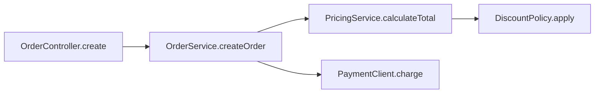
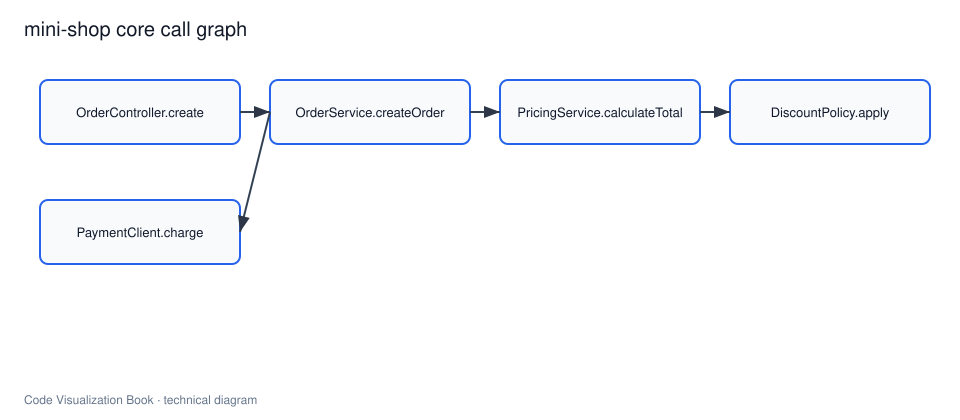

# 代码图谱：节点、边与属性

## 本章要解决的问题

代码事实如何被建模成统一图谱？最小模型需要哪些节点与边？

## 读者读完应获得什么

1. 能为 `mini-shop` 定义节点、边和关键属性。
2. 能写出 3 到 5 个有工程价值的查询。
3. 能在 JSON/SQLite 与图数据库之间做取舍。

## 本章不讲什么

- 不绑定唯一图数据库产品。
- 不追求一次覆盖所有语言语义。

---

代码图谱是软件理解系统的核心数据层。它把结构、关系、行为、演进和组织事实放到可查询模型中。

## 最小 schema

### 节点类型

- `module` / `file` / `class` / `method` / `test`
- 可扩展：`route`、`config`、`pr`、`owner`

### 边类型

- `contains`、`calls`、`tests`、`depends_on`
- 可扩展：`covers`、`owns`、`changed_in`

### 关键属性

```text
id, name, qualified_name
file_path, start_line, end_line
source, confidence, updated_at
```

## mini-shop 实例

完整样例：[`examples/mini-shop/artifacts/code-graph.json`](../examples/mini-shop/artifacts/code-graph.json)

核心调用链：




## 有工程价值的查询

1. **find_symbol**
 `DiscountPolicy.apply` 定义在哪？
2. **find_callers**
 谁调用了 `DiscountPolicy.apply`？
3. **impact_analysis**
 从变更方法出发的反向路径与入口？
4. **related_tests**
 哪些测试覆盖该调用链？
5. **architecture_rules**
 `pricing` 是否依赖 `payment`？

这些查询直接服务 PR 影响面和 Agent 上下文包。

## 存储取舍

| 方案 | 优点 | 适用 |
| --- | --- | --- |
| JSON 文件 | 简单可讲解 | 教学与最小原型 |
| SQLite | 可 SQL 查询、易分发 | 本地工具 |
| 图数据库 | 深层路径与图算法 | 大规模扩展 |

本书实践优先 JSON/SQLite 讲清模型，图数据库作为扩展。

## 多源融合原则

同一条 `calls` 边可能来自静态解析或动态观测。属性中应保留：

- `source`
- `confidence`
- `evidence_refs`

冲突时按策略合并，而不是静默覆盖。

## 局限

- 模型过粗会丢关键语义，过细会难维护
- ID 稳定性决定演进分析能否成立
- 查询性能与增量更新需要工程投入

## 小结

1. 代码图谱用节点/边/属性统一软件事实。
2. 最小模型即可支撑影响面与 Agent 查询。
3. 查询设计应先于可视化炫技。
4. 存储选择服务可复现，而不是先追求规模。

## 查询体验的最低标准

图谱是否成功，不看节点数，而看能否在 3 次查询内回答：

1. 这个符号在哪？
2. 谁调用它？
3. 哪些测试锁住它？

对 `DiscountPolicy.apply`，金标答案应稳定可复现。若三次查询仍要靠全文搜索碰运气，说明模型或索引未达标。

## 工作示例：五个金标查询

| 查询 | 期望 |
| --- | --- |
| find_symbol(DiscountPolicy.apply) | method 节点 + 文件行号 |
| find_callers(apply) | calculateTotal |
| find_callees(createOrder) | calculateTotal, charge, save |
| related_tests(apply) | PricingServiceTest, OrderServiceTest |
| architecture_rules(pricing) | pricing-no-payment = pass |

把这五条做成自动化契约测试，实践项目就不会“看起来有图、其实不可用”。

## 常见问题：代码图谱模型

### 必须上图数据库吗？

教学与早期不必；模型正确优先。

### 边太多怎么办？

分层、过滤、任务子图，而不是一次画完。

### 如何防止假精确？

低置信与 unresolved 必须保留。

## 本章检查清单

1. 节点/边/属性是否完整
2. 是否有证据字段
3. 金标查询是否可过
4. 存储取舍是否说明

## 关键要点复盘

围绕「代码图谱：节点、边与属性」，读者离开本章前应能做到：

1. 用自己的话解释核心概念与边界
2. 在 `mini-shop` / `PR-42` 上指出对应实体、路径或产物
3. 说明它如何服务人或 AI 的具体决策
4. 列出至少两个局限或失败模式
5. 知道下一章将把它连接到哪一层能力

若任一做不到，请先复习本章例子与练习，再继续向后读。

## 练习

1. 为 `mini-shop` 写出 5 个查询及其预期结果。
2. 设计 `calls` 边的属性：source/confidence/evidence。
3. 比较 JSON 与 SQLite 在教学原型中的优劣。

## 延伸阅读与参考资料

- [Neo4j data modeling](https://neo4j.com/docs/getting-started/data-modeling/)：图建模基础。资料卡：`../docs/research-cards/rc-neo4j-modeling.md`
- [SQLite docs](https://www.sqlite.org/docs.html)：本地可查询存储。资料卡：`../docs/research-cards/rc-sqlite.md`
- [Joern Code Property Graph](https://docs.joern.io/code-property-graph/)：代码属性图概念。
- [Graph Data models overview (academic/engineering surveys)](https://neo4j.com/blog/)：图模型取舍补充阅读。
- [LSP](https://microsoft.github.io/language-server-protocol/)：符号索引与查询能力对照。资料卡：`../docs/research-cards/rc-lsp.md`
- 本书样例：[`examples/mini-shop/artifacts/code-graph.json`](../examples/mini-shop/artifacts/code-graph.json)。
