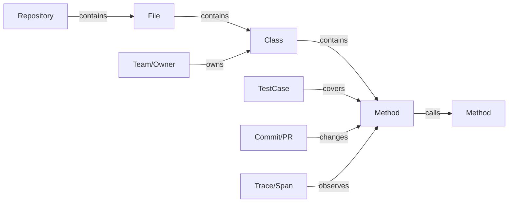

# 代码图谱：节点、边与属性

代码图谱是把代码事实组织成可查询模型的一种方式。它不只是画图，而是把源码结构、程序分析、运行时数据、变更历史和组织信息统一到同一套节点、边和属性里。

如果说前几章分别介绍了静态、动态和变更数据，那么代码图谱要做的就是把这些数据连接起来。它让系统可以回答跨数据源的问题：这次变更影响哪些入口，相关测试是什么，是否处于高频运行路径，哪个团队负责，历史上是否频繁出问题。

## 图谱的基本模型

一个图由节点和边组成。节点表示实体，边表示实体之间的关系，属性描述节点或边的状态。

在代码图谱中，节点可以是代码实体，也可以是运行时实体、变更实体和组织实体。边可以来自语法结构、调用关系、依赖关系、测试覆盖、运行时 Trace 或 Git 历史。

代码图谱的目标不是把所有东西都画出来，而是建立一个统一事实层。图只是它的一种输出方式。

> 后续 AI 配图备注：可生成一张“代码图谱节点和边”的海报式解释图，节点颜色区分代码、测试、运行时、变更、组织五类实体。

## 节点设计

常见节点包括：

- Repository：仓库。
- Module：模块或子项目。
- Package：包或命名空间。
- File：文件。
- Class / Interface：类和接口。
- Method / Function：方法和函数。
- Route / API：接口入口。
- Service：服务或应用。
- DatabaseTable：数据库表。
- MessageTopic：消息 topic。
- TestCase：测试用例。
- PullRequest / Commit：变更记录。
- Team / Owner：团队或负责人。

节点粒度要服务问题。影响面分析通常需要方法级节点，架构治理通常需要模块和服务级节点，AI 上下文工程则需要文件、符号、调用路径和测试节点共同参与。

如果粒度太粗，无法定位具体影响；如果粒度太细，图会过大且难以解释。实践中常用多层建模：从服务到模块，从模块到文件，从文件到类和方法。

## 边设计

边表示实体之间的关系。常见边包括：

- `contains`：包含关系，例如文件包含类，类包含方法。
- `imports`：导入关系。
- `depends_on`：模块或服务依赖。
- `calls`：方法调用。
- `references`：引用某个符号。
- `extends`：继承关系。
- `implements`：实现关系。
- `reads` / `writes`：读写资源或字段。
- `covers`：测试覆盖代码。
- `changes`：提交或 PR 修改代码实体。
- `co_changes_with`：文件或模块经常共同变更。
- `owns`：团队或 owner 负责某实体。

边必须有类型和方向。`A calls B` 和 `B calls A` 的含义完全不同。调用边、依赖边、覆盖边和拥有边也不应该混成一种关系。

边还可以带属性，例如调用次数、平均耗时、置信度、来源、最后更新时间。

## 属性设计

属性让图谱不仅表达结构，也表达状态和风险。

节点属性可以包括：

- 源码路径和行号。
- 复杂度。
- 覆盖率。
- 变更频率。
- 最近修改时间。
- 主要作者。
- 运行时耗时。
- 错误率。
- 风险等级。

边属性可以包括：

- 关系来源：静态解析、运行时 Trace、配置推断、人工标注。
- 置信度。
- 观察次数。
- 平均耗时。
- 首次出现和最后出现时间。

属性是从“结构图”走向“证据图”的关键。同样是一个调用边，如果它是生产高频路径，含义就不同于只在测试中出现的调用边。

## 多源数据如何融合

代码图谱要处理来自不同系统的数据。一个方法节点可能来自 AST，一个调用边可能来自静态分析，一个运行时耗时属性来自 Trace，一个覆盖关系来自测试报告，一个 owner 来自代码所有权配置。

融合时要解决三个问题：

1. 身份匹配：不同数据源如何指向同一个实体。
2. 时间同步：数据是否来自同一个版本或时间窗口。
3. 证据来源：某个关系或属性来自哪里，是否可信。

例如方法签名变化后，历史 Coverage 和当前源码如何对应；文件重命名后，Git 历史是否还能追踪；服务改名后，Trace 中的服务名如何映射到仓库模块。这些都是工程实现中必须处理的问题。

## 存储选择

小型系统可以用 JSON、SQLite 或关系数据库保存节点表和边表。这样实现简单，便于教学和调试。

大型系统可以考虑图数据库或专门的索引服务。图数据库适合多跳关系查询，例如查找从变更方法到业务入口的路径。但图数据库也会带来运维、建模和性能成本。

选择存储时，不要只看“图谱”这个词。关键问题是：

- 查询模式是什么。
- 数据规模多大。
- 是否需要增量更新。
- 是否需要多版本对比。
- 是否需要和 CI、IDE、Agent 工具集成。

实践项目可以先用简单存储验证模型，等查询复杂度上升后再换更强的后端。

## 查询能力

代码图谱至少应该支持几类查询：

- 查符号：某个类或方法在哪里定义。
- 查调用方：谁调用了目标方法。
- 查被调用方：目标方法依赖哪些下游。
- 查路径：从入口到目标方法有哪些路径。
- 查影响面：某次变更可能影响哪些入口和测试。
- 查 owner：哪个团队负责目标代码。
- 查风险：目标代码是否高复杂度、低覆盖、高频变更。

这些查询既可以服务人类界面，也可以服务 AI Agent。

## 代码图谱与普通关系图的区别

普通关系图通常是一次性展示结果，代码图谱是可持续维护的事实层。

普通图回答“看起来有什么关系”，代码图谱回答“系统里有哪些可查询的事实”。它可以生成可视化视图，也可以输出报告、推荐测试、检查架构规则、支持 Agent 查询。

因此，代码图谱不应该只被设计成前端图形。它需要稳定 ID、数据来源、更新时间、查询接口和增量更新机制。

## 和 AI Agent 的关系

对 AI Agent 来说，代码图谱是上下文压缩和结构化查询层。

Agent 可以用图谱回答：

- 这个任务相关文件有哪些。
- 目标方法的调用方是谁。
- 这次修改影响哪些测试。
- 是否跨越架构边界。
- 哪些历史 PR 和目标代码相关。

相比把整个仓库塞进上下文，图谱查询更可控，也更容易审计。Agent 查过什么、依据哪些边做出判断，都可以记录下来，作为 Review 的一部分。

## 小结

代码图谱把静态结构、动态运行、变更历史和组织信息组织成统一事实层。节点、边和属性不是为了画一张大图，而是为了支持查询、解释和验证。

下一章会讨论如何把图谱和分析结果表达给人：可视化不应停留在漂亮图形，而要变成可追溯的工程证据。

## 延伸阅读与参考资料

- [Backstage Catalog Graph](https://backstage.io/docs/features/software-catalog/creating-the-catalog-graph/)：软件目录中实体关系图的参考。
- [CodeQL About CodeQL](https://codeql.github.com/docs/codeql-overview/about-codeql/)：把代码建模成可查询数据库的代表性工具。
- [Neo4j Graph Data Modeling](https://neo4j.com/docs/getting-started/data-modeling/)：图数据建模基础参考。
- [OpenTelemetry Traces](https://opentelemetry.io/docs/concepts/signals/traces/)：运行时 Trace 如何进入图谱的参考。
