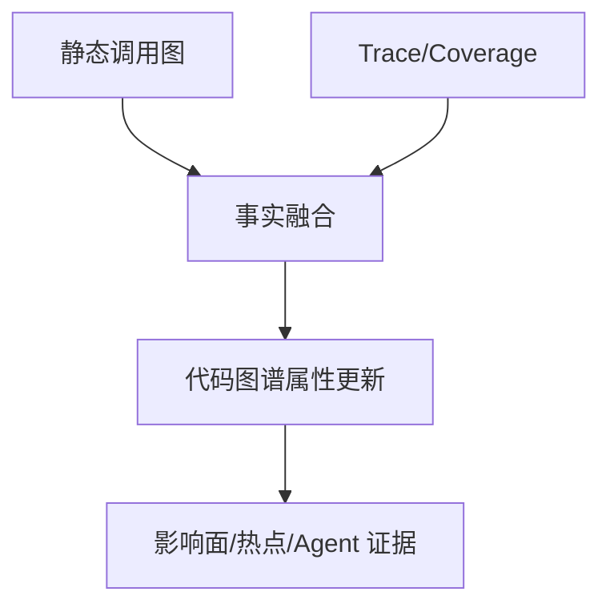

# 动态分析：运行起来之后才能知道什么

## 本章要解决的问题

运行时证据补足了哪些静态分析盲区？如何把 Trace/Coverage 连回代码实体？

## 读者读完应获得什么

1. 能说明 Log、Trace、Profile、Coverage 的分工。
2. 能设计“请求路径 -> 方法实体”的关联方式。
3. 能判断何时必须引入动态证据。

## 本章不讲什么

- 不讲具体 APM 产品选型大全。
- 不部署完整观测平台。

---

静态分析回答“可能怎样”，动态分析回答“实际怎样”。对代码理解系统，动态事实用于验证、降噪和风险判断。

## 主要动态信号

| 信号 | 说明 | 连回代码的关键字段 |
| --- | --- | --- |
| Log | 事件与错误信息 | logger 名称、堆栈 |
| Trace/Span | 分布式请求链路 | span 名、代码属性 |
| Coverage | 测试/线上覆盖 | 文件行号、方法 |
| Profile | CPU/内存热点 | 栈帧符号 |
| Runtime call | 实际调用采样 | 调用对 |

## 与静态事实融合



示例：静态显示 `createOrder -> calculateTotal -> apply` 可能发生；若集成测试覆盖了 VIP 订单路径，则可为这些边标记 `covered_by_test=true`。

## 关联方法

要把 Span 连到 `mini-shop` 方法，常见做法：

1. 约定 span 名与方法全名一致
2. 使用 OpenTelemetry code 属性
3. 通过堆栈采样映射符号
4. 用覆盖率行号映射到方法区间

没有稳定映射，动态数据就只是另一套孤立监控，无法进入代码图谱。

## 何时必须用动态证据

- 静态调用不可见（反射、插件）
- 需要知道生产热路径
- 评估“改动是否落在高频路径”
- 验证 AI 修改后行为是否保持

对 `PR-42`，本地测试覆盖已能提供强证据；若在生产调整折扣策略，还应用 Trace/业务指标观察支付金额分布变化。

## mini-shop 的动态证据示例

假设为 `OrderServiceTest.shouldCreateVipOrderWithDiscount` 打开覆盖率，可得到：

```text
covered methods:
 OrderService.createOrder
 PricingService.calculateTotal
 DiscountPolicy.apply
 PaymentClient.charge
```

于是在图谱中可为这些方法/边写入：

```json
{
 "coverage": {
 "test": "test:OrderServiceTest#shouldCreateVipOrderWithDiscount",
 "covered_entities": [
 "method:OrderService#createOrder",
 "method:PricingService#calculateTotal",
 "method:DiscountPolicy#apply",
 "method:PaymentClient#charge"
 ]
 }
}
```

当 `PR-42` 修改 `apply` 时，动态/测试证据能说明：该变更不仅静态可达，而且已被现有测试路径执行到。这对 AI 修改后的验证特别有价值。

## 局限

- 覆盖受输入与环境限制，未见不等于不可能
- 采样有偏差
- 运行时探针有成本

## 小结

1. 动态分析补齐真实路径与热点。
2. 关键是把运行时信号映射回代码实体。
3. 与静态图融合后才能服务影响面和治理。
4. AI 验证常需“静态影响面 + 动态/测试证据”组合。

## 动态事实进入图谱的最小 schema

建议至少写入这些属性：

```json
{
 "edge_id": "calls:createOrder->calculateTotal",
 "runtime": {
 "seen_in_trace": true,
 "trace_ids": ["tr_demo_001"],
 "covered_by_tests": ["test:OrderServiceTest#shouldCreateVipOrderWithDiscount"],
 "last_seen_at": "2026-07-22T10:00:00Z"
 }
}
```

没有这些字段，动态数据就只是另一套监控面板，无法与 PR 影响面、Agent 上下文共用。

## 与 AI 验证的结合

Agent 修改后，除了静态影响面，还应尽量给出：

1. 相关测试是否执行到变更实体
2. 若有预发 Trace，热路径是否包含变更方法
3. 若无动态证据，报告需显式写“动态证据缺失”

对 `PR-42`，本地测试覆盖已能形成强证据；缺少线上 Trace 并不阻断合并，但应降低“生产无影响”的表述强度。

## 工作示例：测试覆盖回写

执行 `OrderServiceTest` 后：

```text
covered:
 OrderController? no (单测直接调 service)
 OrderService.createOrder yes
 PricingService.calculateTotal yes
 DiscountPolicy.apply yes
 PaymentClient.charge yes
```

于是 `PR-42` 相关测试推荐不应只给 pricing 单测，也应包含 order 单测——因为行为断言建立在链路上。动态/测试证据纠正了“只看变更文件”的偏见。

## 关键要点复盘

围绕「动态分析：运行起来之后才能知道什么」，读者离开本章前应能做到：

1. 用自己的话解释核心概念与边界
2. 在 `mini-shop` / `PR-42` 上指出对应实体、路径或产物
3. 说明它如何服务人或 AI 的具体决策
4. 列出至少两个局限或失败模式
5. 知道下一章将把它连接到哪一层能力

若任一做不到，请先复习本章例子与练习，再继续向后读。

## 动态事实如何并入图谱

Trace/Coverage 不应替换静态图，而应作为带证据的边/属性：

```json
{
  "type": "calls",
  "from": "method:OrderService#createOrder",
  "to": "method:PaymentClient#charge",
  "source": "dynamic",
  "confidence": "high",
  "evidence_refs": ["trace:order-create-001"]
}
```

合并策略建议：

1. 静态有、动态无：保留静态，confidence 不变
2. 动态有、静态无：新增边，标记 dynamic
3. 两边都有：提升 confidence，并记录双来源
4. 冲突：保留冲突项，供人/Agent 审查，不静默覆盖

## mini-shop 示例

下单路径的动态证据可确认：

```text
createOrder -> calculateTotal -> apply
createOrder -> charge(total)
```

这对解释 `PR-42` 很关键：折扣变化会传导到支付金额，即使 diff 只改了定价文件。


## 练习

1. 说明如何把一次订单请求 Trace 映射到 `createOrder -> calculateTotal -> apply`。
2. 若 Coverage 显示 VIP 测试覆盖了 `apply`，对 `PR-42` 风险判断有何帮助？
3. 讨论采样 Trace 的主要偏差来源。

## 延伸阅读与参考资料

- [OpenTelemetry Traces](https://opentelemetry.io/docs/concepts/signals/traces/)：Trace/Span 概念。资料卡：`../docs/research-cards/rc-opentelemetry-traces.md`
- [W3C Trace Context](https://www.w3.org/TR/trace-context/)：分布式追踪上下文标准。
- [Jaeger architecture](https://www.jaegertracing.io/docs/latest/architecture/)：追踪系统结构参考。
- [Istanbul coverage](https://istanbul.js.org/)：覆盖率事实来源之一。
- [OpenTelemetry code attributes 相关文档](https://opentelemetry.io/docs/)：将 span 关联到代码实体的方向。
- 本书案例：[`examples/mini-shop/`](../examples/mini-shop/)。
