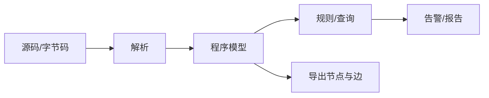
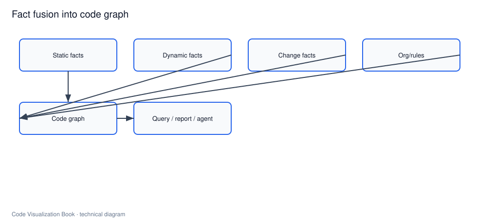

# 静态分析：不运行代码时能知道什么

## 本章要解决的问题

静态分析能提取哪些事实，边界在哪里？它如何为代码图谱提供边？

## 读者读完应获得什么

1. 能列举静态分析的典型产出与误差来源。
2. 能说明调用图、依赖图、规则检查与测试无关路径的差异。
3. 能在 `mini-shop` 上给出静态可得的关系集合。

## 本章不讲什么

- 不测评具体商业工具。
- 不展开完整抽象解释理论。

---

静态分析在不执行程序的情况下，从源码、字节码或 IR 推导事实。它是代码可视化最常用的事实来源之一：结构稳定、可重复、可在 CI 中运行。

## 静态分析能知道什么

| 类别 | 例子 | 工程用途 |
| --- | --- | --- |
| 结构 | 类/方法/字段 | 大纲、图谱节点 |
| 依赖 | import、模块依赖 | 架构图 |
| 调用 | 直接调用边 | 影响面 |
| 规则 | 分层违规、禁用 API | 治理 |
| 度量 | 复杂度、耦合 | 热点辅助 |

对 `mini-shop`，静态阶段至少能得到：

```text
OrderController.create -> OrderService.createOrder
OrderService.createOrder -> PricingService.calculateTotal
PricingService.calculateTotal -> DiscountPolicy.apply
OrderService.createOrder -> PaymentClient.charge
```

以及模块依赖：`order -> pricing`、`order -> payment`。

## 基本流程




## 误报与漏报

静态分析必须诚实面对不确定性：

- **漏报**：反射、依赖注入、动态代理让调用不可见
- **误报**：保守分析把不会发生的路径标成可能

因此图谱边最好带属性：

```text
confidence: high | medium | low
source: static
evidence: file:line
```

## 在 PR 与 AI 中的位置

`PR-42` 不需要运行系统，也能先做：

1. 变更实体定位
2. 反向调用静态追踪
3. 规则检查（pricing 是否错误依赖 payment）

AI Review 可以先消费这些静态证据，再决定是否要求补充运行时或测试结果。

## 局限

- 不知真实流量是否走到某路径
- 难证明性能与并发问题
- 框架魔法需要专用规则补充

## 小结

1. 静态分析提供可重复的结构与关系事实。
2. 调用/依赖/规则是代码图谱的核心输入。
3. 必须标注置信度，避免虚假确定。
4. 它是影响面与 Agent 上下文的第一层来源。

## 进阶要点：把规则变成可查询事实

静态规则只有进入图谱或报告，才会成为持续能力。例如：

```text
rule:pricing-no-payment
if exists edge depends_on(pricing, payment): fail
```

对 `mini-shop`，当前应通过。若 Agent 为“复用支付费率”而让 pricing 依赖 payment，系统应在验证报告中直接 fail，而不是等人工读 diff 才发现。

## 静态分析输出如何服务 AI

给 Agent 的不应是“告警洪水”，而是可操作子集：

1. 与当前任务符号相交的告警
2. 架构规则结果
3. 高置信调用边
4. 需要人工确认的低置信候选

若把全量静态告警塞进上下文，模型会过载并忽略关键约束。静态分析要会做**任务裁剪**。

## 工作示例：规则检查输出

```json
{
 "rule_id": "pricing-no-payment",
 "status": "pass",
 "evidence": [],
 "checked_modules": ["pricing", "payment"]
}
```

若失败：

```json
{
 "rule_id": "pricing-no-payment",
 "status": "fail",
 "evidence": [
 {"from": "class:PricingService", "to": "class:PaymentClient", "via": "import_or_call"}
 ]
}
```

该输出应同时进入：架构治理面板、PR 检查、Agent 验证报告。同一规则，三处消费，避免多套口径。

## 常见问题：静态分析

### 静态分析能证明没 bug 吗？

不能。它提供事实与候选问题，不是完备证明。

### 误报多是不是没用？

关键是分置信度与任务裁剪，不是放弃。

### 和测试什么关系？

互补：静态广覆盖，测试给行为证据。

## 本章检查清单

1. 是否区分漏报误报
2. 是否标注置信度
3. 是否支持规则查询
4. 是否服务 PR/Agent 裁剪

## 关键要点复盘

围绕「静态分析：不运行代码时能知道什么」，读者离开本章前应能做到：

1. 用自己的话解释核心概念与边界
2. 在 `mini-shop` / `PR-42` 上指出对应实体、路径或产物
3. 说明它如何服务人或 AI 的具体决策
4. 列出至少两个局限或失败模式
5. 知道下一章将把它连接到哪一层能力

若任一做不到，请先复习本章例子与练习，再继续向后读。

## 练习

1. 列出 `mini-shop` 仅靠静态分析可得的 5 条边。
2. 给出 1 个会漏报、1 个会误报的场景，并说明如何在图谱中标注置信度。
3. 写一条架构规则检查：`pricing` 不得依赖 `payment`。

## 延伸阅读与参考资料

- [CodeQL docs](https://codeql.github.com/docs/)：查询式静态分析。资料卡：`../docs/research-cards/rc-codeql-dataflow.md`
- [Semgrep docs](https://semgrep.dev/docs/)：模式化静态规则。
- [SpotBugs](https://spotbugs.github.io/)：字节码级缺陷模式检测。
- [Error Prone](https://errorprone.info/)：编译期静态检查实践。
- [ArchUnit](https://www.archunit.org/)：架构规则测试化。
- 本书案例：[`examples/mini-shop/artifacts/code-graph.json`](../examples/mini-shop/artifacts/code-graph.json)。
