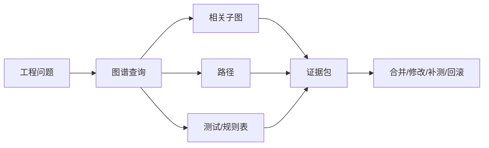
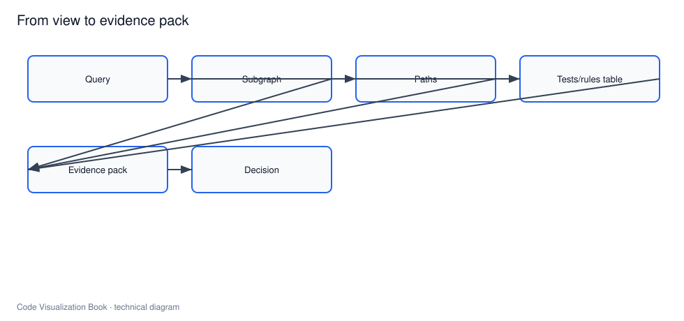

# 可视化表达：从图到证据

## 本章要解决的问题

怎样让可视化成为可审计证据，而不是装饰性图表？

## 读者读完应获得什么

1. 能定义“证据型可视化”的标准。
2. 能把图、路径、表格、报告组合成证据包。
3. 能说明 AI 输出为何必须可回跳事实层。

## 本章不讲什么

- 不教授设计美学教程。
- 不比较所有前端可视化库。

---

代码可视化的失败模式很常见：图很漂亮，但无法回答“所以呢”。证据型可视化要求每个视觉元素都能追溯到数据，并能支持决策。

## 证据标准

一条可视化结论应可检查：

1. **来源**：来自静态/动态/变更哪一层
2. **定位**：对应哪个文件/符号/行号
3. **路径**：如何从问题走到该节点
4. **置信度**：确定还是候选
5. **动作**：建议测试、Review 关注点或回滚条件

## 表达组合

| 表达 | 适合 |
| --- | --- |
| 子图 | 局部关系探索 |
| 路径列表 | 影响链解释 |
| 表格 | 测试、风险、规则 |
| 报告 | PR/Agent 交付物 |
| 查询轨迹 | AI 审计 |

`PR-42` 的证据包不应只有一张调用图，而应包含：

- 变更实体表
- 影响路径
- 相关测试表
- 风险说明
- 查询轨迹

见 [`examples/mini-shop/artifacts/verification-report-pr-42.md`](../examples/mini-shop/artifacts/verification-report-pr-42.md)。

## 从“看见”到“证明”




## 对 AI 输出的要求

模型可以说“可能影响订单总价”，但系统应附上：

```text
path: apply -> calculateTotal -> createOrder -> create
tests: PricingServiceTest, OrderServiceTest
rule_check: pricing-no-payment = pass
```

否则 Reviewer 只能选择相信或放弃，无法审计。

## 设计原则

1. 默认展示任务相关子图，不丢全库大图
2. 节点可点击回源码
3. 边显示来源与置信度
4. 先摘要后下钻
5. 报告与图共享同一查询结果

## 局限

- 证据链过长会淹没重点
- 低置信度边展示不当会造成误导
- 需要产品化的信息层级，而不是一次画完

## 小结

1. 可视化的目标是证据，不是装饰。
2. 图、路径、表、报告应组成可审计证据包。
3. AI 结论必须回跳到图谱事实。
4. 好的表达服务于决策动作。

## 证据包模板（可直接复用）

```text
# Evidence Pack
Claim: ...
Entities: ...
Paths: ...
Tests: ...
Rules: ...
Confidence: ...
Query Trace: ...
Suggested Action: ...
```

AI 生成的自然语言说明只能作为 `Claim` 的草稿，不能替换后六项。

## 工作示例：同一结论的两种呈现

弱呈现：

> 这张图显示订单和定价有关系，所以可能有风险。

强呈现：

> 变更实体 `DiscountPolicy.apply`；影响路径 `apply -> calculateTotal -> createOrder -> create`；相关测试 2 个将失败；架构规则通过；查询轨迹 4 步可回放。

出版级终稿要求全书默认使用强呈现：每个重要视觉结论都能改写成强呈现段落。

## 常见问题：证据可视化

### 为什么不直接给最大图？

全图不可决策，证据需要裁剪与解释。

### 颜色编码可以使用吗？

可以，但必须有图例，并服务信息而非装饰。

### AI 插画能当证据吗？

不能。证据必须可回跳数据。

## 本章检查清单

1. 结论能否改写成强呈现
2. 是否有来源与置信度
3. 是否可回源码
4. 是否服务明确动作

## 关键要点复盘

围绕「可视化表达：从图到证据」，读者离开本章前应能做到：

1. 陈述证据七步法
2. 用 PR-42 组装路径+测试+规则三件套
3. 拒绝无 ID/无轨迹的插图
4. 说明颜色与 AI 插画的边界
5. 衔接到工程场景篇

若任一做不到，请先复习本章例子与练习，再继续向后读。

## 证据图判定标准

一张图要成为证据，必须同时满足：

1. **可追溯**：节点/边能回到源码或产物 ID
2. **可复现**：给定同一输入可再生成
3. **有任务边界**：说明查询条件/过滤
4. **有置信度**：低置信不可画成实线“事实”

反例：无过滤的全仓力导向图、无来源标签的调用箭头、与报告数字不一致的截图。

## PR-42 证据三件套

1. 影响路径图：`apply -> calculateTotal -> createOrder -> create`
2. 测试表：两测需更新断言
3. 规则结果：`pricing-no-payment = pass`

三者缺一，就从“证据”退回“插图”。


## 如何把结论做成证据（操作步骤）

1. **锁定主张**：先写一句话结论（例如：`PR-42` 会改变 VIP 订单总价并影响支付入参）。
2. **绑定实体 ID**：把结论落到 `method:DiscountPolicy#apply` 等稳定 ID，而不是“某个折扣文件”。
3. **选择最少表达**：路径图 + 测试表 + 规则结果；默认不渲染全仓大图。
4. **标注来源与置信度**：边/结论标明 static/dynamic 与 high/medium/low。
5. **提供回跳**：每个关键节点可定位文件与行号，或指向 artifacts。
6. **保留查询轨迹**：记录 `find_symbol` / `find_callers` / `related_tests` 等步骤，使结论可复现。
7. **分级展示**：阻断/重要/提示分层，避免证据过载。

```text
claim
 -> entities
 -> minimal views (path/table/rule)
 -> confidence + source
 -> source jump
 -> query_trace
 -> reviewer decision
```

这套步骤是方法，不只是版式建议。缺步骤 2/4/6 的图，通常只能算插图。


## 练习

1. 把 `verification-report-pr-42.md` 拆成“图/路径/表/轨迹”四类证据。
2. 指出一张“很好看但不可审计”的图可能缺少哪些字段。
3. 为 AI 结论设计必须附带的最小证据包字段。

## 本章导航

- 上一章：[代码图谱：节点、边与属性](code-graph-model.md)
- 下一章：[代码库理解与上下文构建](../part4/codebase-understanding.md)
- 相关章：[变更影响分析与验证](../part4/change-impact-verification.md)；[构建代码图谱](../part6/build-code-graph.md)

## 延伸阅读与参考资料

- [Nielsen Norman Group: Minimize Cognitive Load](https://www.nngroup.com/articles/minimize-cognitive-load/)：信息呈现与认知负荷。
- [OpenTelemetry visualization of traces](https://opentelemetry.io/docs/concepts/signals/traces/)：路径可视化直觉。
- [SARIF](https://docs.oasis-open.org/sarif/sarif/v2.1.0/sarif-v2.1.0.html)：机器可读分析结果交换。资料卡：`../docs/research-cards/rc-sarif.md`
- [GitHub PR checks](https://docs.github.com/en/pull-requests/collaborating-with-pull-requests/collaborating-on-repositories-with-code-quality-features/about-status-checks)：证据进入工作流的位置。
- [D3 graph interaction patterns](https://d3js.org/)：交互探索参考（实现可选）。
- 本书样例：[`examples/mini-shop/artifacts/verification-report-pr-42.md`](../examples/mini-shop/artifacts/verification-report-pr-42.md)。
