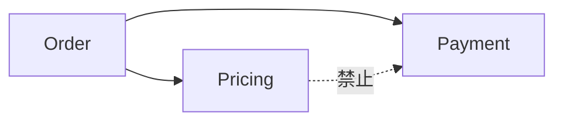

# 架构理解与遗留系统改造

## 本章要解决的问题

如何用代码事实理解架构边界，并安全推进遗留系统改造？

## 读者读完应获得什么

1. 能区分“宣称架构”和“事实架构”。
2. 能用依赖/调用/变更耦合发现边界侵蚀。
3. 能把改造拆成可验证的小步，并保留对比证据。

## 本章不讲什么

- 不提供某行业遗留系统迁移剧本全集。
- 不鼓吹一次性重写。

---

架构图常常描述系统“应该怎样”，代码图谱和变更历史描述系统“实际怎样”。遗留改造要先对齐这两层。

## 宣称架构 vs 事实架构

以 `mini-shop` 的简化架构为例：

```text
order -> pricing
order -> payment
pricing -/-> payment (禁止)
```

若某次改造让 `pricing` 直接调用 `payment` 查费率，事实架构就破坏了分层，即使 README 仍写“pricing 纯计算”。



## 发现边界问题的信号

1. 模块依赖违规
2. 跨层调用增多
3. 变更耦合显示无关模块总被一起改
4. 入口过多、公共工具包膨胀
5. 测试只能做端到端，无法局部验证

## 改造前地图

改造前至少准备：

| 地图 | 内容 |
| --- | --- |
| 模块依赖图 | 当前方向与违规 |
| 关键路径 | 业务主入口调用链 |
| 测试地图 | 哪些行为被锁住 |
| 热点图 | 高风险改动区 |
| 规则集 | 允许/禁止依赖 |

没有地图就开改，等于在迷雾中拆迁。

## 小步改造策略

以“把折扣策略独立配置化”为例：

1. 先加表征测试锁住 VIP/非 VIP 价格
2. 抽取配置点，不改外部行为
3. 对比调用图：对外路径应保持
4. 再切换实现
5. 输出迁移前后依赖与测试对比报告

AI 可以辅助改代码，但每一步都要有行为保持证据。

## 验证清单

- 架构规则是否仍通过
- 关键路径是否保持
- 相关测试是否全绿
- 性能/错误率是否回归（如有动态证据）
- 回滚点是否明确

## 和 AI 的协作方式

适合交给 Agent 的：

- 样板式移动/重命名
- 补测试骨架
- 生成依赖差异报告

不适合无约束交给 Agent 的：

- 无测试的大爆炸重写
- 边界未定义的跨模块重构

## 局限

- 事实架构受分析精度限制
- 业务语义与组织权力结构不在图中
- 改造成功取决于节奏与验证，不只是工具

## 小结

1. 先用事实架构对齐真实边界。
2. 改造前需要地图与规则，而不是直接开改。
3. 小步 + 对比证据是安全默认策略。
4. AI 适合加速受约束改造，不适合替代架构判断。

## 改造看板最小字段

| 字段 | 说明 |
| --- | --- |
| target_boundary | 目标模块边界 |
| current_violations | 当前违规依赖 |
| characterization_tests | 表征测试集合 |
| step_plan | 小步序列 |
| rollback | 回滚点 |
| exit_metrics | 退出标准（违规=0/关键路径绿） |

没有看板的“AI 重构”，通常只是把混乱从一个目录搬到另一个目录。

## 工作示例：禁止依赖的守护测试

可用 ArchUnit 风格伪代码表达：

```text
no classes in package "..pricing.."
 should depend on classes in "..payment.."
```

把它纳入 CI 后，AI 重构若引入反向依赖，会在证据层直接失败。遗留改造的“地图 + 守护”比“一次性画目标架构图”更重要。

## 常见问题：架构与改造

### 目标架构图画完是否算完成？

否。要有事实架构、守护规则与小步验证。

### AI 适合哪类改造？

机械且边界清晰的小步；不适合无测试大爆炸。

### 如何防止越改越乱？

看板 + 规则 + 表征测试 + 回滚点。

## 本章检查清单

1. 宣称vs事实
2. 规则可执行
3. 小步计划
4. 退出指标

## 关键要点复盘

围绕「架构理解与遗留系统改造」，读者离开本章前应能做到：

1. 区分事实架构与宣称架构
2. 用 pricing-no-payment 做规则检查
3. 说明 Strangler 小步与大爆炸差异
4. 把规则接入 AI 改造护栏
5. 衔接到 AI 时代动机章

若任一做不到，请先复习本章例子与练习，再继续向后读。

## 架构规则与改造步的耦合

改造每一步都要能回答：

1. 依赖方向是否仍满足规则？
2. 主路径是否仍有表征测试？
3. 新旧实现是否可并存（Strangler）？
4. 回滚点在哪？

`mini-shop` 中的金标规则：

```text
pricing must not depend on payment
```

任何“为了方便复用费率”而让 pricing 依赖 payment 的 AI 改动，应在合并前被规则检查拦截。


## 练习

1. 对比 `mini-shop` 的宣称架构与事实架构，写出一条可自动检查的规则。
2. 用 Strangler Fig 思路，把“折扣配置化”拆成 3 个可验证小步。
3. 列出改造前最小地图：依赖、关键路径、测试、规则。

## 本章导航

- 上一章：[变更影响分析与验证](change-impact-verification.md)
- 下一章：[为什么 AI 时代更需要代码理解](../part5/why-code-understanding-matters-in-ai-era.md)
- 相关章：[AI 生成代码的 Review 证据层](../part5/ai-code-review-evidence.md)；[构建变更影响分析](../part6/build-change-impact-analysis.md)

## 延伸阅读与参考资料

- [Strangler Fig Application](https://martinfowler.com/bliki/StranglerFigApplication.html)。资料卡：`../docs/research-cards/rc-strangler-fig.md`
- [Architecture Decision Records](https://adr.github.io/)。资料卡：`../docs/research-cards/rc-adr.md`
- [ArchUnit](https://www.archunit.org/)：架构规则可执行化。
- [Backstage](https://backstage.io/docs/features/software-catalog/)：服务/Owner 目录。资料卡：`../docs/research-cards/rc-backstage-catalog.md`
- [Fitness Function-driven architecture](https://www.thoughtworks.com/insights/articles/fitness-function-driven-development)：架构守护思路。
- 本书案例：[`examples/mini-shop/`](../examples/mini-shop/)。
