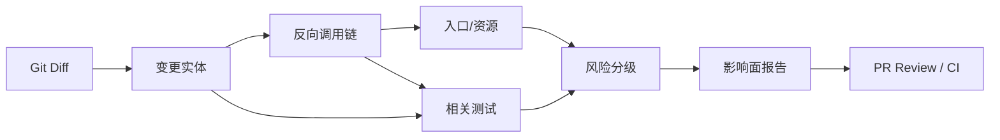
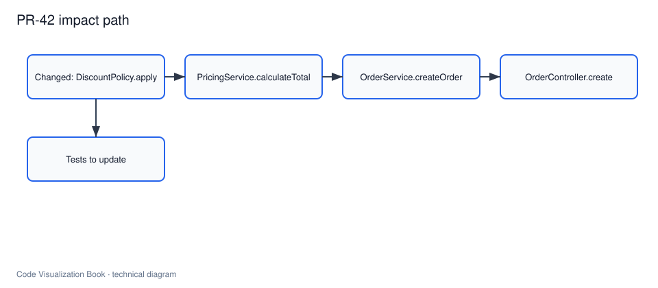

# 变更影响分析与验证

## 本章要解决的问题

如何从一次 Diff 推导影响范围，并形成可进入 PR 的验证策略？

## 读者读完应获得什么

1. 能把行级 Diff 映射为代码实体变更。
2. 能沿调用图做反向追踪，并关联测试与风险分级。
3. 能输出一份可审计的影响面报告，并说明它在 PR 流程中的位置。

## 本章不讲什么

- 不承诺零误报的完美影响面。
- 不展开所有测试选择算法细节。
- 不依赖真实公司仓库。

---

行级 Diff 告诉你“哪些行变了”，工程决策需要的是“可能影响什么”。变更影响分析的任务，就是把 Diff 转成影响路径、相关测试和风险说明。

本章以 `mini-shop` 的 `PR-42` 为完整例子：把 VIP 折扣从 `0.9` 调整为 `0.85`。




> 后续 AI 配图备注：可生成“PR 页面中的影响面分析报告”界面 mockup，突出变更实体、影响路径、建议测试和风险标签。

## 为什么 Diff 不够

`PR-42` 的实质变更只有一行：

```diff
- return amount * 0.9;
+ return amount * 0.85;
```

如果只看 Diff：

- 不知道它属于 `DiscountPolicy.apply`
- 不知道 `PricingService.calculateTotal` 会用到它
- 不知道订单入口和支付金额间接受影响
- 不知道两份测试仍断言 `180.0`

影响面分析要补的，正是这些工程语义。

## 从 Diff 到变更实体

步骤：

1. 解析 Diff，得到文件与行号
2. 用源码索引定位行号落入的方法/类
3. 生成变更实体列表

结果：

```json
{
 "changed_entities": [
 {
 "id": "method:DiscountPolicy#apply",
 "file": "src/main/java/com/minishop/pricing/DiscountPolicy.java",
 "lines": [6],
 "change_type": "modified"
 }
 ]
}
```

没有实体映射，就无法查询调用方，也无法稳定跟踪历史。

## 调用链反向追踪

从变更方法出发，沿 `calls` 边反向扩展：

```text
DiscountPolicy.apply
 <- PricingService.calculateTotal
 <- OrderService.createOrder
 <- OrderController.create
```

同时记录同层副作用：

```text
OrderService.createOrder -> PaymentClient.charge
```

因此金额字面量变化会传导到支付入参。

完整图数据见 [`examples/mini-shop/artifacts/code-graph.json`](../examples/mini-shop/artifacts/code-graph.json)。

## 依赖传播和资源影响

除了调用方，还要看：

- 模块依赖是否变化
- 配置/资源是否变化
- 对外 API 契约是否变化

`PR-42` 中：

- 模块依赖未变
- 对外方法签名未变
- 行为契约变了：VIP 订单总价从 `180` 变为 `170`（数量 2、单价 100）

行为契约变化必须进入报告，否则 Reviewer 会误判为“纯内部常量”。

## 关联测试与覆盖率

相关测试可通过以下信号发现：

1. 直接 `tests` 边
2. 测试代码调用了变更方法或其调用方
3. 覆盖率显示测试执行了变更行

`mini-shop` 中至少应关联：

| 测试 | 原因 |
| --- | --- |
| `PricingServiceTest.shouldApplyVipDiscount` | 直接验证 VIP 折扣总价 |
| `OrderServiceTest.shouldCreateVipOrderWithDiscount` | 经过订单链路验证总价 |

两者当前都断言 `180.0`，在折扣改为 `0.85` 后应更新为 `170.0`。

## 风险分级

可用一个可解释的规则集，而不是黑盒分数：

| 信号 | PR-42 |
| --- | --- |
| 是否在核心业务链路 | 是（下单计价） |
| 是否影响金额/权限等敏感语义 | 是 |
| 相关测试是否存在 | 是，但会失败需更新 |
| 是否跨模块传播 | 是（pricing -> order/payment 入参） |
| 架构规则是否破坏 | 否 |

综合等级：**中**。
单行修改不等于低风险。

## 影响面报告设计

最小报告字段：

```text
pr / title
changed_entities
impact_paths
related_tests
risk.level + reasons
recommended_actions
query_trace
```

`PR-42` 样例：

- JSON：[`examples/mini-shop/artifacts/impact-report-pr-42.json`](../examples/mini-shop/artifacts/impact-report-pr-42.json)
- Markdown：[`examples/mini-shop/artifacts/verification-report-pr-42.md`](../examples/mini-shop/artifacts/verification-report-pr-42.md)

报告示例片段：

```markdown
## 影响路径
apply -> calculateTotal -> createOrder -> create

## 建议
1. 更新定价与订单测试期望值
2. 运行 pricing/order 测试
3. Review 支付金额是否随总价变化
```

## 在 PR 流程中的位置

建议接入点：

1. **开发本地**：提交前预览影响面
2. **CI**：对 PR Diff 自动生成报告注释
3. **Review**：Reviewer 先看路径/测试/风险，再看代码
4. **合并后**：必要时结合线上指标观察

它不替代测试，而是帮助决定“测什么、看什么、问什么”。

## AI 时代的影响面验证

当修改由 Agent 生成时，影响面报告还要回答：

1. Agent 是否改到了声称的实体
2. 是否漏掉相关测试更新
3. 查询轨迹是否支持其上下文选择
4. 是否违反架构规则

也就是说，影响面分析既是给人类的，也是给 AI 变更的验证层。

## 方法依据

影响面分析并不是“凭感觉扩文件”，其工程基础通常包括：

1. **变更定位**：由版本控制 diff 提供行级变化（见 Git 文档）。
2. **实体映射**：把行映射到方法/类等可索引对象。
3. **依赖传播**：沿调用/依赖关系扩展候选影响集。
4. **测试选择**：按变更选择相关测试（Test Impact Analysis 思路）。
5. **风险解释**：用可检查信号解释为何是中/高风险，而不是黑盒分数。

因此，报告里的每一条路径和测试建议，都应能回跳到图谱边或 diff 证据。

## 局限

- 静态反向调用可能漏掉反射/配置入口
- 测试关联可能不完整
- 风险规则需要团队校准
- 不能证明“无影响”，只能提供证据与候选范围

## 小结

1. Diff 必须先映射到代码实体。
2. 影响面 = 变更实体 + 反向路径 + 测试 + 风险。
3. 报告应可进入 PR，并可审计。
4. 对 AI 修改，影响面是关键验证证据层。

## 关键要点复盘

围绕本章，读者离开前应能做到：

1. 从 diff 走到影响面报告字段
2. 解释 PR-42 风险为何 medium
3. 列出相关测试与更新断言
4. 说明 AI 时代影响面在 PR 中的位置
5. 衔接到架构与遗留改造

若任一做不到，请先复习本章例子与练习，再继续向后读。

## 练习

1. 基于 `pr-42.diff` 手工写出变更实体、影响路径、相关测试、风险等级。
2. 解释为何 `PaymentClient` 未改文件仍可能受影响。
3. 若删除 `OrderServiceTest`，风险等级与建议动作如何变化？
4. 把影响面报告改写成 PR 评论的 8 行摘要。

## 常见问题：影响面

### Diff 绿了是不是就没影响？

否。影响在调用路径与测试，不只在 diff 行。

### 风险 medium 如何决策？

金额语义变化需测更新与人工确认业务值。

## 本章检查清单

1. 变更实体是否方法级
2. 路径/测试/规则是否齐全
3. 报告是否可进入 PR

## 本章导航

- 上一章：[代码库理解与上下文构建](codebase-understanding.md)
- 下一章：[架构理解与遗留系统改造](architecture-and-legacy-modernization.md)
- 相关章：[AI 生成代码的 Review 证据层](../part5/ai-code-review-evidence.md)；[构建变更影响分析](../part6/build-change-impact-analysis.md)

## 延伸阅读与参考资料

- [Git diff](https://git-scm.com/docs/git-diff)。资料卡：`../docs/research-cards/rc-git-diff.md`
- [Test Impact Analysis](https://learn.microsoft.com/en-us/azure/devops/pipelines/test/test-impact-analysis)。资料卡：`../docs/research-cards/rc-test-impact.md`
- [GitHub code scanning / checks](https://docs.github.com/en/code-security)：PR 中的自动检查位。
- [Codecov docs](https://docs.codecov.com/docs)：覆盖与 PR 反馈参考。
- [CodeQL](https://codeql.github.com/docs/)：深度静态证据补充。
- [Launchable / TIA industry practice](https://www.launchableinc.com/)：测试选择工程化参考（产品文档，次级）。
- 本书样例：[`impact-report-pr-42.json`](../examples/mini-shop/artifacts/impact-report-pr-42.json)、[`verification-report-pr-42.md`](../examples/mini-shop/artifacts/verification-report-pr-42.md)。
