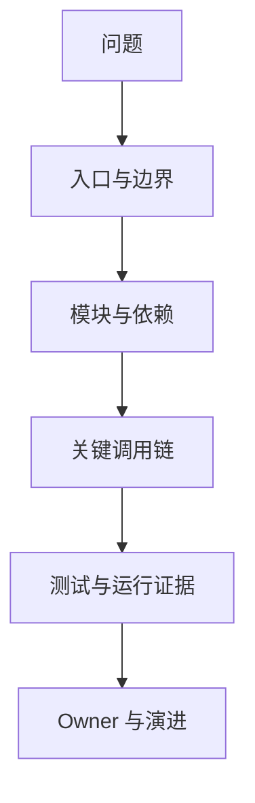

# 代码库理解与上下文构建

## 本章要解决的问题

面对陌生代码库，如何系统构建上下文，而不是盲目搜索？

## 读者读完应获得什么

1. 能按入口、模块、调用链、测试、Owner 分层建立理解。
2. 能用代码图谱加速“这功能怎么走”的问题。
3. 能为人和 Agent 输出可复用的上下文摘要。

## 本章不讲什么

- 不讲具体业务域知识学习法。
- 不承诺自动生成完美架构文档。

---

代码库理解是所有后续场景的基础。无论是排查问题、做变更，还是给 Agent 派任务，第一步都是构建正确上下文。

## 理解任务的分层



| 层级 | 问题 | mini-shop 例子 |
| --- | --- | --- |
| 入口 | 从哪里进来 | `OrderController.create` |
| 模块 | 责任如何切分 | order / pricing / payment |
| 调用链 | 关键路径 | create -> createOrder -> calculateTotal -> apply |
| 测试 | 如何验证 | Order/Pricing tests |
| 演进 | 最近如何变 | PR-42 折扣调整 |

## 从问题到查询

不要先“把仓库读完”。先把问题翻译成查询：

1. 功能入口是什么？
2. 核心实体/服务是什么？
3. 写路径与读路径分别经过谁？
4. 哪些测试锁定行为？
5. 有哪些架构规则不能破？

对“VIP 订单如何计价”：

```text
find_symbol(OrderController.create)
find_callees(OrderService.createOrder)
find_path(createOrder, DiscountPolicy.apply)
related_tests(calculateTotal)
```

## 上下文摘要模板

给人与 Agent 共用的最小摘要：

```text
# 功能：VIP 订单计价
入口：OrderController.create
核心路径：createOrder -> calculateTotal -> apply
关键不变量：VIP 总价 = quantity * unitPrice * 0.85
测试：PricingServiceTest, OrderServiceTest
规则：pricing 不依赖 payment
```

这比丢给模型 20 个无关文件更有效。

## 可视化怎么帮

- 模块依赖图：先看边界
- 调用子图：只展开任务相关路径
- 测试覆盖视图：看哪些行为被锁住
- 热点图：避免先钻冷代码

## 交接与 onboarding

代码库理解系统可以把“老人经验”沉淀为：

- 入口目录
- 标准查询
- 架构规则
- 常见变更检查单

新人与 Agent 都从同一事实层开始。

## 局限

- 缺少运行时数据时，理解偏静态
- 业务语义仍需领域补充
- 自动摘要可能过时，需与变更分析联动刷新

## 小结

1. 代码库理解是分层构建上下文，不是随机阅读。
2. 先问题后查询，再决定看哪些子图。
3. 上下文摘要应同时服务人和 Agent。
4. 图谱让理解过程可重复、可交接。

## 上下文构建操作手册（可复用）

面对陌生仓库，建议固定 30 分钟流程：

1. **定位入口**（5 分钟）
 搜索 Controller/router/main，确认外部入口集合。
2. **画模块边界**（5 分钟）
 先看目录与依赖方向，不先看算法细节。
3. **抽一条主路径**（10 分钟）
 选一个代表用例，沿着调用走到数据/外部依赖。
4. **锁测试**（5 分钟）
 找到表征该行为的测试，记录断言。
5. **写上下文摘要**（5 分钟）
 产出可交给同事或 Agent 的一页纸。

把这五步工具化后，就接近“代码库理解系统”的最小产品形态。

## mini-shop 示例摘要

```text
功能：VIP 订单计价
入口：OrderController.create
主路径：createOrder -> calculateTotal -> apply
支付副作用：createOrder -> charge(total)
不变量：VIP total = qty * unitPrice * discount
测试：PricingServiceTest / OrderServiceTest
规则：pricing 不依赖 payment
```

## 工作示例：Issue 到上下文包

Issue：`VIP 用户投诉折扣不对`

查询序列：

1. 搜索关键字 VIP/discount → `DiscountPolicy`
2. find_callers(apply) → calculateTotal / createOrder
3. related_tests → 两测
4. 生成上下文摘要交给人或 Agent

30 分钟内应能定位，而不是在 payment 与 order 目录来回猜。

## 关键要点复盘

围绕「代码库理解与上下文构建」，读者离开本章前应能做到：

1. 用自己的话解释核心概念与边界
2. 在 `mini-shop` / `PR-42` 上指出对应实体、路径或产物
3. 说明它如何服务人或 AI 的具体决策
4. 列出至少两个局限或失败模式
5. 知道下一章将把它连接到哪一层能力

若任一做不到，请先复习本章例子与练习，再继续向后读。

## 上下文摘要模板（人/Agent 共用）

```markdown
# Context Brief: <question>
## Entry points
- ...
## Primary path
- ...
## Key symbols
- id / file / why relevant
## Invariants
- ...
## Tests locking behavior
- ...
## Architecture rules
- ...
## Unknowns / low-confidence edges
- ...
## Suggested next queries
1. ...
2. ...
```

把该模板填完，才算“理解了这段代码”，而不是“读过几个文件”。

## 失败模式

1. **从细节开始**：先抠算法实现，却不知道入口与模块边界。
2. **只搜关键字**：命中日志字符串，漏掉真实调用链。
3. **不记测试**：改完无法证明行为。
4. **给 Agent 一大段无关源码**：噪音压过结构事实。


## 练习

1. 针对“VIP 订单如何计价”写出 5 条图谱查询顺序。
2. 生成一份给人与 Agent 共用的上下文摘要（10 行内）。
3. 说明为何“先通读仓库”通常不是最优策略。

## 延伸阅读与参考资料

- [GitHub Copilot: Explore a codebase](https://docs.github.com/en/copilot/tutorials/explore-a-codebase)。资料卡：`../docs/research-cards/rc-github-copilot-explore.md`
- [Backstage Software Catalog](https://backstage.io/docs/features/software-catalog/)。资料卡：`../docs/research-cards/rc-backstage-catalog.md`
- [Sourcegraph code search docs](https://docs.sourcegraph.com/)：大规模代码导航参考。
- [LSP](https://microsoft.github.io/language-server-protocol/)：符号级导航能力。资料卡：`../docs/research-cards/rc-lsp.md`
- [SWE-bench](https://github.com/swe-bench/SWE-bench)：仓库级任务难度背景。资料卡：`../docs/research-cards/rc-swe-bench.md`
- 本书案例：[`examples/mini-shop/`](../examples/mini-shop/)。
