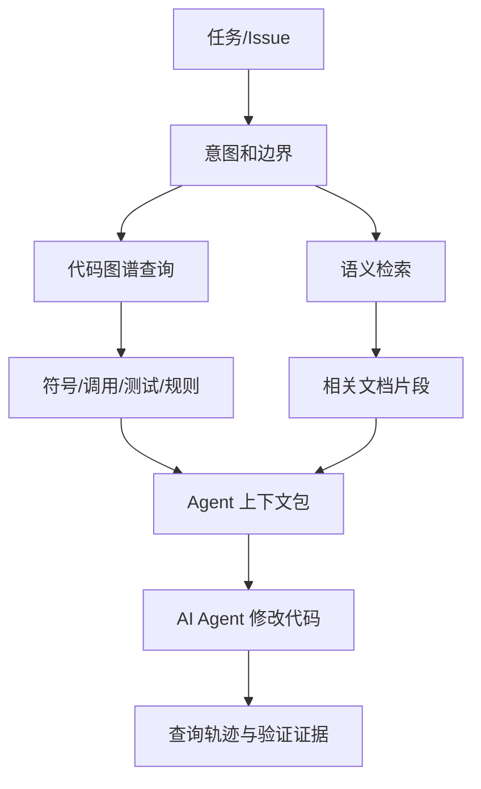
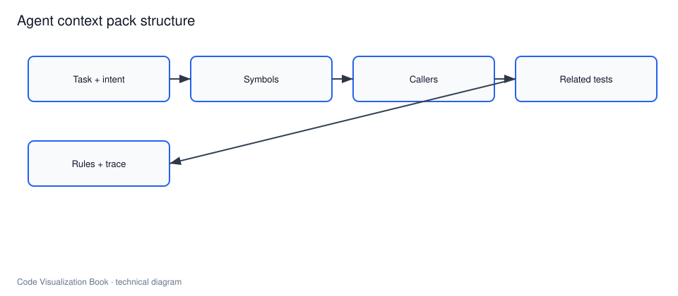

# Agent 上下文工程

## 本章要解决的问题

如何给 AI Agent 提供正确、充分、可验证的代码上下文，而不是单纯扩大窗口？

## 读者读完应获得什么

1. 能区分“上下文窗口”和“代码理解”。
2. 能设计包含符号、调用方、测试和规则的上下文包。
3. 能记录查询轨迹，使 Agent 行为可审计。

## 本章不讲什么

- 不讨论具体模型供应商的提示词技巧大全。
- 不把向量检索当成唯一上下文方案。

## 本章与邻章边界

- 本章聚焦**改前**：如何构造任务化、可审计的上下文包。
- 图谱工具清单与协议映射详见“代码图谱如何服务 AI Agent”；改后审计详见 Review 证据层。

---

Agent 上下文工程关注如何围绕任务选择、组织和约束信息。如果没有这层工程，Agent 容易变成“会写代码的搜索器”：能读文件、改文件，但不一定知道哪些边界不能跨、哪些测试必须跑。




> 后续 AI 配图备注：可生成“Agent 先查询代码图谱再修改”的流程插画。

## 上下文窗口不等于代码理解

把更多文件塞进提示，并不等于更好理解。有效上下文应满足：

1. **相关**：与任务有明确关系
2. **结构化**：说明符号与依赖，而不只是文本
3. **可验证**：结论能追溯到查询与源码

因此上下文工程 = 任务理解 + 检索 + 图谱查询 + 裁剪 + 证据组织。

## 任务：调整 VIP 折扣

任务描述：

```text
将 mini-shop 的 VIP 折扣从 0.9 调整为 0.85，并保证相关测试通过。
```

意图边界：

| 项 | 内容 |
| --- | --- |
| in_scope | `DiscountPolicy.apply`、相关定价/订单测试 |
| out_of_scope | 支付渠道集成、非 VIP 规则重做、无关注架重构 |

先写清边界，再取上下文，可减少 Agent 乱动。

## 相关文件选择

错误做法：全文搜索 `0.9` 或 `calculate`，把日志字符串也当候选。
正确做法：先定位符号，再扩展邻居。

最小相关集合：

1. `DiscountPolicy.java`（修改目标）
2. `PricingService.java`（直接调用方）
3. `PricingServiceTest.java` / `OrderServiceTest.java`（断言依赖）
4. 可选：`OrderService.java`（理解金额如何流向支付）

## 必须查询的图谱问题

1. `find_symbol("DiscountPolicy.apply")`
2. `find_callers(method:DiscountPolicy#apply)`
3. `related_tests(method:DiscountPolicy#apply)`
4. `architecture_rules(module=pricing)`

这些查询的结果应进入上下文包，而不是只留在系统日志里。

## 上下文包结构

完整样例：[`examples/mini-shop/artifacts/agent-context-pack.json`](../examples/mini-shop/artifacts/agent-context-pack.json)

```text
task
intent.in_scope / out_of_scope
symbols[]
callers[]
related_tests[]
architecture_rules[]
snippets[]
query_trace[]
```

示例：

```json
{
 "task": "将 VIP 折扣从 0.9 调整为 0.85，并保证相关测试通过",
 "symbols": [{"id": "method:DiscountPolicy#apply", "role": "primary_edit_target"}],
 "callers": [
 "method:PricingService#calculateTotal",
 "method:OrderService#createOrder"
 ],
 "related_tests": [
 "test:PricingServiceTest#shouldApplyVipDiscount",
 "test:OrderServiceTest#shouldCreateVipOrderWithDiscount"
 ],
 "architecture_rules": ["pricing 模块不得直接依赖 payment 模块"]
}
```

## 查询轨迹和审计

每次工具调用都应记录：

```text
tool name
arguments
result summary
timestamp
```

价值：

- Reviewer 可检查 Agent 是否查过测试
- 失败时可复盘上下文是否缺失
- 可对比“模型声称”和“系统检索到的事实”

对 AI Coding 工具建设者，查询轨迹是产品能力，不是调试边角。

## 与验证闭环衔接

上下文包负责“改前理解”，验证报告负责“改后证明”：

```text
上下文包 -> Agent 修改 -> 影响面分析 -> 测试结果 -> 验证报告
```

`PR-42` 验证报告样例见 [`examples/mini-shop/artifacts/verification-report-pr-42.md`](../examples/mini-shop/artifacts/verification-report-pr-42.md)。

## 常见失败模式

1. 只给目标文件，不给调用方和测试
2. 用文本相似度替代符号关系
3. 无 out_of_scope，导致越改越大
4. 无查询轨迹，Review 只能盲信
5. 把低置信度调用边当确定事实

## 设计原则（可检查）

一个合格上下文包应能通过这些问题：

1. 是否包含**主编辑符号**及其源码位置？
2. 是否包含**直接/关键调用方**，而不只是相似文本？
3. 是否包含**相关测试**？
4. 是否包含**架构规则/范围边界**？
5. 是否包含**查询轨迹**以便审计？

任一题为“否”，Agent 就更像在猜，而不是在受约束地修改。

## 上下文是有限资源：管理而非堆料（2026 方法论）

近年的实践（Anthropic 等一线团队方法论）把上下文工程从“选择什么”推进到“如何管理一个会衰减的有限资源”。这部分值得单独讲，因为它决定了上下文包在长任务下是否仍成立。

### context rot：token 越多，回忆越差

多组实验（Chroma 对 18 个模型的评测、EMNLP 2025 论文）观察到：随着上下文 token 数增加，模型对其中信息的准确回忆能力下降，即使信息仍在窗口内。这不是模型“没看到”，而是注意力分布被稀释——产业界把这种现象称为 **context rot（上下文腐烂）**。

> 证据强度说明：也存在受控实验（“Is Context Rot Real?”, 150k tokens 内合成场景）给出有界负结果，提示退化幅度与模型和任务相关。因此本书把它作为**需要管理的风险**而非铁律：裁剪策略不应依赖“窗口很大所以不用管”。

对现代编程 Agent 的直接影响是：**不要用“上下文够大”替代“上下文够好”**。长窗口不是免裁剪的通行证。

### attention budget：每一步都在花预算

LLM 的注意力稀缺使其对大量 token 的利用是递减的。把上下文当作有限预算后，设计原则自然变成：

1. 每个 token 都应服务于当前任务目标
2. 无法论证相关性的信息默认排除
3. 宁可让 Agent 按需取，不要一次性堆满

### 管理长任务的三种技法（compaction / note-taking / sub-agent）

窗口总会被耗尽或污染，长任务（如大型迁移、大仓改造）需要主动管理：

| 技法 | 做法 | 适用 |
| --- | --- | --- |
| **compaction（压缩）** | 快满时把历史总结进新窗口，保留决策与未决问题 | 长对话连续工作流 |
| **structured note-taking（结构化笔记）** | Agent 把状态写入外部笔记（如 NOTES.md），按需重新读入 | 多阶段的迭代开发 |
| **sub-agent 架构** | 主 Agent 协调，子 Agent 各自探索（可耗大量 token），只回传浓缩摘要（通常 1–2k token） | 并行深挖、研究与大型分析 |

对代码可视化系统的含义：**上下文包本身也可以被压缩、被笔记化、被拆给子任务**。把“一个包喂给一个 Agent”默认化，会很快撞上 context rot。

### just-in-time context：按需取，替代预取全量

主流编码 Agent（如 Claude Code）的做法是混合：启动时只带少量轻量引用（如 `CLAUDE.md`、文件路径），运行时用 `glob`/`grep`/图谱查询按需加载真实内容。好处：

1. 避开陈旧索引——每次取的都是当前文件系统/图谱状态
2. 避免预取无关内容——只有被实际引用的才进窗口
3. 元数据本身就是信号——路径、目录结构、时间戳提示用途

这与“渐进披露（progressive disclosure）”一脉相承：Agent 通过探索逐层组装理解，而不是一次背下全书。

### 对本书上下文包的修正

前面讨论的上下文包结构（符号/调用方/测试/规则/轨迹）依旧成立，但现在可知它应满足额外约束：

1. **应该是“小种子 + 引用”，而非“大快照”**：包内保存稳定 ID 与路径，真实内容按需取
2. **应设计压缩边界**：长任务中哪个字段必须保留，哪个可总结丢弃（通常是 query_trace 保留、冗余 snippet 丢弃）
3. **应可被拆分子任务**：上下文包不是单 Agent 专属，也可作为子 Agent 的探索传票

## 上下文不是“更多 token”

一个常见误区是：只要把仓库塞进更长上下文窗口，Agent 就会变靠谱。实践里恰恰相反——无关文件、生成物、测试夹具和历史注释会淹没真正的种子符号。上下文工程的核心是**裁剪**：用图谱查询决定带什么，用 out_of_scope 决定不带什么，用 query_trace 证明你不是瞎贴。

对 `PR-42`，高质量上下文包几乎总是小的：一个主符号、少量 callers、两个测试、一条架构规则、若干短 snippet。它看起来“少”，却比粘贴整个 `order` 包更安全。

查看金标：`examples/mini-shop/artifacts/agent-context-pack.json`。


## 局限

- 图谱不完整时上下文会偏
- 过严裁剪可能漏掉隐式依赖
- 上下文工程不能替代测试与人工设计审查

## 小结

1. 上下文工程是任务化的信息选择，不是窗口堆料。
2. 符号、调用方、测试、规则是最小必备结构。
3. 上下文包应可序列化、可审计、可复用。
4. 查询轨迹让 Agent 从“会改”变成“可审查地改”。
5. 上下文是有限资源：长窗口下也会有 context rot，长任务要靠 compaction / note-taking / sub-agent 管理，并以 just-in-time 取用对抗陈旧索引。

## 关键要点复盘

围绕本章，读者离开前应能做到：

1. 设计上下文包字段
2. 说明切片规则（seed/include/exclude）
3. 把 query_trace 写入包
4. 指出全仓粘贴源码的失败
5. 衔接到图谱查询工具

若任一做不到，请先复习本章例子与练习，再继续向后读。

## 练习

1. 为 VIP 折扣任务写 in_scope / out_of_scope。
2. 写出 4 次图谱查询及期望结果，并形成 query_trace。
3. 比较“只给 DiscountPolicy.java”与完整上下文包的失败风险。
4. 将 `agent-context-pack.json` 改成更短但信息不丢的版本。
5. 设计一个 50 次工具调用的长任务：说明何时 compaction、何时写 NOTES.md、何时开子 Agent，并估算各自省下的 token。
6. 把上下文包改成“小种子 + 引用”形态：包内只留 `DiscountPolicy#apply` 的稳定 ID 与路径，说明 Agent 如何按需取真实内容。

## 常见问题：上下文工程

### 上下文窗口更大是否就够？

不够。长窗口下仍可能 context rot，需要结构化符号、边界与轨迹，并用管理技法对抗衰减。

### 要不要把全仓源码塞进 prompt？

不要。按 seed/include/exclude 切片，优先 just-in-time 按需取。

### 长任务上下文爆了怎么办？

先 compaction 压缩历史；跨阶段开发用 structured note-taking；需要并行深挖时拆 sub-agent。三者按任务类型选。

## 本章检查清单

1. 上下文包字段是否完整
2. 是否包含 related_tests 与 rules
3. 是否记录 query_trace

## 本章导航

- 上一章：[为什么 AI 时代更需要代码理解](why-code-understanding-matters-in-ai-era.md)
- 下一章：[代码图谱如何服务 AI Agent](code-graph-for-ai-agent.md)
- 相关章：[给 AI Agent 的查询接口](../part6/query-interface-for-ai-agent.md)；[AI 修改后的验证报告](../part6/ai-change-verification-report.md)

## 延伸阅读与参考资料

- [GitHub Copilot: Explore a codebase](https://docs.github.com/en/copilot/tutorials/explore-a-codebase)。资料卡：`../docs/research-cards/rc-github-copilot-explore.md`
- [Model Context Protocol](https://modelcontextprotocol.io/)。资料卡：`../docs/research-cards/rc-mcp.md`
- [LSP](https://microsoft.github.io/language-server-protocol/)：符号级检索基础。资料卡：`../docs/research-cards/rc-lsp.md`
- [Anthropic: Effective context engineering for AI agents](https://www.anthropic.com/engineering/effective-context-engineering-for-ai-agents)：context rot、attention budget、compaction / note-taking / sub-agent、just-in-time 的一手方法论。资料卡：`../docs/research-cards/rc-context-engineering.md`
- [Chroma: Context Rot 研究](https://www.trychroma.com/research/context-rot)：token 增多导致 recall 下降的实测。资料卡：`../docs/research-cards/rc-context-rot.md`
- [RAG survey / retrieval literature 入口](https://arxiv.org/)（检索 Retrieval-Augmented Generation）：语义检索与结构检索互补。
- [SWE-bench](https://github.com/swe-bench/SWE-bench)：仓库级任务对上下文的要求。资料卡：`../docs/research-cards/rc-swe-bench.md`
- 本书样例：[`examples/mini-shop/artifacts/agent-context-pack.json`](../examples/mini-shop/artifacts/agent-context-pack.json)。
