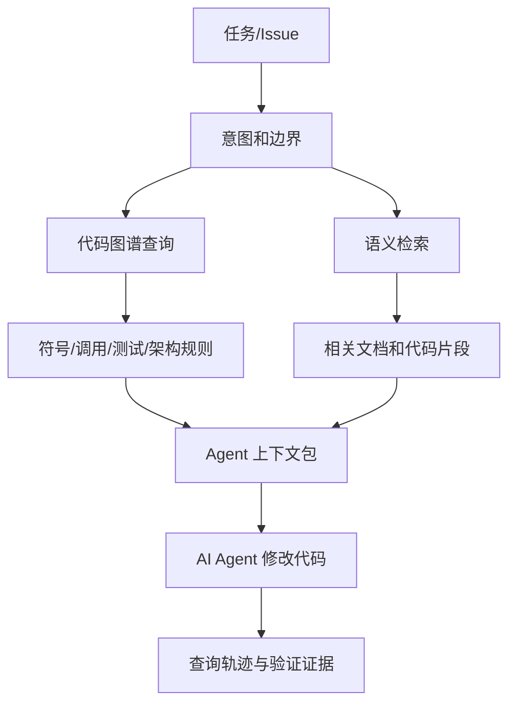

# Agent 上下文工程

Agent 上下文工程关注如何给 AI 提供正确、充分、可验证的代码上下文。它不是简单扩大上下文窗口，而是围绕任务选择、组织和约束信息。

如果没有上下文工程，Agent 很容易变成“会写代码的搜索器”：它能读文件、改文件，但不一定知道哪些文件重要、哪些边界不能跨、哪些测试需要运行。上下文工程要解决的就是这个问题。



> 后续 AI 配图备注：可生成一张“Agent 在修改前先查询代码图谱”的流程插画，表现任务、检索、图谱查询、上下文包、修改、验证报告的闭环。

## 上下文窗口不等于代码理解

把更多文件塞进上下文，并不等于更好的理解。上下文太少会遗漏关键关系，上下文太多会引入噪声，让 Agent 注意力分散。

有效上下文应该满足三个条件：

1. 相关：与当前任务有明确关系。
2. 结构化：说明文件、符号、调用、测试之间的关系。
3. 可验证：每个结论能追溯到代码或数据来源。

因此，Agent 上下文工程更像“检索 + 图谱查询 + 任务裁剪 + 证据组织”，而不是单纯拼接文本。

## 任务理解与意图边界

上下文构建首先要理解任务意图。不同任务需要不同上下文。

例如：

- 修复一个接口 bug：需要入口、调用路径、相关测试、异常日志。
- 修改一个数据字段：需要读写关系、数据库迁移、消费者和 API。
- 重构一个模块：需要依赖边界、变更历史、测试覆盖和 owner。
- 补充测试：需要目标行为、覆盖缺口和历史失败。

任务边界也很重要。系统应该尽量明确：哪些文件是主要修改范围，哪些文件只读参考，哪些模块不应修改。对 Agent 来说，边界本身就是约束。

## 相关文件选择

相关文件可以来自多个信号：

- 关键词和语义检索。
- 同目录和同模块。
- 符号定义与引用。
- 调用方和被调用方。
- 相关测试。
- 历史共同变更。
- 运行时 Trace 路径。
- PR 或 Issue 中提到的文件。

这些信号应该组合使用。全文检索能找到候选文件，符号和调用关系能确认结构相关性，变更历史能发现隐性耦合，Coverage 能找到验证入口。

一个实用策略是把文件分层：

- 必读文件：任务直接修改或直接依赖。
- 相关文件：调用链、测试、配置、历史共同变更。
- 背景文件：架构规则、接口定义、文档。

这样 Agent 可以先读必读文件，再按需要扩展。

## 符号查询

符号查询比文本搜索更稳定。它能回答：

- 这个类或方法在哪里定义。
- 这个符号在哪里被引用。
- 这个接口有哪些实现。
- 这个方法属于哪个类型。
- 这个字段在哪些地方读写。

Agent 修改代码前，应该优先查询目标符号，而不是只搜索字符串。否则它可能混淆同名方法、忽略重载、漏掉实现类。

## 调用方和被调用方查询

调用关系是上下文工程的核心。修改一个方法前，Agent 至少需要知道：

- 谁调用它。
- 它调用谁。
- 是否处于业务入口路径。
- 是否被多个模块共享。
- 是否有运行时高频路径。

调用方查询用于判断影响面，被调用方查询用于理解实现依赖。两者结合，才能避免只看局部实现。

## 相关测试查询

Agent 经常需要补测试或运行测试，但它必须知道哪些测试相关。

相关测试可以来自：

- Coverage。
- 测试命名和目录。
- 测试调用路径。
- 历史共同变更。
- CI 失败记录。

测试上下文不应该只给文件名，还应该说明推荐依据。例如“该测试覆盖了目标方法”“该测试历史上因相关模块变更失败”“该测试覆盖业务入口但未覆盖异常分支”。

## 架构约束查询

Agent 需要知道哪些事情不能做：

- 哪些模块不能依赖。
- 哪些接口是稳定边界。
- 哪些资源只能通过指定服务访问。
- 哪些目录不能新增业务逻辑。
- 哪些变更必须同步测试或文档。

这些约束可以来自架构规则、CODEOWNERS、文档、CI 检查和历史 Review。把约束明确放进上下文，可以减少 AI 的边界误改。

## 上下文包结构

一个面向 Agent 的上下文包可以包含：

```text
任务摘要
  -> 修改目标
  -> 必读文件
  -> 关键符号
  -> 调用方和被调用方
  -> 相关测试
  -> 相关配置和资源
  -> 架构约束
  -> 风险提示
  -> 禁止修改范围
```

上下文包最好是结构化的，而不是一大段自然语言。结构化上下文便于 Agent 执行，也便于 Reviewer 审计。

## 查询轨迹和审计

Agent 查过什么，也应该被记录。查询轨迹可以帮助 Reviewer 判断：

- Agent 是否查过目标方法的调用方。
- 是否查看了相关测试。
- 是否检查了架构规则。
- 是否只读了一个局部文件就开始修改。

查询轨迹本身也是 Review 证据。它让 AI 的工作过程不再是黑盒。

## 小结

Agent 上下文工程的目标，是让 AI 在正确边界内获得足够证据。它需要结合语义检索、符号查询、代码图谱、变更历史、测试覆盖和架构规则。

下一章会进一步讨论：代码图谱如何成为 Agent 查询上下文的核心基础设施。

## 延伸阅读与参考资料

- [GitHub Copilot: Explore a codebase](https://docs.github.com/en/copilot/tutorials/explore-a-codebase)：AI 辅助探索代码库的官方教程。
- [VS Code: How Copilot understands your workspace](https://code.visualstudio.com/docs/agents/reference/workspace-context)：工作区上下文、搜索和 Agent 工具使用方式。
- [GitHub Copilot cloud agent](https://docs.github.com/copilot/concepts/agents/cloud-agent/about-cloud-agent)：云端编码 Agent 的官方概念说明。
- [SWE-bench](https://github.com/swe-bench/SWE-bench)：真实仓库 Issue 到补丁的评测基准。
- [Retrieval-Augmented Code Generation Survey](https://arxiv.org/html/2510.04905v1)：仓库级代码生成中的 RAG 综述。
