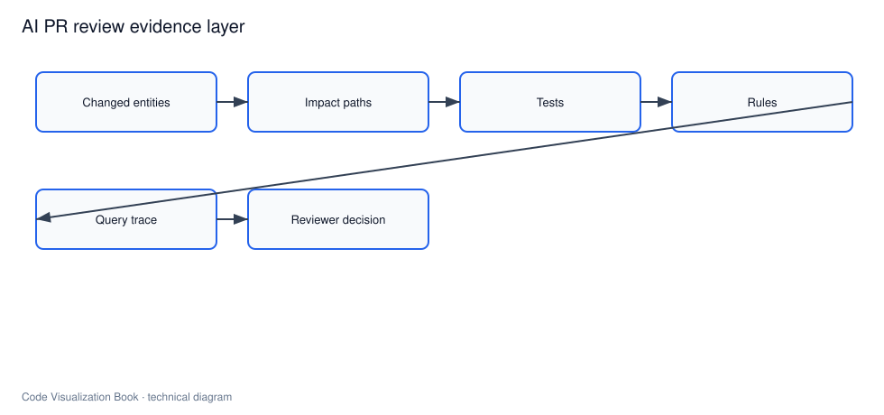

# AI 生成代码的 Review 证据层

## 本章要解决的问题

Reviewer 需要哪些证据才能判断 AI 改动是否可信？

## 读者读完应获得什么

1. 能列出 AI PR 的最小证据清单。
2. 能区分“模型解释”和“系统证据”。
3. 能把证据层接入 CI/PR 注释。

## 本章不讲什么

- 不设计完整人工管理流程。
- 不声称证据可替代所有人工判断。

## 本章与邻章边界

- 本章聚焦**改后**：Reviewer 需要哪些系统证据。
- 影响面算法细节见第四篇；Agent 改前上下文见上下文工程章。

---



AI 生成的 PR 往往包含流畅说明，但 Reviewer 需要的是可核验证据。证据层把代码理解系统接到评审现场。

## 最小证据清单

对任何 AI 修改，至少检查：

1. **改动范围**：实际变更实体列表
2. **影响路径**：入口与关键下游
3. **相关测试**：已跑/未跑/需更新
4. **规则检查**：架构/安全基线
5. **查询轨迹**：Agent 如何得到上下文
6. **残留风险**：已知不确定点

`PR-42` 样例报告：[`examples/mini-shop/artifacts/verification-report-pr-42.md`](../examples/mini-shop/artifacts/verification-report-pr-42.md)

## 模型说明 vs 系统证据

| 类型 | 例子 | 可信基础 |
| --- | --- | --- |
| 模型说明 | “只改了折扣，无风险” | 生成文本 |
| 系统证据 | callers=calculateTotal...；tests 需更新 | 图谱查询与命令结果 |

Review 政策应要求：关键断言必须有系统证据支撑。

## 证据在 PR 中的呈现

建议顺序：

```text
1. 变更摘要（实体级）
2. 影响路径图/列表
3. 测试计划与结果
4. 规则与安全检查
5. 查询轨迹折叠区
6. 人工待确认项
```

不要把原始 JSON 一股脑贴出；先摘要，后下钻。

## 自动化与人工分工

- 自动：影响面、测试关联、规则、格式化报告
- 人工：业务语义、产品取舍、例外批准
- AI：草拟说明，但不可自证安全

## 反模式

1. 只看模型自信度
2. 绿测就过，不看是否测到变更路径
3. 证据不可回跳源码
4. 无查询轨迹，无法复盘

## 局限

- 证据完整不等于业务正确，关键语义仍需人工判断。
- 自动化检查受索引新鲜度和规则覆盖限制。
- 证据过多会造成 Review 疲劳，需要分层呈现。

## 小结

1. AI PR 需要专门的证据层。
2. 证据必须来自可复现查询与检查。
3. 报告要服务 Reviewer 决策，而不是炫技。
4. 人工仍负责业务与例外判断。

## 进阶要点：证据分级

不是所有证据同等重要。可分级：

| 级别 | 例子 | 合并策略参考 |
| --- | --- | --- |
| 阻断 | 架构规则失败、高危路径无测试 | block |
| 重要 | 影响路径跨模块、金额语义变化 | 必审 |
| 提示 | 文案/日志变化、低置信调用边 | 可折叠展示 |

`PR-42` 属于“重要”：金额语义变化 + 测试需更新，但架构规则未破。

## 工作示例：PR 评论骨架

```markdown
### 自动证据
- Changed: DiscountPolicy.apply
- Paths: apply -> calculateTotal -> createOrder -> create
- Tests: 2 related (need assert update 180 -> 170)
- Rules: pricing-no-payment pass
- Trace: find_symbol, find_callers, related_tests, rules

### 人工待确认
- 业务是否确认 VIP 折扣新值 0.85
```

自动证据解决“改了什么/影响谁/测什么”；人工确认解决“该不该改成这个业务值”。

## 常见问题：AI Review 证据

### 模型很自信是否可合并？

不可以。自信不是证据。

### 测试全绿是否足够？

不够。还要确认测到了变更路径，且规则/影响面已被检查。

### 证据太多怎么办？

分级：阻断/重要/提示；默认展示前两级。

## 本章检查清单

1. 变更实体是否列出
2. 影响路径是否可回跳
3. 相关测试是否识别并执行
4. 规则结果是否展示
5. 查询轨迹是否保留

## 关键要点复盘

围绕「AI 生成代码的 Review 证据层」，读者离开本章前应能做到：

1. 区分阻断/重要/提示证据
2. 填写证据包字段契约
3. 用 PR-42 写自动证据+人工确认
4. 拒绝“模型自信/全绿即过”
5. 衔接到 AI 辅助重构

若任一做不到，请先复习本章例子与练习，再继续向后读。

## Reviewer 60 秒路径

1. 看变更实体是否与 PR 描述一致
2. 看影响路径是否到达入口/资金/权限点
3. 看测试是否覆盖这些路径
4. 看规则是否失败
5. 看轨迹是否显示 Agent 查过测试与规则

任何一步对不上，就从“快速合并”降级为“深入审”。

## 证据包字段契约

AI PR 证据层建议固定字段，便于 CI 与 UI 共用：

```json
{
  "pr": "PR-42",
  "changed_entities": [{"id": "method:DiscountPolicy#apply", "change_type": "modified"}],
  "impact_paths": [{"path": ["method:DiscountPolicy#apply", "method:PricingService#calculateTotal", "method:OrderService#createOrder", "method:OrderController#create"]}],
  "related_tests": ["test:PricingServiceTest#shouldApplyVipDiscount"],
  "rules": [{"id": "pricing-no-payment", "status": "pass"}],
  "risk": {"level": "medium", "reasons": ["pricing semantics change"]},
  "query_trace": ["find_symbol", "find_callers", "related_tests", "architecture_rules"],
  "human_checks": ["业务是否确认折扣 0.85"]
}
```

缺 `changed_entities` 或 `query_trace` 的报告，只能算摘要，不能算可审计证据。

## 练习


1. 用 PR-42 填完整证据清单 6 项。
2. 把模型说明“无风险”改写成必须附带的系统证据段落。
3. 设计 CI 门禁：哪些证据缺失应 block merge。

## 本章导航

- 上一章：[代码图谱如何服务 AI Agent](code-graph-for-ai-agent.md)
- 下一章：[AI 辅助重构与系统迁移](ai-assisted-refactoring-and-migration.md)
- 相关章：[给 AI Agent 的查询接口](../part6/query-interface-for-ai-agent.md)；[AI 修改后的验证报告](../part6/ai-change-verification-report.md)

## 延伸阅读与参考资料

- [GitHub status checks](https://docs.github.com/en/pull-requests/collaborating-with-pull-requests/collaborating-on-repositories-with-code-quality-features/about-status-checks)
- [CodeQL code scanning](https://codeql.github.com/docs/codeql-overview/about-code-scanning-with-codeql/)
- [SARIF](https://docs.oasis-open.org/sarif/sarif/v2.1.0/sarif-v2.1.0.html)。资料卡：`../docs/research-cards/rc-sarif.md`
- [Codecov PR reporting](https://docs.codecov.com/docs)
- [Test Impact Analysis](https://learn.microsoft.com/en-us/azure/devops/pipelines/test/test-impact-analysis)。资料卡：`../docs/research-cards/rc-test-impact.md`
- 本书样例：[`verification-report-pr-42.md`](../examples/mini-shop/artifacts/verification-report-pr-42.md)。
