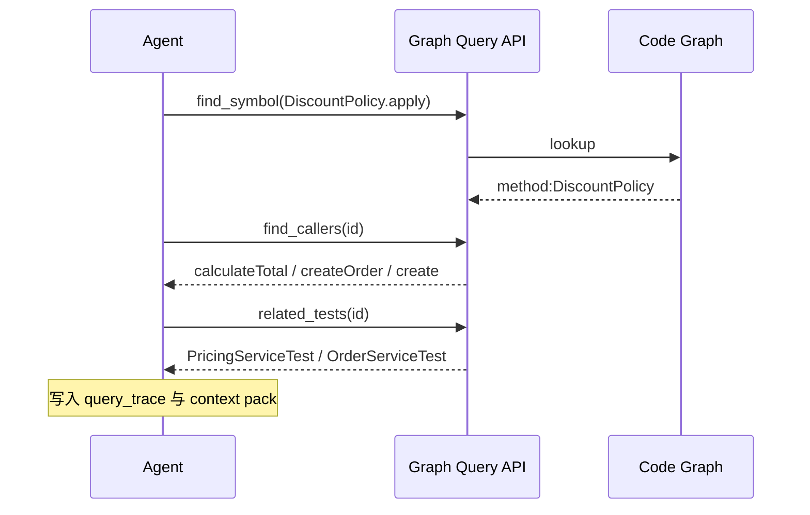

# 代码图谱如何服务 AI Agent

## 本章要解决的问题

图谱如何成为 Agent 的上下文压缩、边界约束和审计基础？

## 读者读完应获得什么

1. 能说明图谱查询与纯 RAG 的互补关系。
2. 能设计最小工具集：find_symbol / callers / impact / tests / rules。
3. 能描述失败模式与降级策略。

## 本章不讲什么

- 不绑定单一 Agent 框架。
- 不把 MCP 当唯一实现。

## 本章与邻章边界

- 本章聚焦**查询与约束**：Agent 通过哪些图谱工具获得结构事实。
- 不重讲上下文包组装细节（见 Agent 上下文工程），也不展开 PR 证据报告模板（见 Review 证据层）。

---

向量检索擅长找“语义相似文本”，代码图谱擅长表达“结构上相关”。Agent 两者都需要。

## 为什么需要图，而不只是 RAG

| 需求 | RAG | 代码图谱 |
| --- | --- | --- |
| 找描述相似代码 | 强 | 弱 |
| 找精确调用方 | 弱 | 强 |
| 架构规则 | 弱 | 强 |
| 影响路径 | 弱 | 强 |
| 可审计轨迹 | 中 | 强 |

改折扣时，“VIP 优惠文案”可能语义相似，但结构无关；`DiscountPolicy.apply` 的调用方才是关键。

## 最小工具面

```text
find_symbol
find_callers
find_callees
impact_analysis
related_tests
architecture_rules
```

`PR-42` 上的成功路径：

```text
find_symbol(apply)
 -> find_callers
 -> related_tests
 -> architecture_rules
 -> 生成补丁
 -> impact_analysis 复核
```

## 上下文压缩

图谱帮助把全库压缩为任务子图：

```text
全仓库文件 N
 -> 相关符号与邻居 K (K << N)
 -> 提示中只放 K 的关键片段与结构化摘要
```

压缩的目标不是更短，而是更高密度的正确关系。

## 边界约束

在工具层强制：

- 默认不允许跨 `out_of_scope` 模块写文件
- 破坏 `architecture_rules` 时升级为需确认
- 修改后必须重新查询影响面

这比只在 prompt 里写“请遵守架构”更可靠。

## 失败模式

1. 图谱过期：索引未更新
2. 低置信调用边被当确定
3. 工具太多导致 Agent 乱点
4. 只查不验证，修改后不复核

降级策略：标注不确定、扩大测试范围、请求人工确认。

## Agent 查图调用链



没有轨迹的查图，等于不可审计的“感觉检索”。


## 局限

- 图谱质量决定工具上限，过期索引会误导 Agent。
- 工具集不能消除提示注入与错误任务理解。
- 对动态行为仍需测试与运行时证据补充。

## 小结

1. 图谱补齐 RAG 在结构关系上的短板。
2. 小而稳的查询工具集优于万能聊天。
3. 图谱同时服务压缩、约束和审计。
4. 修改后复核与改前查询同样重要。

## 工具编排策略

不建议让 Agent 自由乱点工具。推荐策略：

1. **先 find_symbol** 锁定主实体
2. **再 find_callers / related_tests** 扩展最小邻居
3. **architecture_rules** 做边界检查
4. 修改后 **impact_analysis** 复核
5. 全过程写入 query_trace

可用状态机约束：

```text
RESOLVE_SYMBOL -> EXPAND_CONTEXT -> EDIT -> VERIFY -> REPORT
```

任何一步失败（未知符号、规则失败、测试缺失）都应进入 `needs_confirmation`，而不是继续“自信修改”。

## 与 MCP 的关系

MCP 提供的是工具暴露与调用协议；它不负责：

- 图谱是否正确
- 检索策略是否合理
- 权限与多租户

因此协议层与事实层要分开建设：先有可信图谱查询，再包装成 MCP/工具接口。

## 工作示例：失败重试策略

若 `find_symbol("apply")` 返回多个重名：

1. 提高查询精度（限定模块 pricing）
2. 仍多候选则返回 needs_confirmation
3. 禁止 Agent 随机挑一个修改

工具层要有“拒绝继续”的能力，这是安全默认，不是功能缺陷。

## 关键要点复盘

围绕「代码图谱如何服务 AI Agent」，读者离开本章前应能做到：

1. 列出最小工具集
2. 演示 find_symbol→callers→tests
3. 要求失败响应结构化
4. 说明轨迹如何进入验证报告
5. 衔接到 Review 证据层

若任一做不到，请先复习本章例子与练习，再继续向后读。

## 工具结果如何写进上下文包

```text
tool: find_callers
result_summary: 1 high-confidence caller
injected_into_context:
 callers: [PricingService.calculateTotal]
 evidence: edge calls confidence=high
```

关键是“结果摘要 + 证据引用”一起注入，而不是把原始巨 JSON 全塞给模型。

## Agent 查图最小工具集

```text
find_symbol(name|id) -> node
find_callers(id, depth=1..n)
find_callees(id)
impact_analysis(changed_ids)
related_tests(id)
architecture_rules(module|id)
```

每次工具调用写入 `query_trace`，最终进入验证报告。没有轨迹的 Agent 结论，Reviewer 无法复盘。

## 上下文包切片规则

给 Agent 的不是全图，而是任务切片：

```json
{
  "task": "change VIP discount factor",
  "seed": ["method:DiscountPolicy#apply"],
  "include": ["callers_depth_3", "related_tests", "rules"],
  "exclude": ["unrelated modules", "full repo dump"]
}
```

切片失败的典型症状：token 爆、改错文件、漏测试。


## 练习

1. 为 `mini-shop` 设计 6 个工具调用序列完成 PR-42。
2. 说明何时应降低 confidence 并要求人工确认。
3. 比较 RAG-only 与 Graph+RAG 在“找 apply 调用方”任务上的差异。

## 延伸阅读与参考资料

- [Model Context Protocol](https://modelcontextprotocol.io/)。资料卡：`../docs/research-cards/rc-mcp.md`
- [Joern CPG](https://docs.joern.io/code-property-graph/)：代码图查询思想。
- [CodeQL](https://codeql.github.com/docs/)：声明式代码查询参考。
- [GitHub Copilot docs](https://docs.github.com/en/copilot)。
- [JSON Schema](https://json-schema.org/)：工具输入输出契约。
- 本书样例：[`examples/mini-shop/artifacts/code-graph.json`](../examples/mini-shop/artifacts/code-graph.json)。
