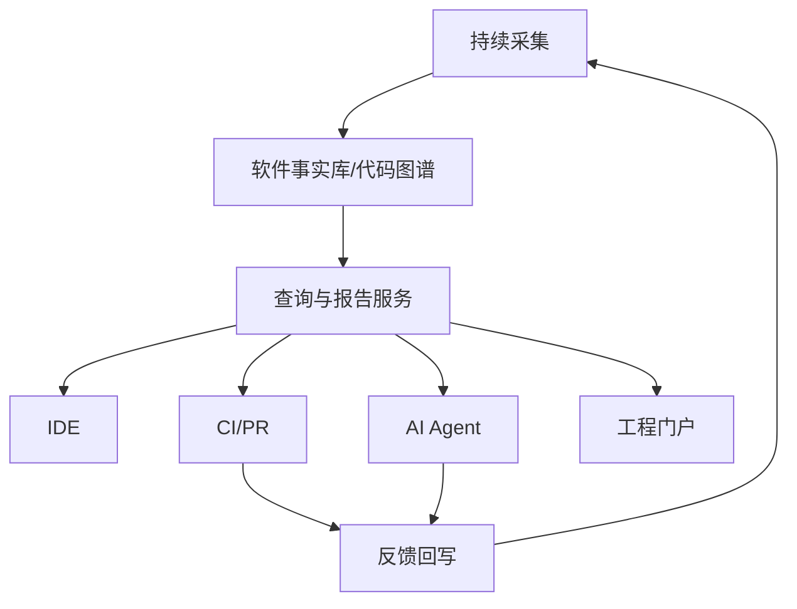

# 从代码可视化到软件理解基础设施

## 本章要解决的问题

如何把一次性图表能力升级为持续更新的软件理解基础设施？

## 读者读完应获得什么

1. 能描述组织级最小基础设施形态。
2. 能列出数据、查询、集成、治理四条建设主线。
3. 能把本书能力映射到路线图，而不是工具堆砌。

## 本章不讲什么

- 不推销特定商业平台。
- 不要求一上来全量中台化。

## 本章与邻章边界

- 本章做组织级收束与建设路线，不重复前文机制细节。
- 最小可运行闭环实现见第六篇实践项目。

---

当代码可视化只用于演示，它是材料；当它持续服务于开发、Review、AI Agent 和治理，它是基础设施。

## 最小基础设施形态



## 四条主线

1. **数据主线**：源码、运行时、变更、组织信息持续入库
2. **查询主线**：符号、调用、影响面、规则、测试
3. **集成主线**：IDE、CI、PR、Agent、门户共用 API
4. **治理主线**：权限、审计轨迹、质量 SLO、索引新鲜度

## 与 mini-shop 实践的关系

第六篇最小系统是基础设施的“可讲解缩影”：

- collector / graph / analysis / ui / agent-api / report

组织级只是在可靠性、多仓、权限和规模上扩展，而不是换一套完全不同的概念。

## 建设顺序建议

1. 单仓可重复采集与调用图
2. PR 影响面报告
3. Agent 查询接口与上下文包
4. 多仓与组织元数据
5. 运行时证据融合
6. 平台化治理

每一步都要能回答：减少了多少理解成本或 Review 风险。

## 成功度量

- 影响面报告在 PR 中的使用率
- 相关测试推荐命中率
- Agent 修改后返工率
- 索引延迟与准确率
- Reviewer 平均理解时间

## 局限

- 平台化有组织成本，不能指望一次建设完成。
- 多仓、多语言会显著提升采集与一致性难度。
- 没有使用度量时，基础设施容易变成展示工程。

## 小结

1. 基础设施 = 持续事实 + 共享查询 + 工作流集成。
2. 从单仓闭环长出来，而不是先画大台。
3. 人、CI、Agent 共用同一证据层。
4. 用工程度量证明价值，而不是用图数量证明价值。

## 进阶要点：从项目到平台的最小增量

不要一开始就做“全公司统一中台”。更稳的增量是：

1. 单仓图谱 + PR 影响面（本周可用）
2. Agent 查询接口 + 轨迹（赋能 AI 工作流）
3. 多仓与 Owner 目录（组织层）
4. 运行时证据融合（降噪与热点）

每一步都要有使用率或返工率等度量，否则平台化容易空转。

## 角色与职责

| 角色 | 职责 |
| --- | --- |
| 平台组 | 索引、查询 API、SLA |
| 应用团队 | 规则、Owner、表征测试 |
| 质量/安全 | 门禁策略与高危规则 |
| AI 工具组 | Agent 策略与轨迹消费 |

基础设施失败常常不是技术做不到，而是职责悬空：谁都不维护索引新鲜度，谁都抱怨“图不准”。

## 工作示例：索引新鲜度 SLO

| 指标 | 目标 |
| --- | --- |
| 主分支索引延迟 | < 15 分钟 |
| PR 增量索引延迟 | < 5 分钟 |
| 关键查询成功率 | > 99% |
| 图谱契约测试 | 每次发布必过 |

没有 SLO 的“平台”最后会变成无人维护的静态导出任务。

## 常见问题：基础设施化

### 先做平台还是先做单仓闭环？

先单仓闭环，再平台化。

### 如何避免平台空转？

设使用率/返工率/索引延迟等度量。

### 谁维护规则与 Owner？

应用团队维护领域规则与 Owner；平台维护索引与 API。

## 本章检查清单

1. 是否有事实层
2. 是否有查询 API
3. 是否接入 PR/Agent
4. 是否有新鲜度 SLO
5. 是否有角色分工

## 关键要点复盘

围绕「从代码可视化到软件理解基础设施」，读者离开本章前应能做到：

1. 用自己的话解释核心概念与边界
2. 在 `mini-shop` / `PR-42` 上指出对应实体、路径或产物
3. 说明它如何服务人或 AI 的具体决策
4. 列出至少两个局限或失败模式
5. 知道下一章将把它连接到哪一层能力

若任一做不到，请先复习本章例子与练习，再继续向后读。

## 采购/自建决策提示

| 问题 | 倾向 |
| --- | --- |
| 是否只要展示图？ | 工具即可 |
| 是否要进 PR/Agent？ | 需要可查询事实层 |
| 是否多语言多仓？ | 平台化与标准 schema |
| 是否强合规审计？ | 轨迹与权限成为硬需求 |

不要用“买一个可视化工具”替代“建设理解基础设施”的决策，除非需求仅止于展示。

## 最小基础设施拓扑

```text
Collectors (AST/graph/diff/test/trace)
    -> Fact Store (graph + evidence)
        -> Query API (human UI + Agent tools)
            -> Reports (impact/verification)
            -> Governance (rules, audit trail)
```

落地顺序建议：

1. 稳定 ID 与采集
2. 可查询图谱
3. 影响面报告
4. Agent 工具与轨迹
5. 组织策略与度量

跳过 1-3 直接做“AI 平台”，通常只会得到更快的不可审改动。

## 运行指标（早期就该看）

| 指标 | 含义 |
| --- | --- |
| 自动影响面覆盖率 | AI/人工 PR 中有报告的比例 |
| 相关测试命中率 | 推荐测试真正失败/需更新的比例 |
| 轨迹完整率 | 含 query_trace 的 PR 比例 |
| 返工率 | 合并后因理解错误导致的 revert/hotfix |


## 练习

1. 画出你们组织从 L2 到 L4 的三步路线图。
2. 给出 4 个成功度量，并说明如何采集。
3. 解释为何 IDE/CI/Agent 应共享同一事实层。

## 延伸阅读与参考资料

- [Backstage](https://backstage.io/docs/overview/what-is-backstage/)。资料卡：`../docs/research-cards/rc-backstage-catalog.md`
- [OpenTelemetry](https://opentelemetry.io/)
- [Internal Developer Platform](https://internaldeveloperplatform.org/)
- [MCP](https://modelcontextprotocol.io/)。资料卡：`../docs/research-cards/rc-mcp.md`
- [GitHub platform docs](https://docs.github.com/)：PR/Checks 集成位
- 本书实践篇：[`part6/mini-code-understanding-system.md`](../part6/mini-code-understanding-system.md)
