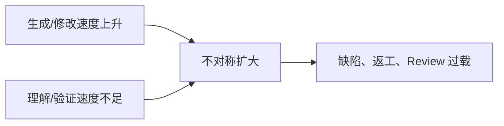

# 为什么 AI 时代更需要代码理解

## 本章要解决的问题

AI 让写代码更快之后，为什么代码理解反而更重要？

## 读者读完应获得什么

1. 能说明生成加速与验证压力之间的不对称。
2. 能列出 Agent 修改代码时必需的结构化能力。
3. 能把本书主线重新收束到“理解、约束、验证”。

## 本章不讲什么

- 不争论模型排名。
- 不把 AI 写成万能或无用。

## 本章与邻章边界

- 本章只回答“为什么 AI 时代更需要代码理解”。
- 不展开上下文包字段、图谱查询接口或 Review 报告模板；这些分别见后续章节。

---

AI 编程降低了“写出一段代码”的成本，但没有自动消除：

- 找对位置
- 保持架构边界
- 更新测试
- 证明改动安全

相反，当 Agent 可以跨文件批量修改时，错误也会以更高速度扩散。代码理解因此从“高级团队加分项”变成“AI 工程基础设施”。

## 速度不对称



如果生成快、验证慢，团队会陷入：

1. 大量 PR 等待人工理解
2. Reviewer 只能抽样看
3. 回归靠运气被测到

## Agent 失败的典型原因

结合 `mini-shop` 任务“改 VIP 折扣”：

| 失败 | 原因 | 缺什么 |
| --- | --- | --- |
| 只改常量不改测试 | 无相关测试查询 | related_tests |
| 改到日志文本 | 无 AST/符号定位 | 结构事实 |
| 不知订单/支付受影响 | 无调用图 | 影响面 |
| 无法向 Reviewer 解释 | 无查询轨迹 | 证据层 |

## 代码理解提供的四类能力

1. **定位**：改哪里
2. **约束**：不能越哪些边界
3. **扩展**：还要看谁、测谁
4. **证明**：如何验证与审计

这四类能力对应本书的图谱、场景、上下文与报告。

## 对人与对 AI 是同一套事实

不要建设两套系统：

- 给人看图
- 给 AI 另做黑盒检索

而应共享代码图谱：

- 人用可视化与报告
- Agent 用查询接口与上下文包
- Reviewer 用同一证据链审计

## 局限

- 代码理解系统不能自动保证生成代码业务正确。
- 组织流程与责任机制仍是落地关键条件。
- 不同团队的规则与风险阈值需要本地化。

## 小结

1. AI 放大的是修改速度，也放大验证缺口。
2. 代码理解是 AI 工程的基础设施，不是附属展示。
3. 定位、约束、扩展、证明是最小能力集。
4. 人与 AI 应共享同一事实层。

## 组织政策草案（可改编）

1. AI PR 必须附变更实体列表
2. 必须附影响路径或说明为何不适用
3. 相关测试必须被识别并执行
4. 架构规则失败默认阻断
5. 查询轨迹保留不少于 14 天

政策不必一开始就很重，但必须可执行；只靠“请大家 Review 仔细一点”无法对抗生成速度。

## 工作示例：速度不对称的数字直觉

假设：

- Agent 每小时可提 10 个跨文件 PR
- 人工深度 Review 每个需 20 分钟
- 则每小时需要约 3.3 小时 Review 产能

若不引入自动证据层与测试选择，Review 必然崩溃或沦为形式签字。代码理解系统首先是在修复这种产能不对称。

## 常见问题：AI 时代动机

### AI 已经能读仓库，为何还要图谱？

能读不等于能稳定检索结构关系并审计。

### 这是不是反对 AI Coding？

相反，这是让 AI Coding 可进入主干的基础设施。

### 小团队也需要吗？

一旦 AI 批量改码，小团队更需要自动证据，因为 Review 产能更少。

## 本章检查清单

1. 是否承认速度不对称
2. 是否定义 AI PR 最低证据
3. 是否区分生成与验证
4. 是否规划事实层共享给人和 Agent

## 关键要点复盘

围绕「为什么 AI 时代更需要代码理解」，读者离开本章前应能做到：

1. 解释生成速度与 Review 产能不对称
2. 写出 AI PR 最低证据政策
3. 用 PR-42 对比有无理解层的差别
4. 自评团队 L0-L4 成熟度
5. 衔接到 Agent 上下文工程

若任一做不到，请先复习本章例子与练习，再继续向后读。

## 能力成熟度（团队自评）

| 级别 | 特征 |
| --- | --- |
| L0 | AI 随意改，人工凭感觉 Review |
| L1 | 有测试门禁，但无影响面 |
| L2 | 有静态影响面与相关测试推荐 |
| L3 | Agent 上下文与轨迹可审计 |
| L4 | 人/CI/Agent 共享事实层并度量返工 |

本书目标是帮助读者从 L0/L1 走向 L2/L3，并理解 L4 的方向。

## 从 PR-42 看“为什么需要理解层”

若无代码理解层，Agent 可能：

1. 用文本替换所有 `0.9`（误伤无关常量）
2. 不更新测试断言
3. 不说明支付金额依赖折后价
4. Reviewer 只能逐文件肉眼扫

有理解层后，最小证据是：

```text
changed: method:DiscountPolicy#apply
path: apply -> calculateTotal -> createOrder -> create
tests: PricingServiceTest, OrderServiceTest (assert 180 -> 170)
rules: pricing-no-payment pass
```

同一改动，从“看起来只是一行”变成“可审计的金额语义变更”。

## 团队落地最小包

第一周不必上平台，先规定：

1. AI PR 描述必须贴变更实体
2. 必须贴相关测试命令与结果
3. 跨模块改动必须手写影响路径或自动报告
4. 禁止无轨迹的“全仓自动重构”

这四条就能把大量高风险生成挡在主干之外。


## 练习

1. 列出 Agent 修改 `mini-shop` 折扣时的 4 类失败，并映射到缺失能力。
2. 用 SWE-bench 的仓库级设定，解释为何“单文件生成成功”不等于工程完成。
3. 写一条团队政策：AI PR 合并前必须具备哪些证据。

## 延伸阅读与参考资料

- [SWE-bench](https://github.com/swe-bench/SWE-bench)。资料卡：`../docs/research-cards/rc-swe-bench.md`
- [GitHub Copilot docs](https://docs.github.com/en/copilot)。
- [Model Context Protocol](https://modelcontextprotocol.io/)。资料卡：`../docs/research-cards/rc-mcp.md`
- [NIST AI Risk Management Framework](https://www.nist.gov/itl/ai-risk-management-framework)：AI 风险治理参考（通用）。
- [OpenAI / vendor tool-use docs 入口](https://platform.openai.com/docs)：工具调用成为 Agent 标配能力的工程背景。
- 本书案例：[`examples/mini-shop/`](../examples/mini-shop/)。
