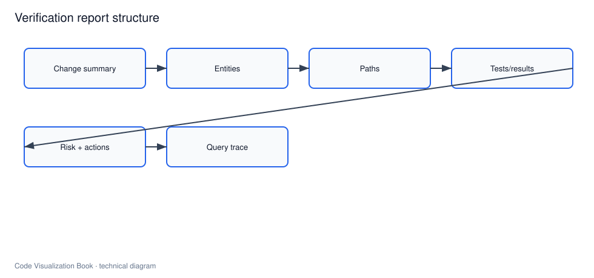

# AI 修改后的验证报告

## 本章要解决的问题

AI 修改后应交付什么验证证据，才能让人和 CI 做出合并判断？

## 读者读完应获得什么

1. 能定义验证报告模板。
2. 能把影响面、测试、规则、查询轨迹组装成交付物。
3. 能用 `PR-42` 完整跑通改后验证故事。

## 本章不讲什么

- 不宣称报告可自动替代负责人决策。

---



验证报告是最小系统闭环的最后一环，也是 AI Coding 工具与 Review 流程的交接点。

## 报告模板

```markdown
# 验证报告：<PR/任务>

## 改动摘要
## 变更实体
## 影响路径
## 相关测试与结果
## 架构/安全规则
## 风险与残留不确定点
## 查询轨迹
## 建议动作
```

完整示例：[`artifacts/verification-report-pr-42.md`](../examples/mini-shop/artifacts/verification-report-pr-42.md)

## PR-42 故事线

1. Agent 领取“调整 VIP 折扣”任务
2. 通过查询接口构建上下文包
3. 修改 `DiscountPolicy.apply`
4. 运行影响面分析
5. 发现测试断言需从 180.0 更新到 170.0
6. 更新测试并重跑
7. 导出验证报告供 Review

## 字段来源

| 字段 | 来源模块 |
| --- | --- |
| 变更实体 | analysis/diff mapper |
| 影响路径 | graph callers search |
| 测试 | related_tests + test runner |
| 规则 | architecture_rules |
| 查询轨迹 | api query logger |

## 机器可读 + 人可读

同时输出：

- `verification-report.json`（CI/工具消费）
- `verification-report.md`（人读/PR 注释）

二者字段同源，避免两套真相。

## 合并建议逻辑（示例）

```text
if architecture_fail: block
elif high_risk and tests_missing: block
elif medium_risk and tests_green: approve_with_notes
else: manual_review
```

逻辑应可配置，并始终展示 reasons。

## 验收

- 对 PR-42 生成报告
- 含路径、测试、风险、轨迹
- 可被 UI 与 PR 注释复用
- 与 impact-report 数据一致

## 局限

- 报告质量受图谱与测试质量上限约束。
- 自动合并建议不能替代责任人决策。
- 跨系统副作用（配置中心、特性开关）可能不在报告内。

## 小结

1. 验证报告是 AI 修改的标准交付物。
2. 证据必须同源、可回跳、可机读。
3. 测试与规则结果要进入同一报告。
4. 到这里，最小代码理解闭环完整闭合。

## 报告分级模板

### Blocker
架构规则失败 / 高危路径无测试 / 解析失败

### Major
金额/权限语义变化、跨模块影响、测试需更新未更新

### Minor
日志文案、低置信候选边、文档同步

`PR-42` 至少是 Major：金额语义变化 + 测试断言过期。

## 工作示例：JSON 与 Markdown 同源

JSON：

```json
{"risk":{"level":"medium","reasons":["money_path","tests_stale"]}}
```

Markdown：

```markdown
风险：中
原因：金额路径；测试断言过期
```

禁止两套手写结果；必须由同一 `Report` 对象渲染，否则 CI 与人工评论会打架。

## 常见问题：验证报告

### 报告由谁生成？

系统生成；模型只能起草说明。

### 能否自动合并？

可建议，不可默认免责自动合并高风险变更。

### JSON 和 Markdown 哪个权威？

同一对象双渲染，禁止两套手写。

## 本章检查清单

1. 字段同源
2. 风险可解释
3. 测试结果纳入
4. 轨迹可回放
5. 门禁策略透明

## 关键要点复盘

围绕「AI 修改后的验证报告」，读者离开本章前应能做到：

1. 用自己的话解释核心概念与边界
2. 在 `mini-shop` / `PR-42` 上指出对应实体、路径或产物
3. 说明它如何服务人或 AI 的具体决策
4. 列出至少两个局限或失败模式
5. 知道下一章将把它连接到哪一层能力

若任一做不到，请先复习本章例子与练习，再继续向后读。

## 验证报告必填章节

1. 变更摘要（实体 ID，不是只写文件名）
2. 影响路径
3. 相关测试与结果
4. 架构规则
5. 风险与建议动作
6. 查询轨迹
7. 人工待确认项

`examples/mini-shop/artifacts/verification-report-pr-42.md` 是金标样例。缺轨迹或实体 ID 的报告不得标记为完成。


## 练习

1. 按模板重写 PR-42 报告的“建议动作”部分。
2. 设计 machine-readable JSON 与 Markdown 的字段映射表。
3. 给出 merge 门禁伪策略，并说明为何不能完全自动免责。

## 延伸阅读与参考资料

- [SARIF](https://docs.oasis-open.org/sarif/sarif/v2.1.0/sarif-v2.1.0.html)。资料卡：`../docs/research-cards/rc-sarif.md`
- [GitHub PR comments API 概念](https://docs.github.com/en/rest/issues/comments)
- [JUnit XML 报告生态](https://github.com/testmoapp/junitxml)
- [CodeQL scanning](https://codeql.github.com/docs/codeql-overview/about-code-scanning-with-codeql/)
- [Test Impact Analysis](https://learn.microsoft.com/en-us/azure/devops/pipelines/test/test-impact-analysis)。资料卡：`../docs/research-cards/rc-test-impact.md`
- 样例：[`verification-report-pr-42.md`](../examples/mini-shop/artifacts/verification-report-pr-42.md)
