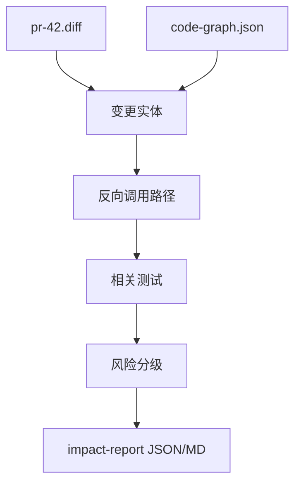

# 构建变更影响分析

## 本章要解决的问题

如何基于 Diff 和图谱自动输出影响面报告？

## 读者读完应获得什么

1. 能实现 Diff -> 实体 -> 反向路径 -> 测试 -> 风险 的算法骨架。
2. 能对 `PR-42` 产出与样例一致的关键字段。
3. 能解释不确定结果如何表示。

## 本章不讲什么

- 不追求研究级指针分析精度。

---

## 算法骨架

```text
1. parse_diff(diff) -> changed_lines_by_file
2. map_lines_to_entities(graph, changed_lines) -> changed_entities
3. for e in changed_entities:
 reverse_dfs(callers) within depth N
4. collect entry points / external resources
5. collect related tests
6. score risk
7. emit report json/md
```

## Diff 映射

对 `pr-42.diff`，变更行落入 `DiscountPolicy.apply` 方法区间，故：

```text
changed_entities = [method:DiscountPolicy#apply]
```

## 反向路径

```text
apply
 ^ calculateTotal
 ^ createOrder
 ^ create
```

伪代码：

```python
def find_callers(graph, method_id, depth=5):
 result = []
 stack = [(method_id, [])]
 while stack:
 cur, path = stack.pop()
 if len(path) > depth: continue
 for edge in inbound_calls(graph, cur):
 nxt = edge.from
 result.append(path + [nxt])
 stack.append((nxt, path + [nxt]))
 return result
```

## 测试关联

```text
tests_edge.to in affected_methods
或 test 方法体候选调用命中 affected_methods
```

## 风险规则（可解释）

```text
if touches_money_path: +2
if has_failing_or_stale_tests: +2
if crosses_modules: +1
if breaks_architecture_rule: +3
```

`PR-42` 应为 medium，并给出 reasons。

## 输出契约

与 [`impact-report-pr-42.json`](../examples/mini-shop/artifacts/impact-report-pr-42.json) 对齐：

```json
{
 "changed_entities": [],
 "impact_paths": [],
 "related_tests": [],
 "risk": {"level": "medium", "reasons": []},
 "recommended_actions": []
}
```

## 验收

- 输入 `artifacts/pr-42.diff`
- 识别 `DiscountPolicy.apply`
- 路径覆盖 `OrderController.create`
- 测试包含 pricing 与 order
- 生成 JSON + Markdown

## 影响面实现流程



输出必须与 `examples/mini-shop/artifacts/impact-report-pr-42.json` 字段兼容。


## 局限

- 静态反向调用无法覆盖所有动态入口。
- 风险规则需要按团队校准。
- 深度过大时路径爆炸，需要裁剪与汇总。

## 小结

1. 影响面是可实现的确定性流水线。
2. 关键在实体映射与调用反向遍历。
3. 风险分数必须可解释。
4. 输出要直接服务 PR 与 Agent 验证。

## 端到端伪代码（可实现）

```python
def analyze(pr_diff, graph):
 changed = map_diff_to_entities(pr_diff, graph)
 impacted = set(changed)
 for e in changed:
 impacted |= reverse_callers(graph, e, depth=5)
 tests = related_tests(graph, impacted)
 risk = score_risk(changed, impacted, tests, graph.rules)
 return Report(changed, paths(impacted), tests, risk)
```

用 `mini-shop` 的 `pr-42.diff` 做金标测试：
`changed={DiscountPolicy.apply}` 且路径包含 `OrderController.create`。

## 工作示例：深度裁剪

反向调用 depth=5 在小仓足够；大仓需要：

1. 按模块裁剪
2. 优先测试入口/API 入口
3. 汇总为“前 N 条关键路径 + 其余计数”

报告应写：`paths_shown=3, paths_total=42`，避免伪称“完整枚举”。

## 常见问题：实现影响面

### depth 设多少？

小仓 5 足够；大仓需裁剪与汇总。

### 如何测算法正确？

用 PR-42 金标：实体、路径、测试、风险字段。

### 风险分数如何避免黑盒？

每条 reason 必须可解释、可配置。

## 本章检查清单

1. diff 映射
2. 反向路径
3. 测试关联
4. 风险解释
5. 报告契约

## 影响面算法伪代码

```text
entities = map_diff_to_entities(diff, graph)
seed = entities.ids
paths = reverse_call_paths(seed, graph, max_depth=5)
entries = paths.map(entry_point)
tests = related_tests(seed ∪ paths.nodes)
risk = score(entities, paths, tests, rules)
emit report(entities, paths, tests, risk, actions)
```

金标检查：`PR-42` 报告中的 `changed_entities`、路径与 `examples/mini-shop/artifacts/impact-report-pr-42.json` 一致。


## 关键要点复盘

围绕「构建变更影响分析」，读者离开本章前应能做到：

1. 实现 diff→实体→路径→测试→风险
2. 对照 artifacts 金标字段
3. 输出 recommended_actions
4. 处理低置信边扩展
5. 衔接到可视化 UI

若任一做不到，请先复习本章例子与练习，再继续向后读。

## 练习

1. 实现（伪代码）diff 行到方法实体的映射。
2. 对 PR-42 跑一遍反向路径，核对是否到达 `OrderController.create`。
3. 给风险规则打分并解释 reasons。

## 本章导航

- 上一章：[构建代码图谱](build-code-graph.md)
- 下一章：[构建可视化界面](build-visualization-ui.md)
- 相关章：[代码图谱：节点、边与属性](../part3/code-graph-model.md)；[Agent 上下文工程](../part5/agent-context-engineering.md)

## 延伸阅读与参考资料

- [git diff](https://git-scm.com/docs/git-diff)。资料卡：`../docs/research-cards/rc-git-diff.md`
- [Test Impact Analysis](https://learn.microsoft.com/en-us/azure/devops/pipelines/test/test-impact-analysis)。资料卡：`../docs/research-cards/rc-test-impact.md`
- [GitHub checks](https://docs.github.com/en/pull-requests/collaborating-with-pull-requests/collaborating-on-repositories-with-code-quality-features/about-status-checks)
- [CodeQL](https://codeql.github.com/docs/)
- [SARIF](https://docs.oasis-open.org/sarif/sarif/v2.1.0/sarif-v2.1.0.html)。资料卡：`../docs/research-cards/rc-sarif.md`
- 样例：[`impact-report-pr-42.json`](../examples/mini-shop/artifacts/impact-report-pr-42.json)
