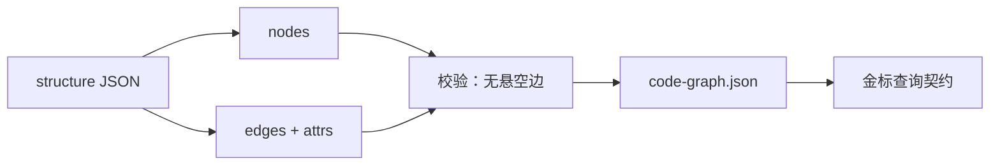

# 构建代码图谱

## 本章要解决的问题

如何把采集结果变成可查询、可校验的图谱模型？

## 读者读完应获得什么

1. 能定义 nodes/edges 表结构。
2. 能完成候选调用到实体的解析策略。
3. 能对图谱做基本完整性校验。

## 本章不讲什么

- 不引入必须的 Neo4j 集群。
- 不做分布式图计算。

---

采集产出的是素材，图谱构建负责统一 ID、补边、写属性和提供查询。这看起来像“搬运”，但真正的工程难点在消解和校验——它们决定了这张图是决策依据，还是自洽的假象。

## 先尝试最朴素的做法：为什么不能只按名字匹配

第一次实现“建调用边”时，最自然的想法是：把采集到的候选调用，按方法名去全仓搜一个同名方法，连上即可。对 `mini-shop` 这个例子，`discountPolicy.apply(...)` 确实能搜到唯一的 `DiscountPolicy.apply`，看起来可行。

但这条路很快会碰到三个失败：

```text
失败 1：同名不同义
 OrderServiceTest 里有 createOrder 调用；若未来 pricing 也出现同名方法，只按名字连，边会指向错误定义

失败 2：不区分接收者
 service.createOrder(...) 里 service 究竟什么类型？不解析接收者，就无法知道该连到哪个类

失败 3：朴素匹配的“自信错误”
 搜到第一个同名方法就连接，并标 confidence=high —— 把猜测包装成事实
```

这三个失败不是理论问题：它们都发生在“只读文本、不读结构”的建图器里。最小可用的消解策略，必须**先限域再匹配，匹配不上就留候选**。

## 调用消解策略（最小）

1. 同文件/同类方法名精确匹配
2. 唯一类名 + 方法名匹配（借接收者文本或类型限定）
3. 多候选时保留 candidates，并标 `confidence=medium`
4. 无候选则保留未解析调用记录

对 `mini-shop`，`discountPolicy.apply` 的接收者是字段 `discountPolicy`，其类型可限定到 `DiscountPolicy`，因此消解到 `DiscountPolicy.apply`，置信度可标 high。

关键判断：**消解的产物不是“每条边都精确”，而是“精确的标注高置信，猜的标注低置信，不知道的明确留白”。** 把不确定标出来，比为了图好看而伪造精确边，对下游重要得多。

## 最小存储

先把图落成可查询的模型。教学用两层即可：

### JSON（交换格式）

```json
{
 "nodes": [{"id": "...", "type": "method"}],
 "edges": [{"type": "calls", "from": "...", "to": "..."}]
}
```

### SQLite（查询实现）

```sql
CREATE TABLE nodes(
 id TEXT PRIMARY KEY,
 type TEXT,
 name TEXT,
 file_path TEXT,
 start_line INT,
 end_line INT,
 props_json TEXT
);
CREATE TABLE edges(
 id TEXT PRIMARY KEY,
 type TEXT,
 from_id TEXT,
 to_id TEXT,
 confidence TEXT,
 source TEXT
);
```

选 SQLite 的理由是：查询影响面（`find_callers`）只需要按 `to_id` 反向找边，SQL 索引即可覆盖；Neo4j 这类专业图库在超大规模与路径算法上更优，但引入成本与运维不是教学必要项（见局限）。

## 必需边集合

对验收，至少存在：

```text
OrderController.create -> OrderService.createOrder
OrderService.createOrder -> PricingService.calculateTotal
PricingService.calculateTotal -> DiscountPolicy.apply
OrderService.createOrder -> PaymentClient.charge
tests 边连接两个测试到对应方法
```

参考：[`artifacts/code-graph.json`](../examples/mini-shop/artifacts/code-graph.json)

## 对照实验：方法级边 vs 文件级边对 PR-42 的影响

很多人第一次建图会退而求其次：只建文件和类级别的依赖（“阶包 / 类文件 → 类文件”），觉得省事又够用。用 `PR-42` 的 impact 结果一对照，差异就出来了：

| 粒度 | `PR-42` 影响面结果 | 测试推荐 | 问题 |
| --- | --- | --- | --- |
| 文件级 | “改动了 `DiscountPolicy.java`，影响 `pricing` 与所有相邻文件” | 泛化到模块内全部测试 | 过度保守：无法区分改的是 `apply` 还是 `getRate` |
| 方法级 | “改动了 `DiscountPolicy#apply`，路径 apply→calculateTotal→createOrder→create” | 精确命中 2 个测试 | 可审计、可回跳、粒度与正文 impact-report 对齐 |

实验结论：**文件级边适合“看趋势”，方法级边才能“做决策”。** 影响面、测试推荐和 Agent 上下文包都吃方法级边；只建文件级边，`impact_report` 会退化成“一堆文件都受影响”，Reviewer 无法缩小范围。这也是金标 `code-graph.json` 全部使用方法级节点的原因。

## 校验规则：脏图比没图更危险

建完图后，第一件事不是给下游用，而是**证明图自身可信**：

1. 所有边端点都存在（无悬空边）
2. method 节点有 file/line（可回跳证据）
3. 无自环 calls（除非真实递归）
4. 架构规则可独立存储并查询

每条规则的背后都是真实失败：悬空边会让 `find_callers` 返回空，Agent 据此认为“没人调用 apply”——它真的会按这个结论修改并声称“无影响面”。节点缺 file/line 会让可视化与 Review 无法回跳源码，证据层当场失效。因此这里有句工程判断：**校验失败就阻断下游，而不是警告后放行。** 脏图上的精美报告，比没有报告更危险。

把五条金标查询（见下）写成自动化测试并不过分：它们是这张图的单元测试。`apply` 的 callers 与 tests 一旦漂移，后面所有 `PR-42` 故事都会一起漂。

## 增量更新：索引会有陈旧的一天

建图不是一次性的。文件变更后必须更新图，而最简单的做法（全仓重建）在仓库变大后越来越贵。按文件粒度更新是标准解：

```text
文件变更时：
1. 删除该文件旧节点与边
2. 重新采集该文件
3. 重建相关 calls/tests
4. 更新 updated_at
```

为什么“删旧再建”而不是“增量打补丁”？因为单个调用边的变化可能波及多条依赖，补丁式更新容易留下悬空边。宁可删掉局部重建，也不要为了“少删”而留下环境债。

陈旧索引的代价是隐蔽的：Agent 拿着昨天的图回答今天的 `find_callers(apply)`，会自信地改一个已经重命名/移动的方法。因此索引必须带版本，过期要能被检测（见“进阶要点”）——这是“证据可信”的底线，不是可选项。

## 建图与校验



`DiscountPolicy#apply` 的 callers / tests 查不到，则建图未验收通过。


建图是把采集结果升级为合同数据的阶段。你要做的核心工作不是挑选图数据库，而是保证边不悬空、ID 稳定、关键查询可回归。没有校验清单就进入影响面，等于把脏数据送进决策。

把五条金标查询写成自动化测试并不过分：它们是系统的单元测试。`apply` 的 callers 与 tests 一旦漂移，后面所有 PR-42 故事都会一起漂。


## 局限

- 最小消解策略在重载/多态场景会留下候选。
- JSON 方案不适合超大规模仓，需后续分层存储。
- 框架注入边需要专用增强，不会凭空出现。

把建图阶段建成质量门，而不是数据搬运工。校验失败就阻断下游，听起来严厉，却能避免影响面和 Agent 在错误图上“自圆其说”。脏图上的精美报告，比没有报告更危险。


## 小结

1. 先有干净模型，再谈高级图算法。
2. 消解允许候选，但必须标置信度。
3. 校验器比“看起来有数据”更重要。
4. JSON/SQLite 足够支撑全书实践。
5. 方法级边是决策粒度，文件级边只够看趋势；索引必须可检出陈旧。

## 进阶要点：增量更新事务

文件级重建时建议：

```text
begin
 delete nodes/edges where file_path = F
 insert new nodes/edges for F
 re-link unresolved calls touching F
commit
```

并记录 `index_version` 与 `updated_at`。Agent 查询若发现索引过期，应明确报错，而不是静默返回陈旧图。

## 工作示例：未解析调用的诚实表达

```json
{
 "type": "calls_unresolved",
 "from": "method:X#y",
 "callee_text": "foo.bar",
 "confidence": "low"
}
```

宁可保留 unresolved，也不要为了“图好看”伪造精确边。Agent 与 Reviewer 都需要知道哪里不确定。

## 常见问题：构建图谱

### 候选调用要不要丢弃？

不要丢，标记 confidence。

### 如何做增量？

按文件删旧建新并重链。

### 如何防陈旧索引？

index_version + 过期报错。

## 本章检查清单

1. schema 清晰
2. 消解策略
3. 校验器
4. 增量更新
5. 金标链可查

## 关键要点复盘

围绕「构建代码图谱」，读者离开本章前应能做到：

1. 完成建图校验清单
2. 保证无悬空边
3. 跑通金标查询
4. 写入 source/confidence
5. 衔接到影响面实现

若任一做不到，请先复习本章例子与练习，再继续向后读。

## 建图校验清单

生成 `code-graph.json` 后必须跑：

1. 所有 edge 的 from/to 都存在于 nodes
2. 关键方法 ID 稳定（`method:Class#method`）
3. 至少 1 条 `tests` 边指向 `DiscountPolicy#apply`
4. 架构规则可计算
5. 与 `PR-42` 变更实体可连接

```text
assert no dangling edges
assert find(method:DiscountPolicy#apply)
assert callers(apply) includes calculateTotal
```

校验失败时禁止进入影响面阶段。


## 练习

1. 写出 nodes/edges 的最小 SQL schema。
2. 对 `discountPolicy.apply` 给出消解策略与 confidence。
3. 列出 4 条图谱完整性校验。

## 本章导航

- 上一章：[采集源码结构](collect-source-structure.md)
- 下一章：[构建变更影响分析](build-change-impact-analysis.md)
- 相关章：[代码图谱：节点、边与属性](../part3/code-graph-model.md)；[Agent 上下文工程](../part5/agent-context-engineering.md)

## 延伸阅读与参考资料

- [SQLite docs](https://www.sqlite.org/docs.html)。资料卡：`../docs/research-cards/rc-sqlite.md`
- [Neo4j modeling](https://neo4j.com/docs/getting-started/data-modeling/)。资料卡：`../docs/research-cards/rc-neo4j-modeling.md`
- [Joern CPG](https://docs.joern.io/code-property-graph/)
- [LSP](https://microsoft.github.io/language-server-protocol/)。资料卡：`../docs/research-cards/rc-lsp.md`
- [JSON Graph / property graph 实践综述入口](https://neo4j.com/docs/)
- 样例：[`code-graph.json`](../examples/mini-shop/artifacts/code-graph.json)
