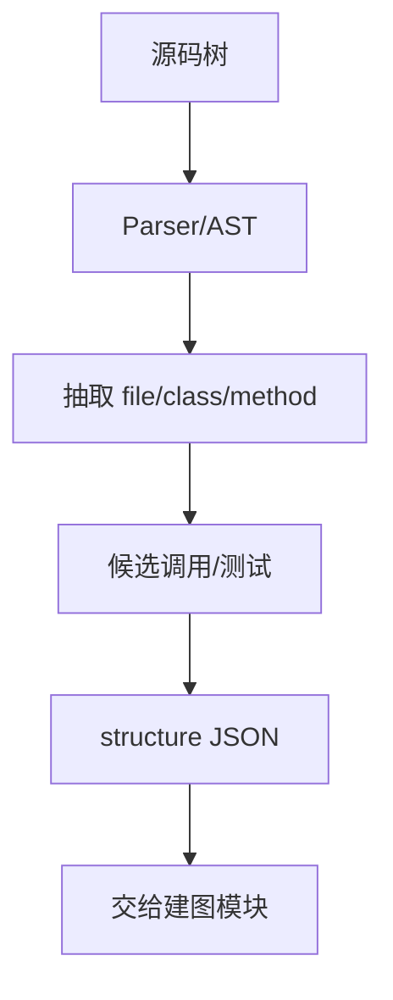

# 采集源码结构

## 本章要解决的问题

如何从源码中抽取文件、类、方法、候选调用和测试，形成稳定 JSON？

## 读者读完应获得什么

1. 能设计采集输入输出契约。
2. 能定义实体稳定 ID。
3. 能处理解析失败而不中断全量任务。

## 本章不讲什么

- 不在本章完成精确语义消解。
- 不支持所有构建系统边角。

---

采集是流水线第一步。目标是可重复地从 `mini-shop` 抽出结构事实。

## 输入输出

输入：

```text
repo_path = examples/mini-shop
source_roots = [src/main/java]
test_roots = [src/test/java]
```

输出节点：file / class / method / test
输出边：contains / calls(候选) / tests(候选)

## 扫描与解析

1. 递归扫描 `.java`
2. 区分 main/test
3. 解析 AST，保留行号
4. 单文件失败时记录错误并继续

## 稳定 ID

```text
file:src/main/java/com/minishop/pricing/DiscountPolicy.java
class:com.minishop.pricing.DiscountPolicy
method:com.minishop.pricing.DiscountPolicy#apply
test:com.minishop.pricing.PricingServiceTest#shouldApplyVipDiscount
```

ID 必须在多次采集间稳定，否则影响面与历史分析会断。

## 方法节点样例

```json
{
 "id": "method:com.minishop.pricing.PricingService#calculateTotal",
 "type": "method",
 "name": "calculateTotal",
 "file_path": "src/main/java/com/minishop/pricing/PricingService.java",
 "start_line": 11,
 "end_line": 16,
 "calls": [
 {"method_name": "apply", "receiver_text": "discountPolicy", "line": 14}
 ]
}
```

注意：此时 `calls` 仍可能是候选，精确绑定可在图谱构建阶段增强。

## 测试识别

简单规则即可起步：

- 路径在 `src/test/java`
- 类名 `*Test`
- 方法带 `@Test`

并尝试从测试方法体提取被测调用，生成 `tests` 候选边。

## 输出目录建议

```text
out/mini-shop/
 files.json
 types.json
 methods.json
 edges.json
 errors.json
```

也可直接合并为 [`artifacts/code-graph.json`](../examples/mini-shop/artifacts/code-graph.json) 形态。

## 验收

- 解析全部 mini-shop 源文件
- 包含 `DiscountPolicy.apply` 与 `OrderService.createOrder`
- 至少抽到 `calculateTotal -> apply` 候选调用
- 错误文件不影响其他文件结果

## 采集流程



采集阶段保留候选，符号消解与置信度可在建图阶段提升。


## 局限

- 候选调用不等于精确调用。
- 生成代码与非常规目录布局需要配置。
- 仅覆盖教学所需 Java 子集时，迁移到其他语言要替换 parser。

## 小结

1. 采集先保证覆盖率与稳定 ID。
2. 候选调用可以后置消解。
3. 失败隔离是工程必备。
4. 输出应能直接进入建图。

## 采集质量门禁

在进入建图前，采集器应输出质量报告：

```json
{
 "files_total": 10,
 "files_parsed": 10,
 "files_failed": 0,
 "methods_extracted": 12,
 "call_exprs": 8,
 "parse_errors": []
}
```

门禁示例：

1. 解析成功率 < 95%：警告
2. 关键模块（order/pricing）解析失败：阻断
3. 无任何 method 节点：阻断

`mini-shop` 教学数据应保持 100% 可解析，作为回归基线。

## 从候选调用到可解释抽取

对 `discountPolicy.apply(...)`，采集阶段至少保留：

- receiver_text
- method_name
- arg_count
- line/column
- enclosing_method_id

这些字段决定后续消解与证据展示是否可用。缺少位置信息的调用边，几乎无法进入 Review 证据层。

## 关键要点复盘

围绕「采集源码结构」，读者离开本章前应能做到：

1. 给出采集输出最小 JSON
2. 区分候选调用与已消解调用
3. 保持稳定 ID
4. 为 mini-shop 列出应抽出的方法集合
5. 衔接到建图

若任一做不到，请先复习本章例子与练习，再继续向后读。

## 采集输出最小 JSON

```json
{
  "files": [{"path": "src/main/java/com/minishop/pricing/DiscountPolicy.java"}],
  "types": [{"id": "class:DiscountPolicy", "file": "...", "lines": [1, 20]}],
  "methods": [{"id": "method:DiscountPolicy#apply", "owner": "class:DiscountPolicy", "lines": [3, 10]}],
  "candidate_calls": [{"from": "method:PricingService#calculateTotal", "name": "apply", "line": 13}],
  "tests": [{"id": "test:PricingServiceTest#shouldApplyVipDiscount"}]
}
```

后续建图阶段再把 `candidate_calls` 提升为带 `resolves_to` 的 `calls` 边。采集阶段保留候选，避免过早丢信息。


## 练习

1. 为 `DiscountPolicy.apply` 设计稳定 ID。
2. 写解析失败时的错误记录字段。
3. 说明候选调用与精确调用的差别，并指出下一章如何消解。

## 常见问题：采集

### 候选调用要不要直接当 calls？

不要。先保留候选，消解后再提升。

### ID 变了怎么办？

显式迁移映射，禁止静默换 ID。

## 本章导航

- 上一章：[构建一个最小代码理解系统](mini-code-understanding-system.md)
- 下一章：[构建代码图谱](build-code-graph.md)
- 相关章：[代码图谱：节点、边与属性](../part3/code-graph-model.md)；[Agent 上下文工程](../part5/agent-context-engineering.md)

## 延伸阅读与参考资料

- [JavaParser](https://javaparser.org/)。资料卡：`../docs/research-cards/rc-javaparser.md`
- [Tree-sitter using parsers](https://tree-sitter.github.io/tree-sitter/using-parsers)。资料卡：`../docs/research-cards/rc-tree-sitter.md`
- [JLS](https://docs.oracle.com/javase/specs/jls/se17/html/index.html)
- [ANTLR](https://www.antlr.org/)。资料卡：`../docs/research-cards/rc-antlr.md`
- [Source path / build layout conventions (Maven)](https://maven.apache.org/guides/introduction/introduction-to-the-standard-directory-layout.html)
- 输出对照：[`code-graph.json`](../examples/mini-shop/artifacts/code-graph.json)
