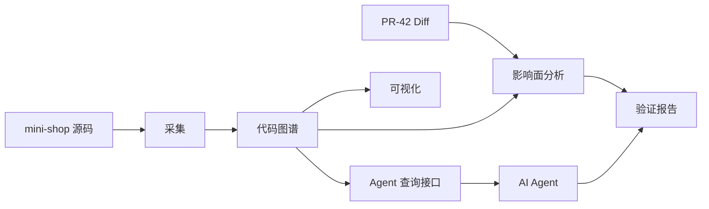
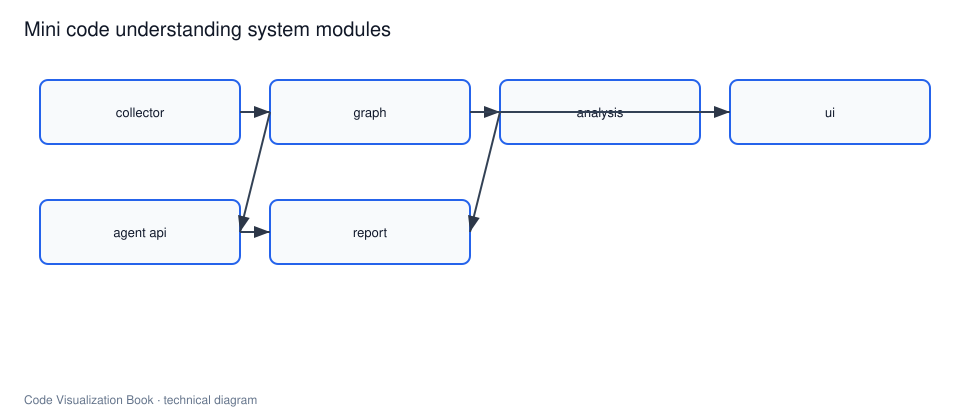

# 构建一个最小代码理解系统

## 本章要解决的问题

如何用最小实现跑通“采集 -> 建图 -> 分析 -> 可视化 -> Agent 查询 -> 验证报告”闭环？

## 读者读完应获得什么

1. 能说明系统目标、边界和模块划分。
2. 能以 `mini-shop` 作为标准示例仓库推进实现。
3. 能定义端到端验收标准。

## 本章不讲什么

- 不做成多租户商业平台。
- 不追求全语言全框架覆盖。

---

本篇把前面的原理与场景收束到实践项目。目标不是大而全，而是完整可讲解。




## 本篇阅读路径

请按下面顺序阅读，后文默认复用总览中的模块划分，不再重复原理定义：

```text
总览（本章）
 -> 采集源码结构
 -> 构建代码图谱
 -> 构建变更影响分析
 -> 构建可视化界面
 -> 给 AI Agent 的查询接口
 -> AI 修改后的验证报告
```

标准输入输出以 `examples/mini-shop/` 与 `examples/mini-shop/artifacts/` 为准。

## 项目目标

1. 解析 `examples/mini-shop`，提取文件/类/方法/调用/测试
2. 生成可查询图谱（JSON 即可）
3. 输入 `PR-42` Diff，输出影响面
4. 提供基础可视化与报告
5. 提供 Agent 工具查询接口
6. 输出验证报告

已提供参考产物：

- [`artifacts/code-graph.json`](../examples/mini-shop/artifacts/code-graph.json)
- [`artifacts/impact-report-pr-42.json`](../examples/mini-shop/artifacts/impact-report-pr-42.json)
- [`artifacts/agent-context-pack.json`](../examples/mini-shop/artifacts/agent-context-pack.json)
- [`artifacts/verification-report-pr-42.md`](../examples/mini-shop/artifacts/verification-report-pr-42.md)

## 系统边界

做：

- Java 子集解析
- 直接调用关系
- Diff 到方法映射
- 反向影响路径
- 测试关联
- JSON 查询 API

不做：

- 完整 IDE
- 完美别名分析
- 生产权限体系
- 大规模分布式图存储

## 模块划分

```text
collector/ 扫描与 AST 抽取
graph/ 节点边存储与校验
analysis/ 影响面与测试推荐
api/ Agent 查询工具
report/ Markdown/JSON 报告
ui/ 最小页面或静态报告页
```

## 技术取舍

| 模块 | 默认选择 | 原因 |
| --- | --- | --- |
| 解析 | JavaParser 或 Tree-sitter | 易讲清 |
| 存储 | JSON/SQLite | 易复现 |
| 可视化 | Mermaid + 简单 HTML | 先证据后炫技 |
| Agent 接口 | 本地工具/JSON API | 可平滑映射 MCP |

## 端到端验收

1. 对 `mini-shop` 生成图谱，包含 `DiscountPolicy.apply` 调用方
2. 对 `pr-42.diff` 识别变更实体
3. 影响路径覆盖到 `OrderController.create`
4. 相关测试包含 pricing/order 两测
5. 能导出验证报告
6. 查询接口可返回 callers/tests

## 局限

- 最小系统只覆盖教学闭环，不替代生产级平台。
- 解析精度、多语言与规模化不在本项目范围。
- artifacts 是标准样例，实现时允许替换存储，但字段契约应保持。

## 小结

1. 最小系统的价值是闭环，不是功能数量。
2. `mini-shop` 与 artifacts 提供标准输入输出。
3. 先 JSON 跑通，再考虑扩展存储与语言。
4. 后续章节分别实现各模块。

## 里程碑验收表

| 里程碑 | 验收 |
| --- | --- |
| M1 采集 | mini-shop 全量 parse，产出 methods/calls |
| M2 建图 | 金标调用链可查询 |
| M3 影响面 | PR-42 报告字段齐全 |
| M4 接口 | 5 工具可调用且有 trace |
| M5 报告 | Markdown+JSON 同源输出 |
| M6 UI | 三视图可完成一次 PR 阅读 |

只有 M1-M5 全绿，才算实践闭环完成；M6 可并行。

## 工作示例：本地演示脚本顺序

```text
1. collect examples/mini-shop -> out/graph.json
2. impact out/graph.json artifacts/pr-42.diff -> out/impact.json
3. context task="vip discount" -> out/context.json
4. report out/impact.json -> out/report.md
```

第六篇各章应按这个脚本顺序对齐输入输出文件名，避免读者在章节间迷路。

## 关键要点复盘

围绕「构建一个最小代码理解系统」，读者离开本章前应能做到：

1. 复述端到端验收剧本
2. 画出模块输入输出
3. 指出任一步 ID 不一致即失败
4. 说明最小系统不是商业平台
5. 衔接到采集实现

若任一做不到，请先复习本章例子与练习，再继续向后读。

## 端到端验收剧本（mini-shop）

1. 采集源码结构 → 生成/更新 `code-graph.json`
2. 输入 `pr-42.diff` → 产出 `impact-report-pr-42.json`
3. 组装 Agent 上下文包 `agent-context-pack.json`
4. 生成 `verification-report-pr-42.md`
5. UI/报告页能在 60 秒讲清变更

任一步产物字段与正文 ID 不一致，即验收失败。

## 模块边界

| 模块 | 输入 | 输出 |
| --- | --- | --- |
| collector | 源码 | 结构事实 |
| graph | 结构事实 | nodes/edges |
| impact | diff+graph | 影响报告 |
| agent-api | graph+report | 工具响应 |
| report | 全部 | 验证报告 |


## 练习

1. 对照 artifacts，列出端到端验收 6 项是否可观察。
2. 说明为何先 JSON 后图数据库。
3. 给 collector/graph/analysis/api/report 各写一句话职责。

## 常见问题：最小系统

### 和商业平台差距在哪？

商业平台强调规模、权限、多仓；本书优先可讲解闭环。

### 可以跳过 UI 吗？

可先报告后 UI，但查询与报告不能省。

## 本章导航

- 上一章：[从代码可视化到软件理解基础设施](../part5/software-understanding-infrastructure.md)
- 下一章：[采集源码结构](collect-source-structure.md)
- 相关章：[代码图谱：节点、边与属性](../part3/code-graph-model.md)；[Agent 上下文工程](../part5/agent-context-engineering.md)

## 延伸阅读与参考资料

- [JavaParser](https://javaparser.org/)。资料卡：`../docs/research-cards/rc-javaparser.md`
- [Tree-sitter](https://tree-sitter.github.io/tree-sitter/)。资料卡：`../docs/research-cards/rc-tree-sitter.md`
- [MCP](https://modelcontextprotocol.io/)。资料卡：`../docs/research-cards/rc-mcp.md`
- [SQLite](https://www.sqlite.org/docs.html)。资料卡：`../docs/research-cards/rc-sqlite.md`
- [Neo4j modeling](https://neo4j.com/docs/getting-started/data-modeling/)。资料卡：`../docs/research-cards/rc-neo4j-modeling.md`
- 标准产物：[`examples/mini-shop/artifacts/`](../examples/mini-shop/artifacts/)
