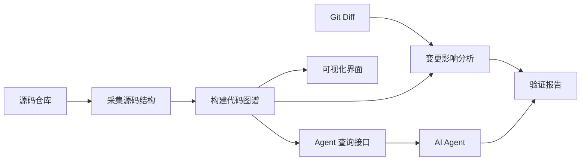

# 构建一个最小代码理解系统

前面几篇分别讲了源码结构化、程序分析、代码图谱、核心工程场景和 AI 时代的新应用。本篇把这些概念收束到一个实践项目：构建一个最小代码理解系统。

这个系统不追求覆盖所有语言和所有框架，也不追求做成商业平台。它的目标是跑通一条最小闭环：



> 后续 AI 配图备注：可生成一张“Mini Code Understanding Platform”的系统架构图，包含 collector、graph、analysis、ui、agent-api、report 六个模块。

只要这条链路跑通，读者就能把本书前面讨论的原理落到工程实现里。

## 项目目标

最小系统需要支持七类能力：

1. 解析示例代码库，提取文件、类、方法和调用关系。
2. 把提取结果组织成节点和边。
3. 提供基础图查询，例如查符号、查调用方、查被调用方。
4. 输入 Git Diff，定位变更实体。
5. 沿调用图追踪影响面，并关联相关测试。
6. 用界面或报告展示图谱、影响路径和风险节点。
7. 给 AI Agent 提供结构化查询接口，并生成验证报告。

这套能力覆盖了本书最核心的主线：代码事实如何被采集、组织、查询、展示，并服务 AI 时代的代码修改验证。

## 示例代码库选择

实践项目建议选择一个小型 Java/Spring 风格项目。原因有三点：

- Java 是静态类型语言，符号和类型关系比较清晰。
- Spring 风格应用有典型入口、服务层、数据访问层和测试结构。
- JavaParser、ANTLR、Tree-sitter 等工具都能支持 Java 代码解析。

示例项目不需要复杂。一个包含 Controller、Service、Repository、DTO、测试用例的简化应用就足够。重点是让结构和关系完整，而不是业务复杂。

如果读者更熟悉 TypeScript、Go 或 Python，也可以替换语言。但需要注意，动态语言的调用关系和类型解析会更不确定，实践中要更多依赖运行时数据和测试。

## 系统边界

最小系统要主动控制范围：

- 不做完整 IDE。
- 不做全语言支持。
- 不做完美调用解析。
- 不做生产级权限和多租户。
- 不做复杂图数据库优化。
- 不替代测试平台和 APM。

它要做的是建立可扩展骨架。后续可以逐步增加语言支持、框架规则、运行时数据、图数据库和前端交互。

## 推荐模块划分

可以按以下模块组织：

```text
collector
  负责源码扫描和 AST 解析

graph
  负责节点、边、属性建模和存储

analysis
  负责调用查询、影响面分析和测试推荐

report
  负责生成 Markdown 或 JSON 报告

ui
  负责图谱和影响面可视化

agent-api
  负责给 AI Agent 提供查询接口
```

模块划分不必一开始就复杂，但边界要清楚。采集、建模、分析、展示和 Agent 接口是不同职责。

## 数据流

系统的数据流可以设计为：

```text
源码仓库
  -> 扫描文件
  -> 解析 AST
  -> 提取类、方法、调用
  -> 生成节点和边
  -> 存储代码图谱
  -> 输入 Diff
  -> 定位变更实体
  -> 查询影响路径
  -> 关联测试
  -> 输出报告和可视化
```

这条数据流的每一步都应该可以单独调试。比如先检查 AST 抽取结果，再检查图谱边，再检查影响面路径。

## 最小数据模型

最小数据模型可以只包含两张核心表：节点表和边表。

节点：

```text
id
type
name
qualified_name
file_path
start_line
end_line
properties
```

边：

```text
id
source
target
type
properties
```

这种模型足够表达文件包含类、类包含方法、方法调用方法、测试覆盖方法、提交修改方法等关系。后续可以增加版本、时间窗口、置信度和数据来源。

## 技术选型

实践项目可以选择轻量技术：

- 源码解析：JavaParser 或 Tree-sitter。
- 存储：JSON、SQLite 或本地文件。
- 图查询：内存邻接表或 SQL 查询。
- 可视化：前端图组件、Mermaid、Graphviz 或简单 HTML。
- Agent 接口：CLI、HTTP API 或 MCP 风格接口。
- 报告：Markdown 和 JSON。

初期不要过早引入复杂基础设施。先让数据链路跑通，再优化存储和性能。

## 验收标准

实践项目完成后，应该能演示下面的流程：

1. 扫描示例项目。
2. 输出类、方法和调用关系。
3. 展示一个方法的调用方和被调用方。
4. 输入一次代码变更。
5. 输出受影响入口和相关测试。
6. 生成可视化视图或 Markdown 报告。
7. 通过 Agent 查询接口返回结构化结果。

这就是一个最小代码理解系统的闭环。

## 小结

本篇实践的目标不是把所有概念一次性做完，而是完成从代码到图谱、从变更到影响面、从影响面到 AI Review 证据的最小实现。

下一章先从第一步开始：采集源码结构。

## 延伸阅读与参考资料

- [JavaParser](https://javaparser.org/)：Java 源码解析实践工具。
- [Tree-sitter](https://tree-sitter.github.io/tree-sitter/)：多语言增量解析工具。
- [Mermaid Flowcharts](https://mermaid.js.org/syntax/flowchart.html)：实践项目中绘制流程图的轻量方式。
- [Model Context Protocol](https://modelcontextprotocol.io/)：后续将图谱查询能力暴露给 Agent 的接口参考。
